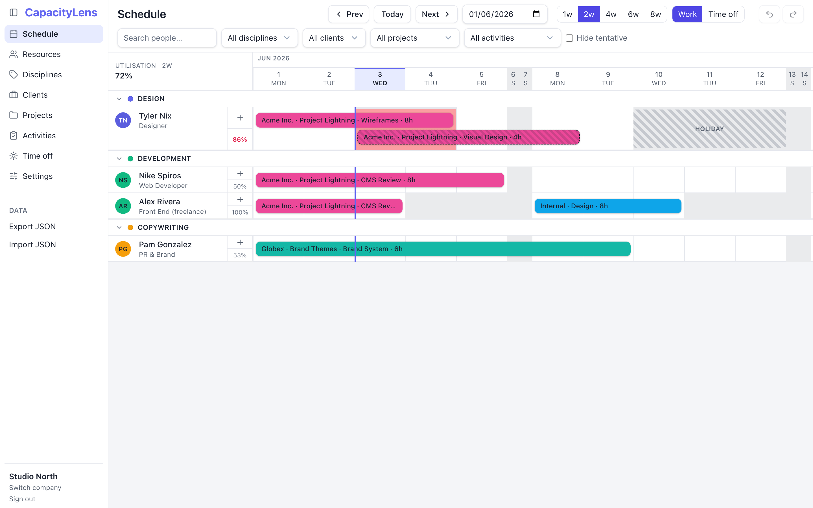

# CapacityLens

[](https://github.com/Kevinjohn/capacitylens/actions/workflows/gate.yml)
[](LICENSE)
[](.nvmrc)

**A helicopter view of who's busy, who's free, and who's overworked — week by week.**
CapacityLens is a self-hosted resource & capacity scheduler for small agencies: a few
staff, rotating freelancers, and one recurring question — *can we take this on?*

<picture>
  <source media="(prefers-color-scheme: dark)" srcset="docs/screenshots/schedule-dark.png">
  
</picture>

## Why it exists

It replaces the resourcing spreadsheet — nothing more. **Deliberately small:** no budgets,
no timesheets, no hour-level tracking, no mobile app. One tool, one problem, done well:

- **The schedule grid** — people grouped by discipline, allocation bars across the weeks,
  time off and holidays visible in the same view. Zoom from 1 to 8 weeks.
- **Three honest workload signals** — a red flag on any *day* someone is over-allocated,
  a utilisation % for the window you're looking at, and an "overloaded soon" warning for
  the next two weeks.
- **Multi-company** — each account is fully isolated, with its own calendar (timezone,
  week start) and team setup. Your data is yours: JSON export/import round-trips everything.
- **Fast to drive** — `⌘K` command palette (jump to a person, project, or date), `Enter`
  submits any dialog, `⌘Z` undoes. Light and dark themes.

Data lives in a single SQLite file behind a small Node API — trivial to back up, no
database server to run. There's also a **zero-backend demo mode** where everything stays
in your browser's localStorage.

## Try it in two minutes

Prerequisites: **Node 24+** (`nvm use` reads the pinned version from `.nvmrc`) and pnpm
(`corepack enable` installs the pinned version — it ships with Node).

```bash
git clone https://github.com/Kevinjohn/capacitylens.git
cd capacitylens
corepack enable
pnpm install
pnpm run dev
```

Open `http://127.0.0.1:5173/` and pick **Studio North** — the dev server seeds a demo
agency so you land on a working schedule, no sign-up needed.

No Node 24? `pnpm run dev:demo` runs the browser-only demo build (localStorage, no
server) on any recent Node.

> **Deploying to a static host?** The default build expects a backend at same-origin
> `/api`. For any backend-less deploy, build the demo: `VITE_CAPACITYLENS_DEMO=1 vite build`.

## Self-hosting

**[`docs/self-hosting.md`](docs/self-hosting.md)** is the guide: a static SPA plus the
SQLite API daemon behind any TLS-terminating proxy, with password auth
([Better Auth](https://www.better-auth.com/)) on. `docker-compose.yml` ships the same
stack as containers. A fresh password instance requires an operator-generated
`CAPACITYLENS_SETUP_TOKEN`; the first-owner form must present it, so the first network visitor
cannot claim the deployment. After that, public sign-up closes and invite links let new password
users set their own credentials and join. See the [authentication steps](docs/self-hosting.md#4-enabling-authentication)
in the self-hosting guide. Day-to-day operations (backups, health checks, audit log) live in
[`docs/runbook.md`](docs/runbook.md); what the app does and doesn't collect is in
[`docs/privacy.md`](docs/privacy.md).

## Architecture in one breath

React 19 + TypeScript + Vite + Zustand + Tailwind, organised as a pnpm workspace:

- **`src/`** — the web app; the scheduler grid builds a unit-tested week-grid view-model.
- **`shared/`** — the pure domain core (types, validation, integrity, cascade, migrate,
  seed), imported by both app and server so client and server validation can't drift.
- **`server/`** — the default backend: Node + built-in `node:sqlite`, a small REST API
  behind the same persistence seam the demo build implements with localStorage.

The data model is multi-tenant by **Account**: Disciplines → Resources (people),
Clients → Projects → Activities, and **Allocations** (a person × activity × date-range
block with hours/day) as the core unit, plus per-person time off. Canonical types:
`shared/src/types/entities.ts`.

## Contributing

Contributions are welcome — [`CONTRIBUTING.md`](CONTRIBUTING.md) has the setup and PR
norms, [`docs/development.md`](docs/development.md) the day-to-day dev detail (test
matrix, ports, troubleshooting), and [`DEFENSIVE-CODING.md`](DEFENSIVE-CODING.md) the
error-handling standard the codebase holds itself to. The quality bar for every change:

```bash
pnpm run gate         # typecheck + lint + unit tests + build
pnpm run gate:server  # the server workspace (needs Node 24)
pnpm run e2e          # Playwright end-to-end (Chromium)
```

CI runs the same gate on every pull request. Please read the **deliberately small**
scope above before proposing features — budgets, timesheets, and hour-granularity
workflows are documented non-goals.

Found a security issue? Please report it privately — see [`SECURITY.md`](SECURITY.md).

## Docs map

- [`docs/self-hosting.md`](docs/self-hosting.md) / [`docs/runbook.md`](docs/runbook.md) /
  [`docs/privacy.md`](docs/privacy.md) — run and operate your own instance.
- [`docs/development.md`](docs/development.md) — dev servers, the full test matrix, troubleshooting.
- [`DECISIONS.md`](DECISIONS.md) — the standing product/engineering decisions, in present tense.
- [`CHANGELOG.md`](CHANGELOG.md) — release notes ([Keep a Changelog](https://keepachangelog.com/)).
- [`CLAUDE.md`](CLAUDE.md) — working notes for AI pair-programming sessions; humans may
  find it a decent orientation too.

## License

[AGPL-3.0](LICENSE). In short: run it, modify it, self-host it freely — but if you offer
a modified version to others over a network, you must share your changes under the same
license.
