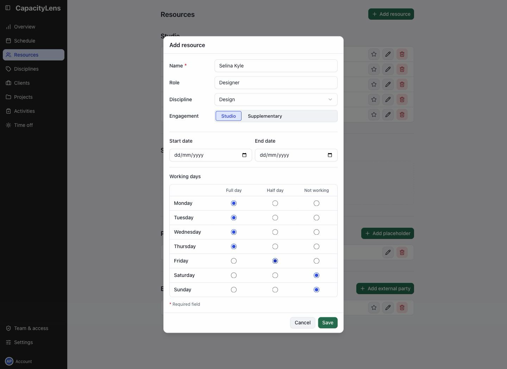
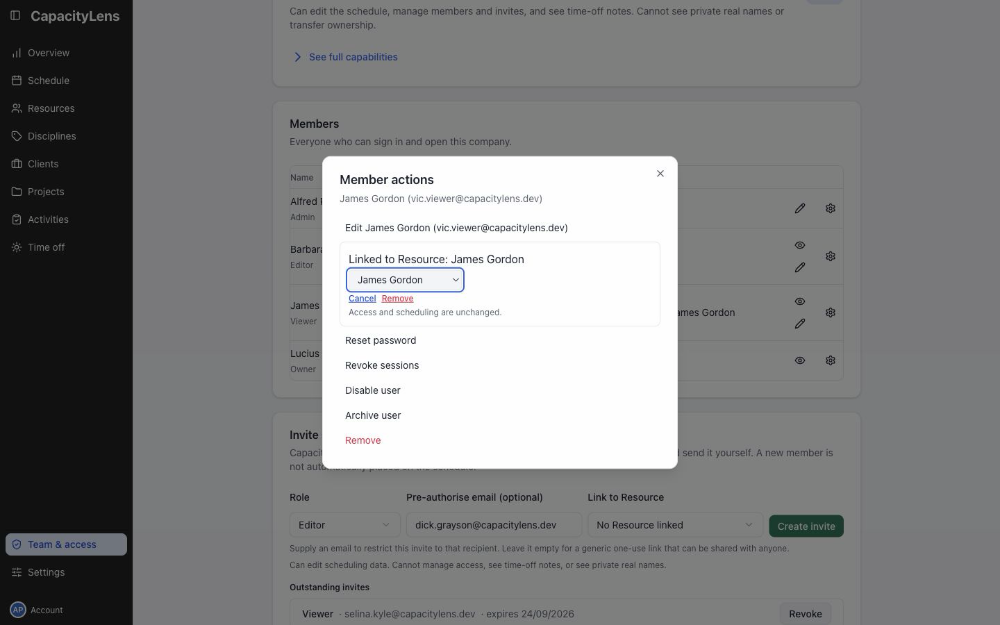

# Add people to the schedule

Open Resources in the left menu and select Add resource.

Enter the person's name. Add their role, engagement and discipline where relevant.

Set Working days to match their usual week. Use Start date and End date if their availability is time-limited.

Select Save. They now have a row on Schedule; they do not need a sign-in.

## Connect their sign-in

If they also need access, [invite them](/admin/invite-teammates).

In Team & access, use Link to Resource beside the member to select their scheduled person. Linking does not change their permissions.

## Plan an unfilled role

Select Add placeholder in Resources and choose its Bound project. The placeholder holds bookings until a person is assigned.

If Add placeholder is missing, enable Show placeholders in [Settings](/admin/company-settings).

[Working patterns, placeholders and external resources](/guide/people-and-placeholders)
