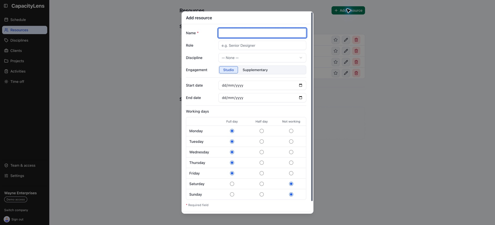

# Add people to the schedule

This task adds the people whose capacity your company plans. A scheduled person does not
need a sign-in.

## Steps

1. **Open Resources and select Add resource.** Choose **Person** for a named person. Use a
   placeholder only for an unfilled role attached to a project.
2. **Enter the person's details.** Add their name, role, engagement, and discipline when
   disciplines are enabled.
3. **Set Working days.** Mark each weekday as **Full day**, **Half day**, or **Not working**.
   Add start and end dates when their availability is time-limited.
4. **Save the person.** They appear in Resources and as a row on Schedule.
5. **Link their sign-in when appropriate.** Open **Team & access**, find the member, and
   use the Link to Resource control. A linked member can be recognised consistently, but
   linking does not change their role.

## What's next

[Choose company settings](/admin/company-settings), or read [People and
placeholders](/guide/people-and-placeholders) for engagement types, placeholders, and
member links.
