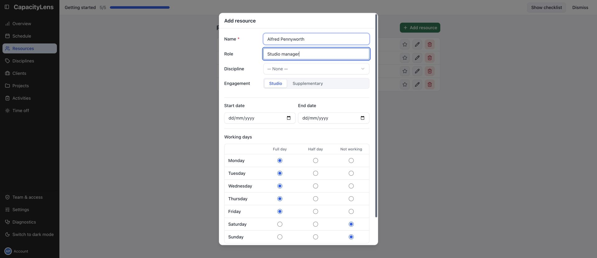
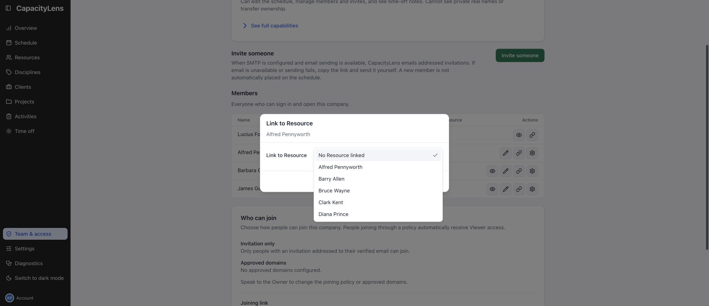

# Add people to the schedule

Open Resources in the left menu and select Add resource.

Enter the person's **Name**. Add a **Role**, choose **Engagement**, and select a **Discipline** when
your company uses disciplines. Create disciplines on the [Disciplines page](/using/disciplines)
before assigning one here.

Set Working days to match their usual week. Use Start date and End date if their availability is time-limited.

Select **Save**. They now have a row on Schedule and can be assigned work or time off; they do not
need a sign-in. Editors and above can create and edit scheduled people. A Viewer cannot.

## Connect their sign-in

If they also need access, [invite them](/admin/invite-teammates).

In Team & access, select the link icon beside the member to open **Link to Resource**, then choose
their scheduled person. The choice saves immediately. A person or member can have only one active
link. If the person is already linked, remove the old link before assigning them to someone else.
Linking does not change permissions or create a schedule row.

## Plan an unfilled role

When **Show placeholders** is enabled, select **Add placeholder** in Resources and choose its
**Bound project**. A placeholder stands for a role you have not filled yet. Its bookings stay tied
to that project and can use only activities from that project or the shared **All projects** group.
When a person is ready to take over, edit or reassign the bookings to that person. Placeholders
follow company working days and can be hidden again by turning the setting off; hiding one does not
delete it.

If Add placeholder is missing, enable Show placeholders in [Settings](/admin/company-settings).

[Working patterns, placeholders and external resources](/using/resources)
