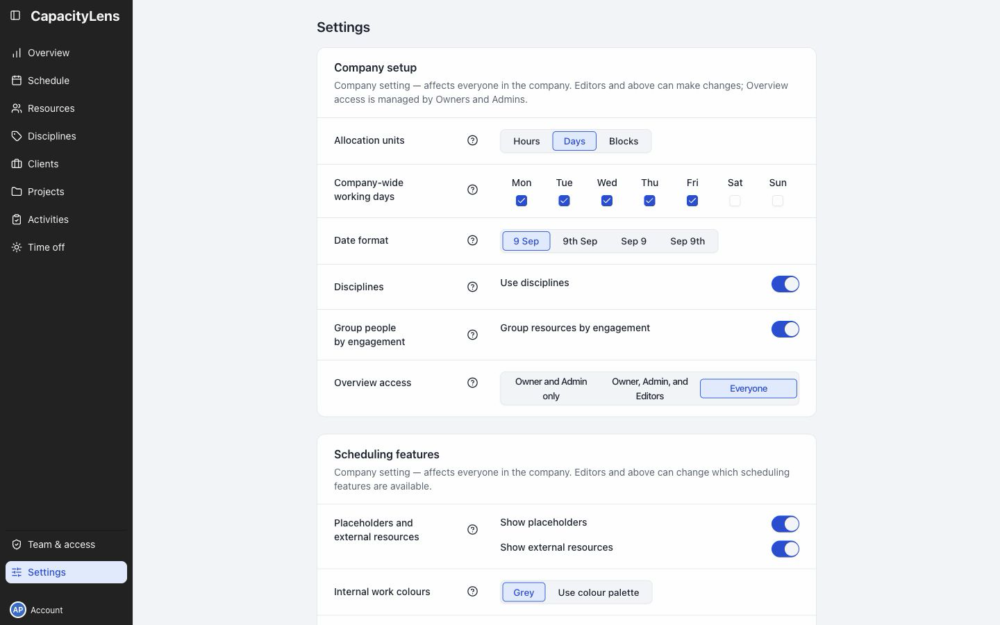
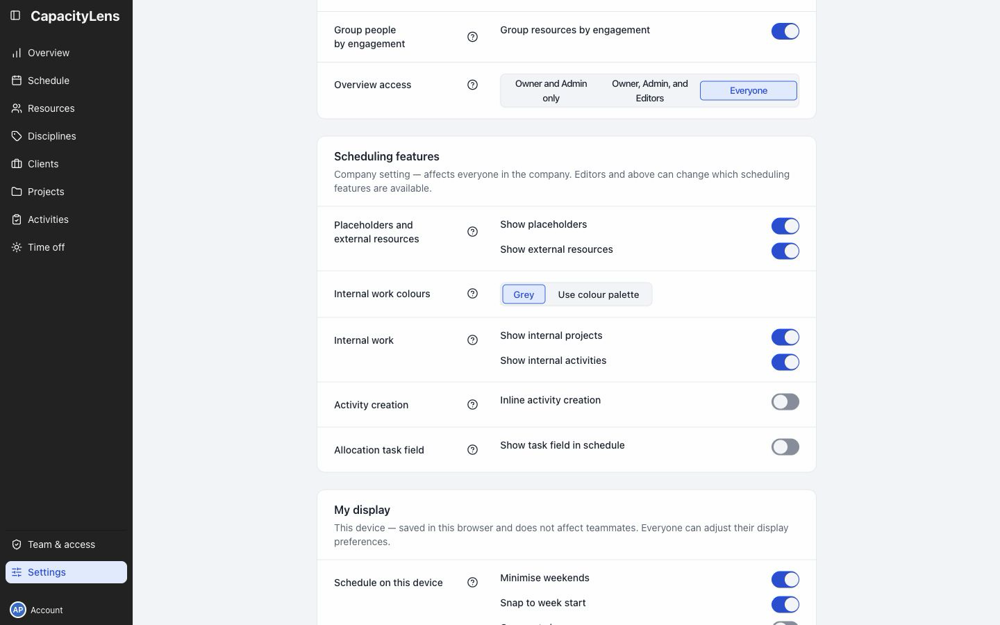

# Choose company settings

Open Settings near the bottom of the left menu. Company setup and Scheduling features affect everyone.

## Company setup

| Setting                       | What it changes                                                                  |
| ----------------------------- | -------------------------------------------------------------------------------- |
| Allocation units              | Enter work in Hours, Days or Blocks. Days is the default.                        |
| Company-wide working days     | Set the shared working week. A person's own working pattern also applies.        |
| Date format                   | Change how planning dates appear for everyone.                                   |
| Use disciplines               | Group people by discipline. Create the names and colours on Disciplines.         |
| Group resources by engagement | Separate Studio and Supplementary people.                                        |
| Overview access               | Choose who can open the capacity summary. Owners and Admins only is the default. |

Changing working days recalculates capacity for existing work; it does not move booking dates.

Editors can change most company settings. Only Owners and Admins can change Overview access.

## Scheduling features

| Setting                                           | What it changes                                                           |
| ------------------------------------------------- | ------------------------------------------------------------------------- |
| Show placeholders                                 | Plan unfilled project roles.                                              |
| Show external resources                           | Track work assigned outside your team.                                    |
| Internal work colours                             | Use grey bars or the saved colour palette.                                |
| Show internal projects / Show internal activities | Show or hide internal work. Hidden work still counts towards utilisation. |
| Inline activity creation                          | Add activities while making a booking.                                    |
| Show task field in schedule                       | Add a short task description to bookings.                                 |

Turning a visibility option off hides existing information; it does not delete it.

## Personal preferences and company details

My display changes only the current browser. Let teammates choose their own [display preferences](/using/settings).

Week start and time zone are fixed after company creation. Check them under Data and support → Company details.

[Full settings reference](/guide/settings)

[Offline access](/guide/offline-access)
