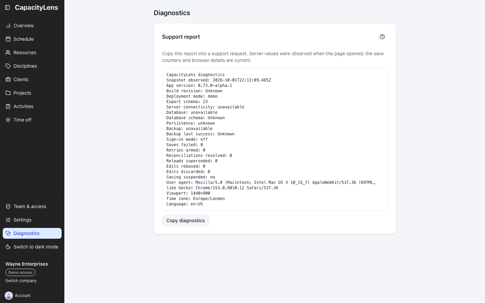

# Diagnostics

Owners and Admins open **Diagnostics** below Settings in the left menu, or by searching for it in
the command palette. Editors and Viewers do not see the link, and a direct visit to `/diagnostics`
returns them to the schedule. When sign-in is off, as in the demo, everyone can open it.

## Copy a support report

Select **Copy diagnostics** and paste the report into your support request. The page shows the
same text that is copied. A short message confirms the copy, or says that the browser blocked the
clipboard.

The report lists:

- the app version, build revision, deployment mode and export schema;
- server connectivity, database schema, persistence and backup status, observed when the page
  opened (**Snapshot observed**);
- the company's sign-in mode;
- this browser session's save counters: failed saves, retries, reconciliations, superseded
  reloads, rebased and discarded edits, and whether saving is suspended;
- the browser's user agent, window size, time zone and language.

A value the page cannot read shows **Unknown** or **unavailable**. The demo has no server, so its
server values are always unavailable.

When the build provides a revision or feedback address, **Build details** shows the revision and
may include a **Send feedback** link. A build without either value omits that section.

## What the report leaves out

The report contains no names, email addresses, identifiers, company data, passwords, invitation or
session values, hostnames, file paths or raw error messages. It is a snapshot, not a live monitor:
reopen the page to observe the server again.

Editors and Viewers cannot open Diagnostics; Owners and Admins can share its build details with a
support report.
