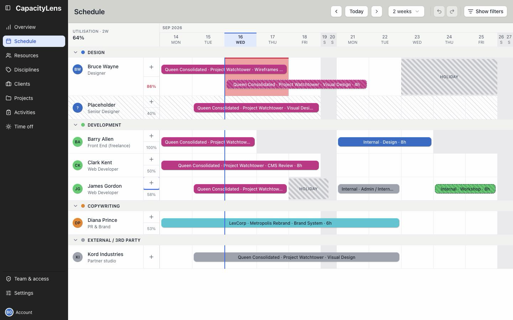
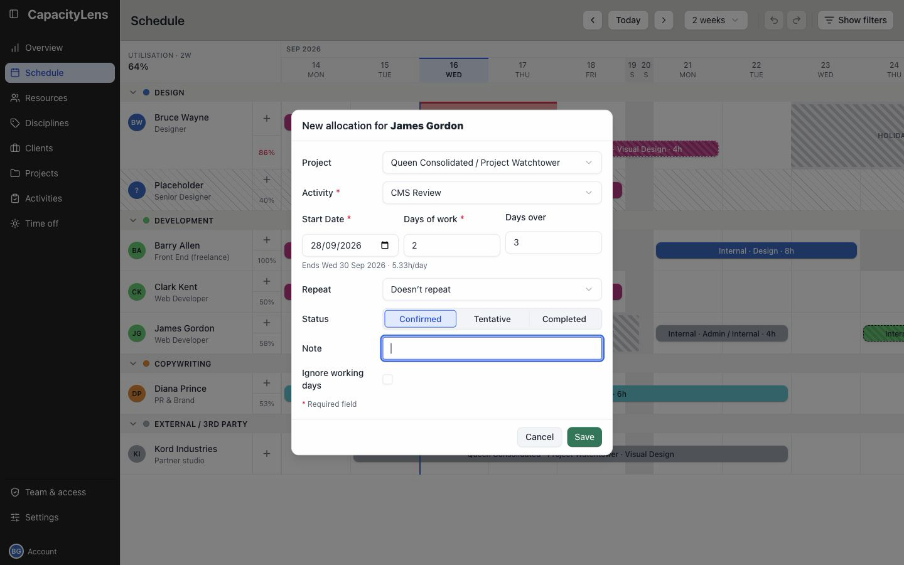

# Make the first booking

You need a [scheduled person](/admin/add-people) and an [activity](/admin/prepare-work).

Open Schedule in the left menu. Select the plus button on the person's row, or drag across the dates to book.

## Save the booking

Choose Project, then Activity. Use Internal or No specific project for work without a project.

Check the assignee, dates, amount and status. Select Save.

The booking appears on the person's row. They can find it in their [work list](/using/read-the-schedule#your-work-list).

[Move or change the booking](/using/change-work)

[Booking options and repeats](/guide/projects-and-allocations)
