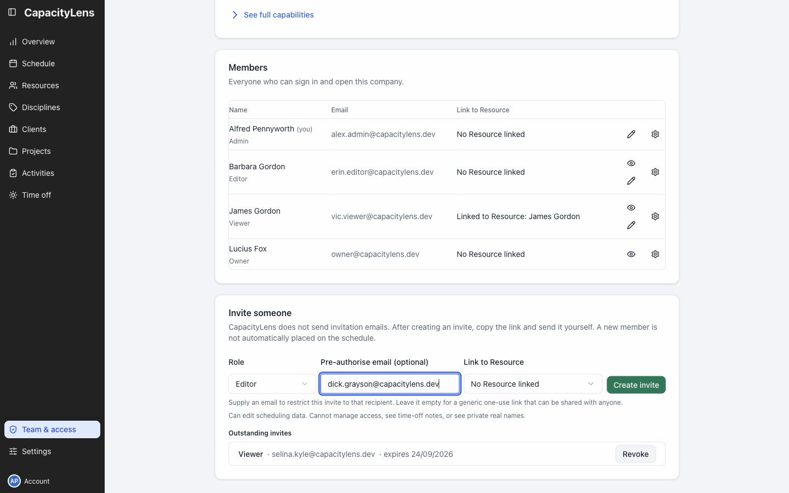
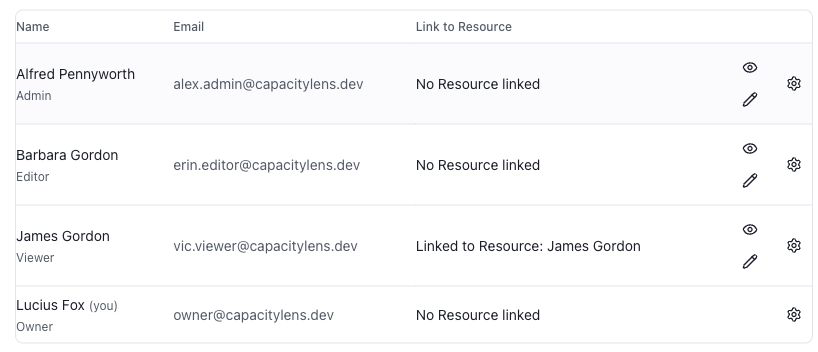

# Invite teammates and manage access

Open Team & access in the left menu and find Invite someone.

| Role   | Allows                                      |
| ------ | ------------------------------------------- |
| Viewer | Read the schedule                           |
| Editor | Change the schedule and planning data       |
| Admin  | Manage members and company settings as well |

Choose the role and enter the teammate's email. An invitation tied to an email can only be accepted by that address.

Leave No Resource linked selected unless their scheduled person already exists.

Select Create invite, then Copy. Send the link privately; CapacityLens does not email it for you.

The link is only displayed now. If you lose it, revoke it under Outstanding invites and create a replacement.

## After they join

The teammate appears in the members list after accepting. Send them the [day-to-day guide](/using/).

Select the pencil beside their name to change their role, then Save role.

Use Link to Resource to connect their sign-in to an existing scheduled person. This does not change their access.

## Stop access

Open Member settings beside the member. Disable user or Archive user stops access while keeping their history. Restore access reverses either choice.

Remove deletes the membership; they need another invitation to return.

[Invitation and access questions](/admin/faq)

[Detailed invitation controls](/getting-started/invite-your-team)
