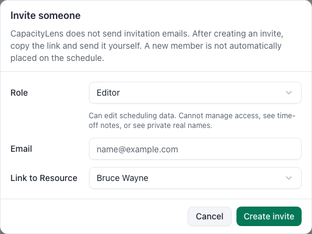

# Invite teammates

This task gives a teammate access to the company. It takes about a minute on your side.
CapacityLens creates a one-time link; it does not send an email.

## Steps

1. **Open Team & access.** Your own role and capabilities appear at the top.
2. **Choose the person's role.** Use Viewer for read-only access, Editor for schedule and
   planning changes, and Admin for people, access, and company administration.
3. **Enter their work email when appropriate.** Company-login-only installations require
   it. An email-bound invitation can be accepted only by that address.
4. **Choose a scheduled person when one already exists.** Otherwise leave **Not on the
   schedule** selected. The invitation can be linked later.
5. **Create the invitation.** Copy the one-time link immediately and send it privately.
6. **Check the members list after acceptance.** The teammate appears with the chosen role.

## What's next

[Add people to the schedule](/admin/add-people), or read the detailed [Invite your team
reference](/getting-started/invite-your-team).
