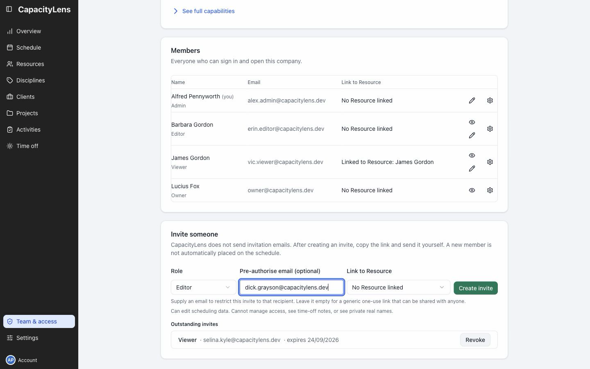
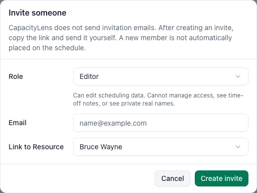
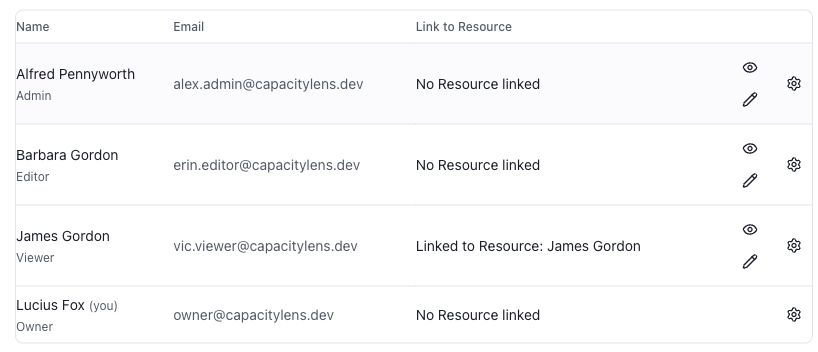
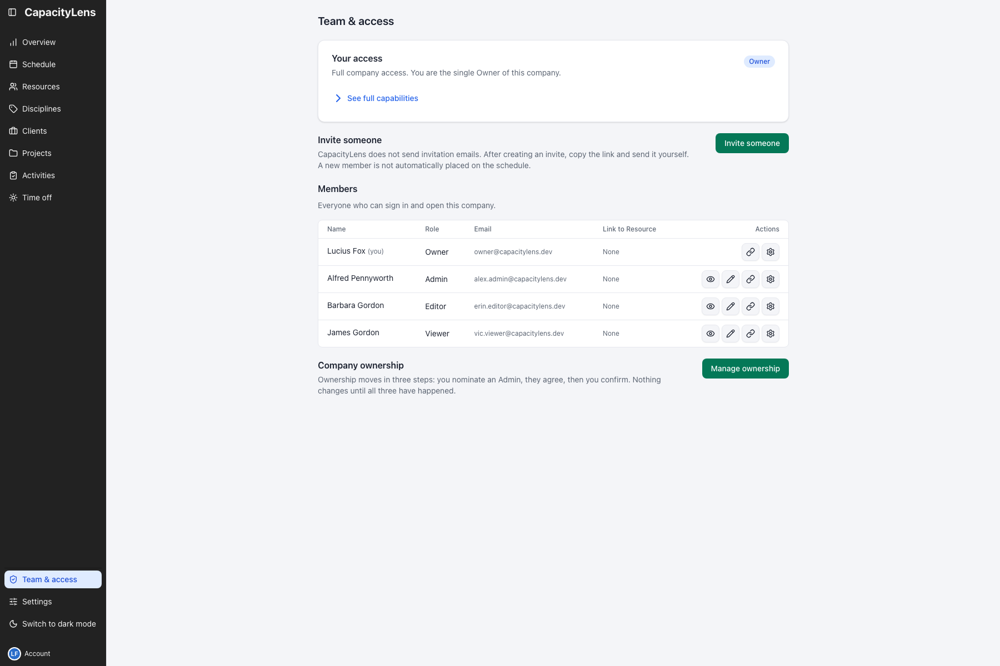
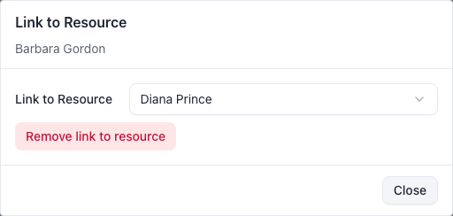

# Invite teammates and manage access

Open Team & access in the left menu and select the primary **Invite someone** button. The
role, email and optional Resource fields open in a centered dialog.

| Role   | Allows                                      |
| ------ | ------------------------------------------- |
| Viewer | Read the schedule                           |
| Editor | Change the schedule and planning data       |
| Admin  | Manage members and company settings as well |

Choose the role and enter the teammate's email in the dialog. An invitation tied to an email can only be accepted by that address.

Leave No Resource linked selected unless their scheduled person already exists.

Select **Create invite**. When SMTP is configured and email sending is available, CapacityLens
emails the addressed invitation. If email is unavailable or sending fails, select **Copy** and send
the link privately. The link remains available either way.

The link is only displayed now. If you lose it, revoke it under Outstanding invites and create a replacement.

Only an Owner or Admin can invite people. A Viewer or Editor who opens **Team & access** sees
their own role and a note that an Owner or Admin handles invitations, instead of the **Invite
someone** button. Select **See full capabilities** for the full list of what a role can and
can't do; the dialog also spells out the consequences of the chosen role.

**Link to Resource** proposes an existing person Resource without reserving it. The recipient
cannot see this selection. If the person is no longer available when the invitation is accepted,
the member can still join; Team & access shows **Resource link needs attention**. Choose
**Choose another person** or **Dismiss** there.

The server keeps only a hash of the one-time link. Closing the dialog clears the link; if you
close it before the invite finishes creating, a notice says the link was not shown.

## What the invitee sees

The invite link opens outside the normal sign-in wall, so the recipient can safely
preview what they're joining before anything happens: your company name, the proposed
role, what that role can and can't do, and when the link expires. Just opening the link
never changes [membership](/reference/glossary).

From there:

- Already have a password sign-in? Enter the invited email and password, review the
  invitation, then choose **Accept invite**.
- New to this install? Use the invitation's **Create account** option. Account
  creation and invitation acceptance happen together.
- Use company login? Choose an available provider, return to the invitation,
  then select **Accept invite**.

The role description is shown in full. Expiry uses your local date and time, without seconds.
An email-bound invitation shows the part before `@`, followed by `@…` (for example,
`selina.kyle@…`). The domain stays hidden. Enter your full email address to sign in or create
an account. Ask the sender if the hint is not enough to identify the address; entering a
different one cannot change who the invitation is for.

Either way, they land directly on your schedule with their role visible.

## After they join

The teammate appears in the members list after accepting. Send them the [day-to-day guide](/using/).

Select the pencil beside their name to change their role, then Save role.

Use Link to Resource to connect their sign-in to an existing scheduled person. Selecting a person saves immediately, and this does not change their access.

## Pending invites

Invites that haven't been accepted yet stay listed on **Team & access** as pending, in
their own bordered table above your members. It uses the same **Name**, **Role**, **Email**,
**Link to Resource** and **Actions** columns as the member table. An invite has no name, and a
proposed Resource stays marked pending until the invite is accepted. Owners and Admins can see this
list; other roles only see their own access. Invitations are ordered Owner, Admin, Editor, then
Viewer, with consistent email and creation-order tie-breakers.

## Managing someone who already joined

Your members are listed by **Name**, **Role**, **Email**, **Link to Resource** and **Actions**.
Owners come first, followed by Admins, Editors and Viewers; ties remain stable by display name.
Long email addresses shorten visually, but the complete address remains available to select and in
the native hover label.

- The **pencil** changes that person's role, with the consequences spelled out before you
  save.
- **More actions** opens a centered dialog with the remaining permitted actions: reset their
  password, sign them out everywhere, Disable Access, archive their membership, or remove them from the company.

The **Link to Resource** column shows the member's association. Select the member's link icon
to open the centered Resource selector directly. Choosing a person saves immediately. If a link
already exists, **Remove link to resource** removes it immediately; closing the dialog never
reverses a completed change. See [Link a person to a member](/using/resources#link-a-person-to-a-member).

## Stop access

Open Member settings beside the member. **Disable Access** stops this person opening the company
immediately, including through an existing session or a later invitation, and prevents rejoining
until an Owner or Admin selects **Enable Access**. The restriction remains visible even after
removal. Only an Owner or Admin can enable access, including for a removed person listed under
**No longer active**. After **Enable Access**, a retained active member keeps their existing role;
an archived or removed person still needs the ordinary restore or invitation process.

If the person later creates a new sign-in identity with the same address, the restriction follows
that address only when the original and new identities have proven mailbox ownership through
verified company sign-in or a completed mailbox ceremony. An addressed invitation or an older
"email verified" flag alone does not establish that link. Owners and Admins can still manage the
original restriction from the inactive member list. An established Microsoft sign-in keeps its
stable provider identity, but a returning sign-in alone does not add mailbox proof to an older
identity that lacks it.

**Archive user** stops current membership access and keeps an inactive record that can later be
restored. **Restore membership** reactivates that record, but does not clear Disable Access.
**Remove** ends the membership; the person may return later if the company's joining policy
permits it. Archiving or removal alone does not prevent a new invitation, and a returning person
receives the invitation's role. Other company memberships remain usable throughout.

## Review who can join

**Who can join** in Team & access shows the current joining policy and every approved
email domain. Only the Owner can change it. Ask them to review the policy if a
teammate cannot join or if registration should be more restricted. A policy join
grants Viewer access; send an addressed invitation when someone needs a different
role. **Approved domains** accepts only the exact listed domains. Under **Approved
domains or invitation**, an addressed invitation can also admit a freelancer from
another domain. **Disable Access** still prevents that person from rejoining.

Owner and Admin can copy the **Joining link** from this section and share it with people who
need access. The link opens this company's joining page; the saved policy still decides who
can join.

[How company joining works](/company-login/#invitations-and-the-first-owner)

[Invitation and access questions](/admin/faq)

## Common questions

**I lost the link before sending it — can I get it back?** No. CapacityLens shows a
one-time link's token exactly once and stores only a hash of it afterwards, so nobody —
including you — can retrieve the original link again. Revoke the invite on **Team &
access** and create a new one instead; the old link stops working as soon as you revoke
it.

**Can I run more than one company on this install?** Not by default — a fresh install
allows exactly one company. An administrator can turn on `CAPACITYLENS_MULTI_ACCOUNT` to
allow more; see [Configuration](/self-hosting/configuration).
