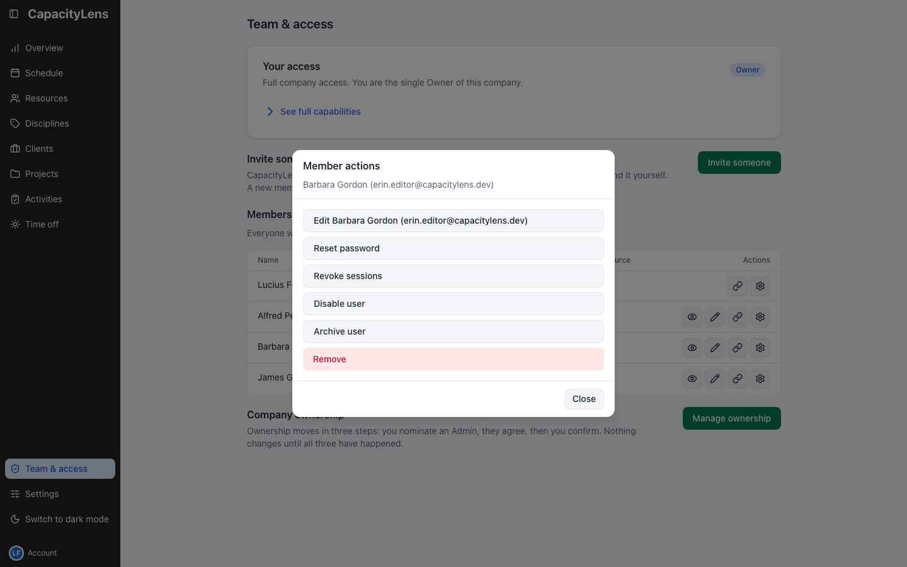
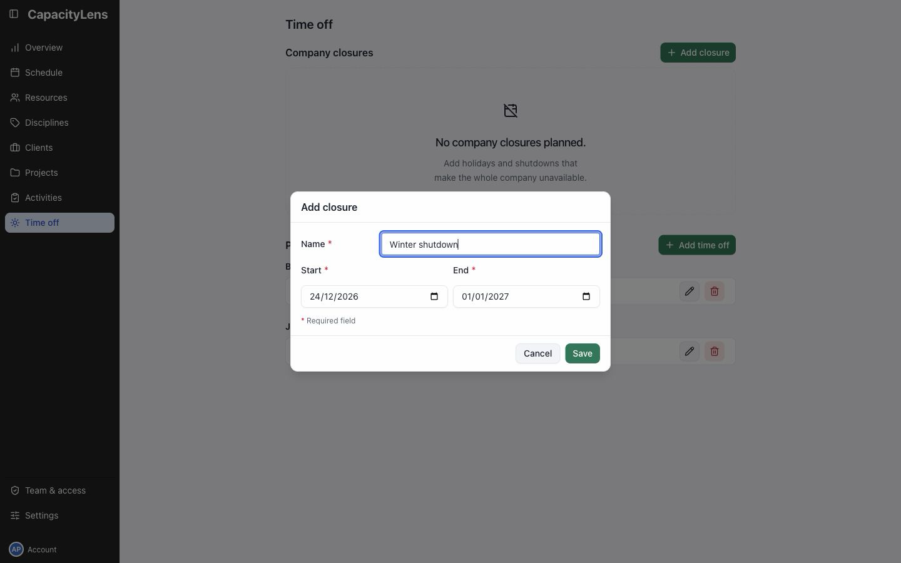

# Handle ongoing administration

## Change access

Open Team & access. Use the pencil beside a member to change their role.

Use the link icon beside a member to open **Link to Resource** and associate, change or remove their scheduled person. Member settings contains Disable user, Archive user and Restore access. [Invite teammates and manage access](/admin/invite-teammates) explains these choices.

## Change working patterns

Open Resources and edit the person. Update Working days or their Start date and End date, then Save.

Archive a resource when they should leave active scheduling. Archived records are available at the bottom of Resources.

## Add a company closure

Open Time off in the left menu. Under Company closures, select Add closure.

Enter the name, Start and End dates, then Save. The closure reduces availability across tracked people and placeholders.

For one person's absence, use [Record time off](/using/record-time-off).

## Settings and support

[Company settings](/admin/company-settings) controls shared working days, optional features and Overview access.

Ask the Owner about ownership transfer, company deletion or importing scheduling data.

Ask the service operator about backups, upgrades and company-login configuration.

[Admin FAQ](/admin/faq)
