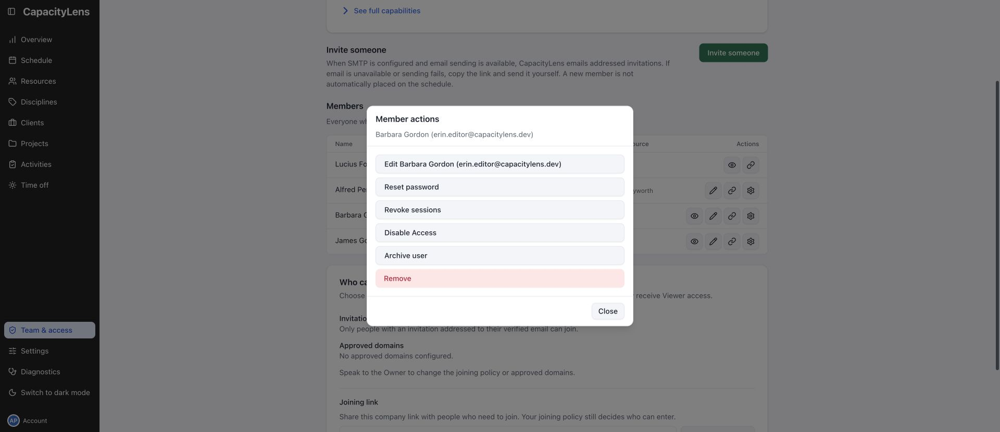
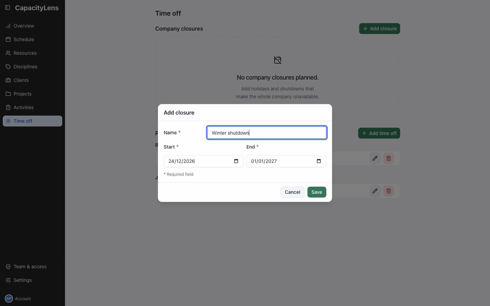
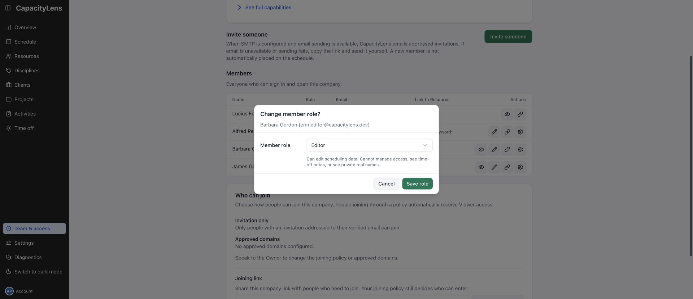

# Handle ongoing administration

## Change access

Open Team & access. Use the pencil beside a member to change their role.

Use the link icon beside a member to open **Link to Resource**. Selecting a scheduled person saves
immediately; use **Remove link to resource** to unlink them. Member actions contains **Disable Access**,
**Enable Access**, **Archive user** and **Restore membership**. [Invite teammates and manage access](/admin/invite-teammates)
explains these choices.

## Change working patterns

Open Resources and edit the person. Update Working days or their Start date and End date, then Save.

Working days set the person's capacity together with the company's working days. Changing them
recalculates utilisation and conflicts; it does not move existing bookings. Availability dates are
inclusive. Outside that range, capacity is zero, but existing bookings remain visible. Check the
[Resources guide](/using/resources#set-availability-dates) before narrowing someone's availability.

Archive a resource when they should leave active scheduling. Archived records are available at the bottom of Resources.

## Add a company closure

Open Time off in the left menu. Under Company closures, select Add closure.

Enter the name, Start and End dates, then Save. The dates are inclusive. The closure makes capacity
zero for every person and placeholder on those dates, including people added later. It does not
cover external parties or remove existing bookings; overlapping work remains visible as a conflict.
If you shorten or delete the closure, capacity returns without changing the booking dates.

For one person's absence, use [Record time off](/using/time-off#record-time-off).

## Review members and invitations

On **Team & access**, review outstanding invites and the member list. Change a member's role with
the pencil. **Member actions** lets an Owner or Admin disable or enable access, archive or restore
membership, or remove a member. Disable Access blocks company entry even if the membership is later
removed; only an Owner or Admin can clear that restriction. Archive stops membership access while
keeping its history and can be restored. Removal ends that membership; it does not disable the
identity or remove the person's other company memberships. See [Invite teammates and manage access](/admin/invite-teammates#stop-access)
for each action and its restrictions.

## Settings and support

[Company settings](/admin/company-settings) controls shared working days, optional features and Overview access.

When something goes wrong, copy a support report from [Diagnostics](/admin/diagnostics).

Ask the Owner about ownership transfer, company deletion or importing scheduling data.

Ask the service operator about backups, upgrades and company-login configuration.

[Admin FAQ](/admin/faq)
