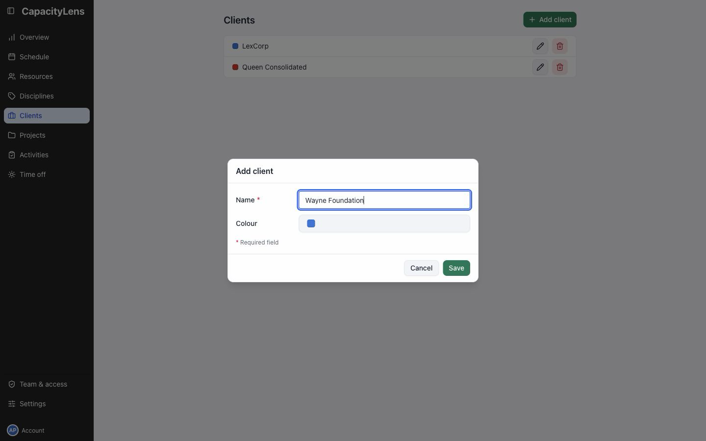
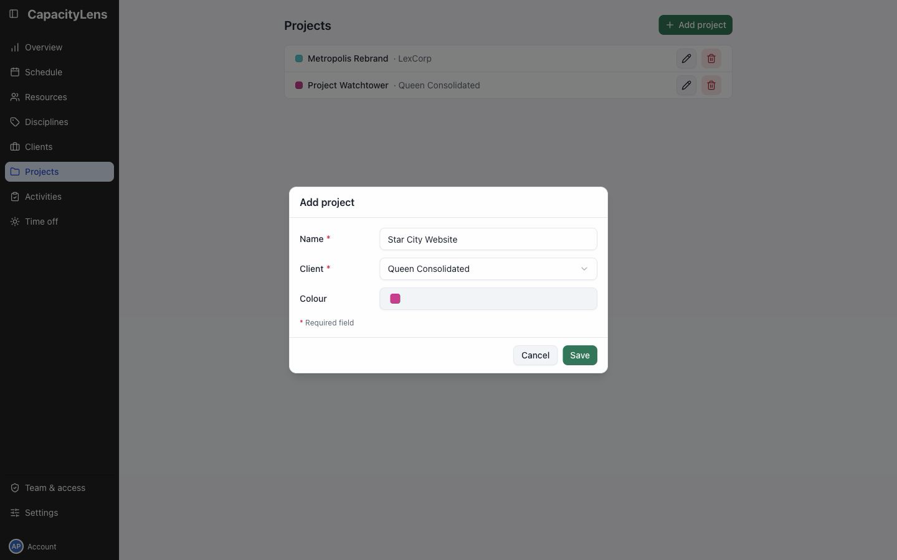
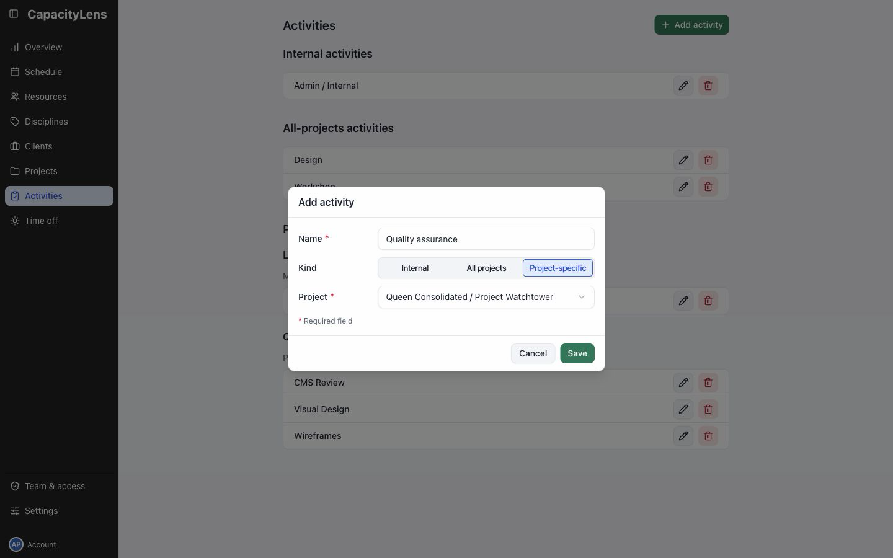

# Prepare clients and work

Open Clients in the left menu. Select Add client, enter the name and Save.

## Add the project

Open Projects and select Add project. Enter the project name, choose its Client and Save.

## Add an activity

Open Activities and select Add activity. Enter its name and choose Kind:

| Kind             | Use                                         |
| ---------------- | ------------------------------------------- |
| Project-specific | Choose the project this activity belongs to |
| All projects     | Reuse the activity across projects          |
| Internal         | Schedule work without a project             |

Select Save. The activity is ready to book.

Internal and All projects activities can be created without first adding a client or project.

[Make the first booking](/admin/first-booking)

[More activity and project options](/guide/projects-and-allocations)
