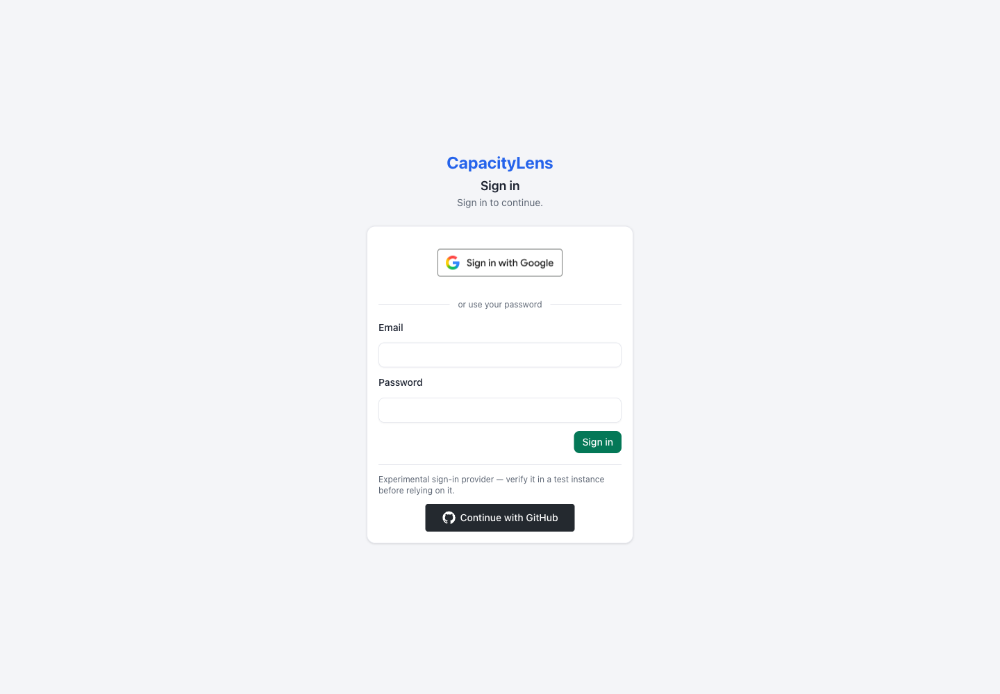

# How sign-in works

CapacityLens can use passwords, Google Workspace or Microsoft Entra ID for
company sign-in. The person running the server chooses which options appear.
The demo and trusted-local mode have no sign-in.

With company sign-in, CapacityLens sends you to Google or Microsoft and receives
you back after authentication. It never sees your provider password. An agency
account alone does not grant access: new people also need an invitation, except
for the explicitly allowed first person on an empty installation.

## Passwords and company sign-in

In password mode, every configured provider appears once in a vertical stack
above the password form, in the order supplied by the server. Google and
Microsoft keep their branded actions; GitHub is an experimental additional
option. Future providers use the same placement. When both sign-in methods are
available, the localized **or use your password** divider appears between the
provider stack and password form. Provider-only sign-in has no password form or
divider, and password-only sign-in has no empty provider area.

First-owner setup keeps its separate field order and provider bootstrap flow.
For example, Microsoft setup requires an email address before the provider
action can begin its mailbox-proof step.

In company-sign-in-only mode, people must use a configured company provider.
Passwords and GitHub cannot satisfy this requirement, including through older
sessions. Keep the chosen Google or Microsoft credentials configured when
changing modes.

See [Set up Google or Microsoft sign-in](/company-login/set-up-company-login)
for registration and server settings. To require one of those providers for
everyone, see [Require company sign-in](/company-login/move-to-single-sign-on).

## Invitations and the first Owner

On an empty installation, the operator can allow specific email addresses to
create the first Google or Microsoft identity. That person then follows **Set up
your company** to become its Owner. The allowance closes when the first identity
exists.

After that, an Owner or Admin creates an invitation in **Team & access** and
shares its link. A new provider identity needs an unused invitation addressed to
its verified email. Signing in to the provider does not silently accept a company
invitation: follow the invitation screen to complete admission.

## Connect an existing account

Sign in to your existing CapacityLens account first. Open **Account → Security**
and, under **Company sign-in**, choose **Connect Google** or **Connect Microsoft**.
Complete the provider sign-in using the same email address as your CapacityLens
account. Your local email must already be verified, and CapacityLens may ask you
to confirm your identity again before connecting.

CapacityLens does not merge accounts because their email addresses match.
Explicit connection preserves your existing memberships and work. A provider
identity already connected to another person cannot be connected again.

Microsoft may need a one-time email link to prove that you control the matching
mailbox. Open it in the same browser session within 15 minutes and confirm the
connection. Returning Microsoft sign-in uses the saved identity and does not
repeat that mailbox check. See [Mailbox proof and recovery](/company-login/set-up-company-login#microsoft-mailbox-proof).

## Sessions and sensitive actions

A session lasts at most twelve hours from sign-in. Activity does not extend that
limit. Thirty minutes without activity also signs you out.

Sensitive actions require a recent identity confirmation: connecting or repairing
a company identity, transferring ownership, resetting another member's password,
revoking another member's sessions, deleting a company, and importing or purging
company data. CapacityLens asks you to confirm again when needed. Routine member
invitations, role changes and membership removal need the appropriate role, but
do not require this extra confirmation.

If confirming through Google or Microsoft sends you away from the page, return
to the action you were taking and submit it again. Signing in confirms your
identity; it does not apply the original change.

## Two-factor sign-in

In password mode, the server operator can require authenticator-app codes before
people can access company data. Save the recovery codes when enrolling. If you
lose both the authenticator and those codes, contact the server operator; there
is no administrator button to bypass them.

For company sign-in, configure and verify multi-factor authentication at Google
or Microsoft. Do not assume that enabling a provider also enables its MFA policy.
The server's MFA attestation records the operator's assurance; it does not switch
on MFA at the provider.

## When someone leaves

Disable their work account at the provider and remove or disable their
CapacityLens membership in **Team & access**. Provider disablement alone does not
immediately revoke existing CapacityLens sessions. Use **Revoke sessions** when
all of the person's CapacityLens sessions must end; that action applies across
their accounts and requires the corresponding authority.

## Next steps

[Set up Google or Microsoft sign-in](/company-login/set-up-company-login), or
[require company sign-in](/company-login/move-to-single-sign-on) for an
existing team.
