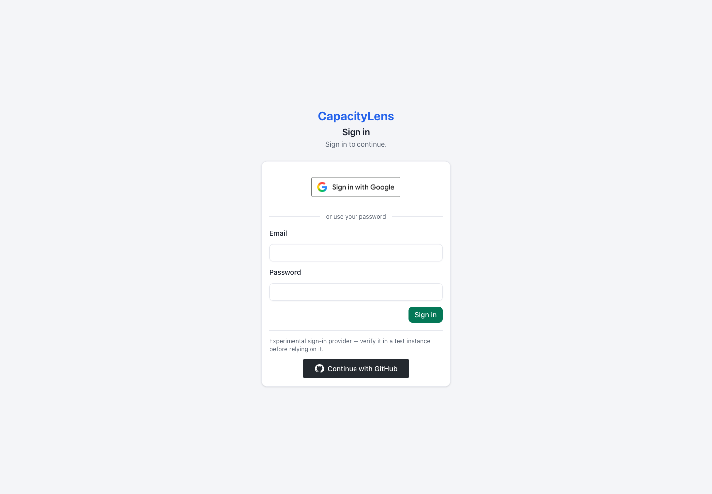

# How sign-in works

CapacityLens can use passwords, Google Workspace or Microsoft Entra ID for
company sign-in. The person running the server chooses which options appear.
The demo and trusted-local mode have no sign-in. Google or Microsoft may require an additional
sign-in step when an agency enables MFA with that provider. CapacityLens does not provide local
MFA or infer whether a provider challenge occurred. Enabling company sign-in alone does not
enable MFA.

With company sign-in, CapacityLens sends you to Google or Microsoft and receives
you back after authentication. It never sees your provider password. An agency
account alone does not grant access. The first person on an empty installation
needs explicit operator approval. After that, each company decides how people may join.

## Passwords and company sign-in

In password-and-sso mode, every configured provider appears once in a vertical stack
above the password form, in the order supplied by the server. Google and
Microsoft keep their branded actions; GitHub is an experimental additional
option. Future providers use the same placement. When both sign-in methods are
available, the localized **or use your password** divider appears between the
provider stack and password form. Provider-only sign-in has no password form or
divider, and password-only sign-in has no empty provider area.

First-owner setup keeps its separate field order and provider bootstrap flow.
For example, Microsoft setup requires an email address before the provider
action can begin its mailbox-proof step.

In company-sign-in-only mode, people must use a configured company provider.
Passwords and GitHub cannot satisfy this requirement, including through older
sessions. Keep the chosen Google or Microsoft credentials configured when
changing modes.

See [Set up Google or Microsoft sign-in](/company-login/set-up-company-login)
for registration and server settings. To require one of those providers for
everyone, see [Require company sign-in](/company-login/move-to-single-sign-on).

## Invitations and the first Owner

On an empty installation, the operator can allow specific email addresses to
create the first Google or Microsoft identity. That person then follows **Set up
your company** to become its Owner. The allowance closes when the first identity
exists.

After that, a company's Owner chooses **Who can join** in **Team & access**. The default
is **Invitation only**. They may allow open registration, approved email domains, or
approved domains plus invitations. An Admin can see the policy and ask the Owner to
change it. A person joining through a policy receives Viewer access; an addressed
invitation can grant its chosen role. **Approved domains** matches only the exact
listed domains, so `team.example.com` is different from `example.com`.

Open the company-specific joining link and choose an available sign-in method.
Google, Microsoft and, in mixed mode, experimental GitHub may be available together.
An existing password user signs in before choosing
**Join company**. The server admits only identities with current trusted email proof
that meet the company's policy; password signup through an open or domain policy is
not available. A person without that proof can use an eligible verified provider or
an addressed invitation. When email delivery is enabled, password users can choose
**Email me a verification link** and open the link within 60 minutes while signed in
to verify their address and join through an open or approved-domain policy. Microsoft may use its same-browser mailbox check when the
address is not already proven. An invitation must be addressed to the verified
email, and a company can disable access even when its joining policy allows it.

## Connect an existing account

Sign in to your existing CapacityLens account first. Open **Account → Security**
and, under **Company sign-in**, choose **Connect Google** or **Connect Microsoft**.
Complete the provider sign-in using the same email address as your CapacityLens
account. Your local email must already be verified, and CapacityLens may ask you
to confirm your identity again before connecting.

If you cancel **Confirm it's you**, no connection starts. If confirmation still
cannot refresh your session, sign out, sign in again, and retry. If CapacityLens
says your local account email is unverified, ask the operator to confirm mailbox ownership
and an authorised Owner or Admin to arrange the guarded repair in mixed mode. That administrator
needs a recent confirmed sign-in and authority over your identity across its companies.
The repair revokes your sessions; sign in again afterwards. The joining verification link is for company admission and does
not verify the local account email required for this connection. See
[Require company sign-in](/company-login/move-to-single-sign-on#connect-existing-accounts)
for the recovery steps and the API request; there is no email-correction button in Account.

CapacityLens does not merge accounts because their email addresses match.
Explicit connection preserves your existing memberships and work. A provider
identity already connected to another person cannot be connected again.

Microsoft may need a one-time email link to prove that you control the matching
mailbox. Open it in the same browser session within 15 minutes and confirm the
connection. Returning Microsoft sign-in uses the saved identity and does not
repeat that mailbox check. See [Mailbox proof and recovery](/company-login/set-up-company-login#microsoft-mailbox-proof).

## Sessions and sensitive actions

A session lasts at most twelve hours from sign-in. Activity does not extend that
limit. Thirty minutes without activity also signs you out.

Sensitive actions require a recent identity confirmation: connecting or repairing
a company identity, transferring ownership, resetting another member's password,
revoking another member's sessions, deleting a company, and importing or purging
company data. CapacityLens asks you to confirm again when needed. Routine member
invitations, role changes and membership removal need the appropriate role, but
do not require this extra confirmation.

If confirming through Google or Microsoft sends you away from the page, return
to the action you were taking and submit it again. Signing in confirms your
identity; it does not apply the original change.

## Multi-factor sign-in at your provider

If your agency requires MFA for company sign-in, configure and verify it at Google or Microsoft.
CapacityLens cannot see or enforce the provider's policy, and enabling a provider does not
switch it on. Test the policy, its recovery path and session behaviour before you rely on it.

## When someone leaves

Disable their work account at the provider and remove their membership or select **Disable Access** for their
CapacityLens membership in **Team & access**. Provider disablement alone does not
immediately revoke existing CapacityLens sessions. Use **Revoke sessions** when
all of the person's CapacityLens sessions must end; that action applies across
their accounts and requires the corresponding authority.
In mixed mode, a verified GitHub sign-in also binds the selected address to a
**Disable Access** restriction. GitHub remains experimental and cannot satisfy
company-provider-only sign-in.

## Next steps

[Set up Google or Microsoft sign-in](/company-login/set-up-company-login), or
[require company sign-in](/company-login/move-to-single-sign-on) for an
existing team.
