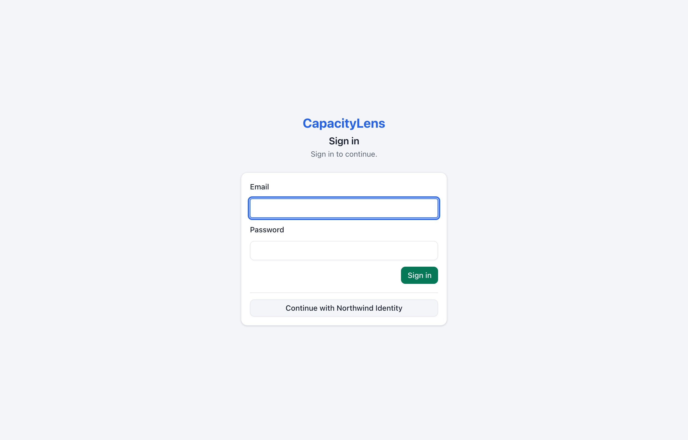
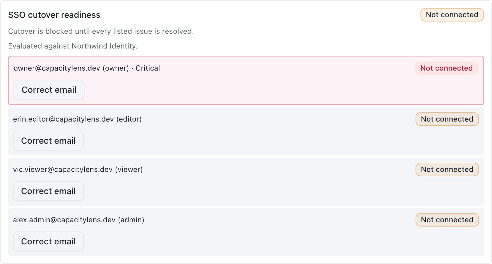
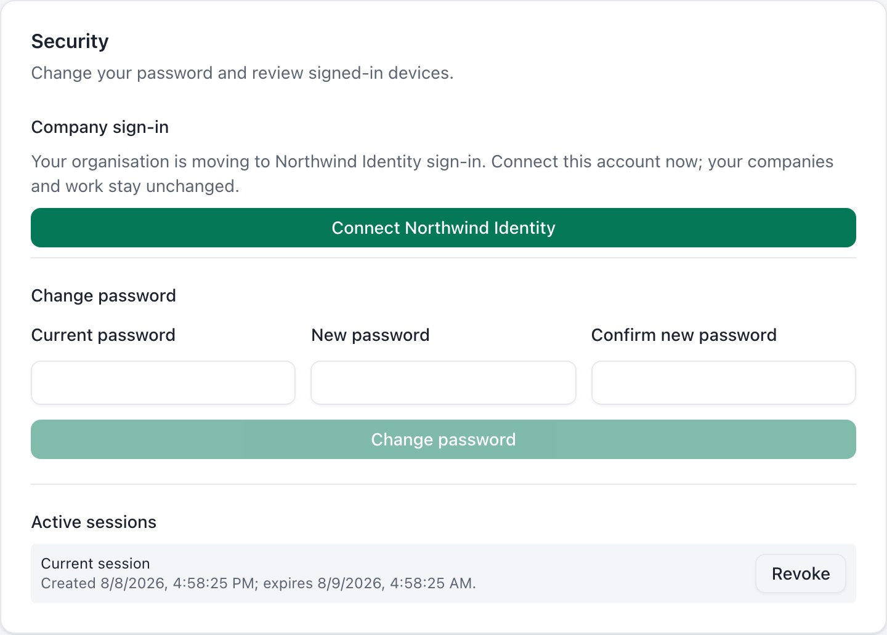
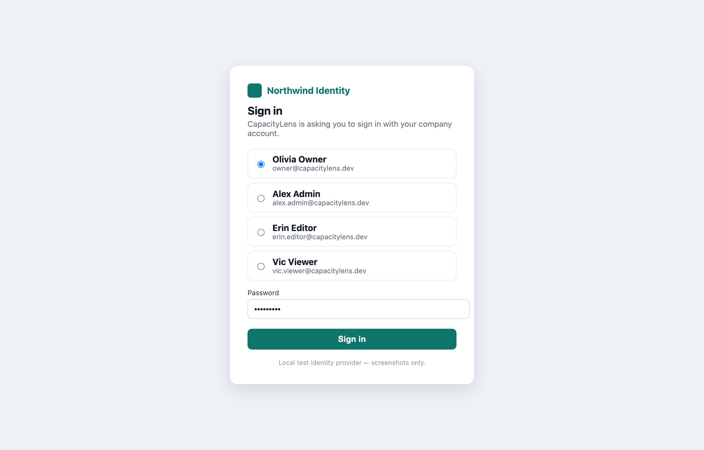
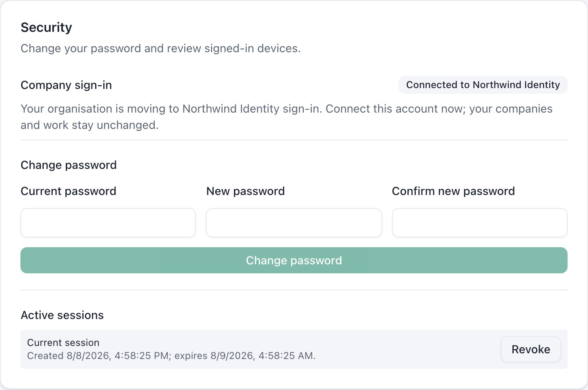
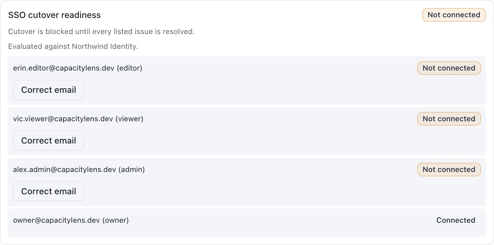
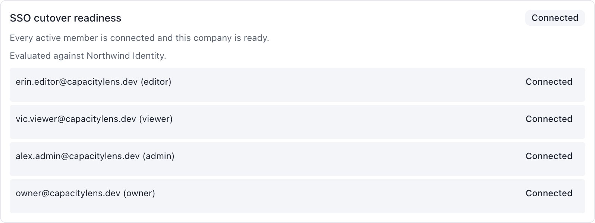
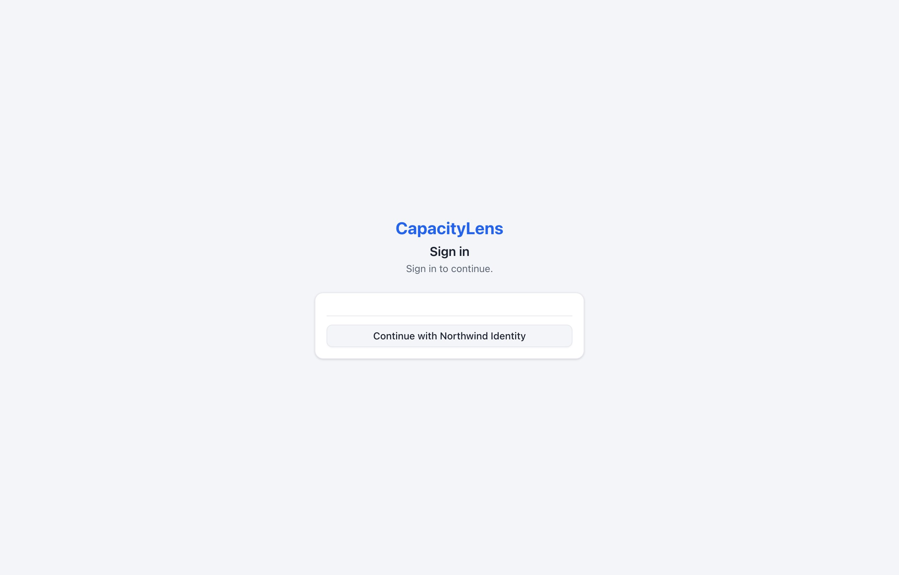
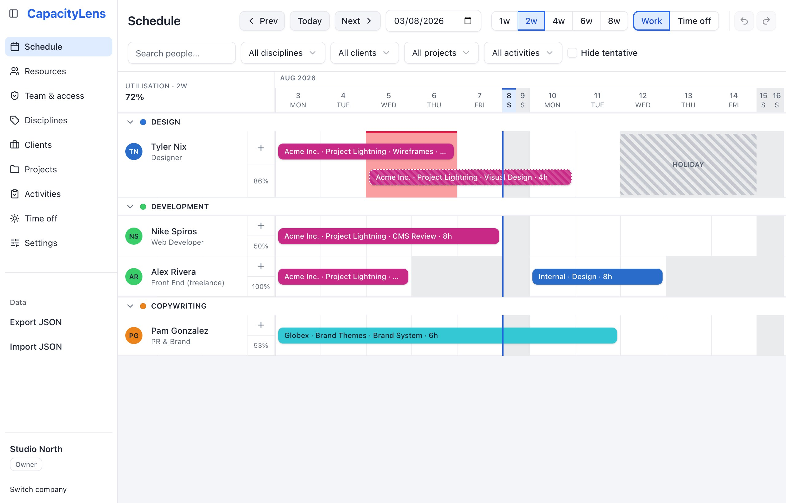

# Move from passwords to single sign-on

You started on email and password because it took five minutes. Now the agency wants
everyone signing in the way they sign into everything else at work — the Google or
Microsoft or Okta account they already have. This page is the whole move, in nine
steps, with a screenshot of every screen you'll see and a copy-paste block for every
setting you'll change.

**Nobody loses anything.** Every person, company, role, Owner seat and every scheduled
hour survives the move untouched. You are changing the front door, not the building.

## Three stages, and you control when each one starts

The trick is the middle stage. You don't flip from passwords to company login overnight
and hope — you run **both doors open at once** for as long as you like, let everyone
connect themselves, and only close the password door when the app tells you every
single person is through.

**Where you are: passwords only.** Profile `self-hosted-password`. Everyone signs in
with email and password; no company login is connected. Password door open.

**The safe middle: both doors open.** Profile `self-hosted-mixed`, mode `password`.
People still sign in with their password, and each person connects their own company
login account when they're ready. Stay here for days or weeks — there's no deadline.
Password door open, company login door open.

**Where you land: company login only.** Profile `self-hosted-sso-only`, mode `sso`.
The password form is gone. Passwords are kept but dormant — that's your way back. New
invitations must go through company login. Company login door open.

You can stop at the middle stage forever if you want to. Mixed mode is a supported way
to run CapacityLens, not a temporary hack — some agencies stay there permanently so
contractors keep passwords while staff use company login.

::: tip The one thing that trips everyone up
CapacityLens matches a person to their company login by _having them prove it
themselves_, while signed in with their password. It never guesses from the email
address. That's deliberate: the address someone signed up with and the address their
company login knows them by often barely resemble each other.

There is one rule you can't dodge: at the moment someone connects, the email their
company login reports must be _identical_ to their CapacityLens sign-in email. If they
differ, you fix the CapacityLens side with a button ([step 5](#step-5)) and they try
again. Nobody has to change anything on the company login side.
:::

## Before you touch anything

| You need                          | Why                                                                                                | Where it comes from                                                                                                 |
| --------------------------------- | -------------------------------------------------------------------------------------------------- | ------------------------------------------------------------------------------------------------------------------- |
| A database backup                 | Your undo button. Take it before [step 1](#step-1) and again at [step 7](#step-7).                 | All your data lives in one file, `capacitylens.db`. Copy it while the app is stopped.                               |
| A way back to today's version     | If you change your mind, you want to start exactly what you're running right now.                  | Don't delete or overwrite whatever you installed from — the download, or the version tag if you run it in Docker.   |
| A login app in your company login | This is what lets CapacityLens hand people over to Google (or Microsoft, or Okta) and back.        | Ten minutes in your provider's admin screens. See [Set up your company login](/company-login/set-up-company-login). |
| Three values from it              | The app's own ID and password, plus the address CapacityLens fetches the rest of the details from. | Shown when you create the login app. Keep the secret one somewhere safe.                                            |
| One address pasted back in        | Where your provider sends people after they've signed in. Without it, the very first click fails.  | `https://your-capacitylens-address/api/auth/oauth2/callback/sso`                                                    |
| A quiet hour                      | [Steps 7–9](#step-7) are the disruptive window; [step 8](#step-8) signs everybody out, once.       | Friday evening is traditional.                                                                                      |

### Do the company login part first

Three of the things in that table come out of the system your staff already sign into
for their email — Google Workspace, Microsoft 365, Okta, whatever yours is. Setting
that up is a ten-minute job of clicking through admin screens, and it has nothing to do
with the move itself, so it's written up on its own page: [Set up your company
login](/company-login/set-up-company-login). Pick your provider, follow the clicks, and
come back with three values.

Come back here when you have them. If someone has already set that up for you, you can
skip straight on.

## Nine steps, in order

Steps 1–7 are safe and reversible, and nobody is signed out. [Step 8](#step-8) is the
point of no easy return — so [step 6](#step-6) makes the computer prove you're ready
before you get there.

Each heading below says who does it. **Operator** means whoever can restart the app and
edit its settings file. **Owner / Admin** means someone signed in to CapacityLens with
those permissions. One step is for everybody.

### 1. Back up the database {#step-1}

_5 minutes · Operator_

Stop the app, copy its data file somewhere safe, and label the copy "before SSO".
Everything CapacityLens knows — every person, company and scheduled hour — lives in
that one file. Also keep hold of whatever you installed the current version from: going
back means starting yesterday's version again, so don't throw yesterday away.

```bash
# with the server stopped
cp /var/lib/capacitylens/capacitylens.db \
   /var/lib/capacitylens/backups/before-sso-$(date +%F).db
```

::: warning
Copy the file while the server is **stopped**. A live copy can miss recent writes that
are still sitting in a temporary side-file next to it.
:::

### 2. Open the second door {#step-2}

_10 minutes · Operator_

Add the six company-login settings you collected, and change the profile line to
`self-hosted-mixed`. Leave the mode as `password` — that line is what keeps the
password door open. Then restart.

```dotenv
# --- what you already have, unchanged ---
SMALLSASS_ACCOUNT_MODE=password
SMALLSASS_ACCOUNT_SECRET=<your existing 32+ byte secret>
SMALLSASS_ACCOUNT_PUBLIC_URL=https://planning.your-agency.com

# --- changed ---
SMALLSASS_ACCOUNT_DEPLOYMENT_PROFILE=self-hosted-mixed

# --- new: your company login ---
SMALLSASS_ACCOUNT_OIDC_CLIENT_ID=capacitylens
SMALLSASS_ACCOUNT_OIDC_CLIENT_SECRET=<from your secret manager>
SMALLSASS_ACCOUNT_OIDC_ISSUER=https://identity.your-agency.com
SMALLSASS_ACCOUNT_OIDC_DISCOVERY_URL=https://identity.your-agency.com/.well-known/openid-configuration
SMALLSASS_ACCOUNT_OIDC_SCOPES=openid profile email
SMALLSASS_ACCOUNT_OIDC_LABEL=Northwind Identity
```

`LABEL` is just the words on the button your people will click, so use the name they'd
recognise — "Northwind Identity", "Google", "Company login".

::: warning Get the [issuer](/reference/glossary#issuer) line right first time, then leave it alone
The first successful start ties this installation to that one company login, and every
connection your people make afterwards is filed against it. Changing the issuer later
cuts every one of them loose.
:::

Restart and load the sign-in page. You should now see **both** doors — the ordinary
email and password form, and a button for your provider:



Mixed mode. Everyone keeps signing in exactly as they did yesterday — the new button is
there for the linking ceremony, not for signing in yet.

#### What if the server refuses to start?

Good — that's the point. It checks your provider settings before it accepts a single
request. The usual causes: the discovery URL doesn't resolve, the issuer in the
discovery document doesn't exactly match `SMALLSASS_ACCOUNT_OIDC_ISSUER`, one of the
three things it asks for is missing, or your provider is set to the weak way of signing
(HS256) instead of the normal one. Fix the setting it names and start again. Nothing has
changed in the database yet.

You don't need `SMALLSASS_ACCOUNT_OIDC_BOOTSTRAP_EMAILS` here. That's for a brand-new
empty install with nobody in it. You already have people.

### 3. See who's connected {#step-3}

_2 minutes · Owner / Admin_

Sign in with your password as usual, and go to **Team & access**. There's a new panel:
**SSO cutover readiness**. Right now it will be a wall of "Not connected", and that's
exactly what it should look like on day one.



Every active member of this company, and whether they've connected. The Owner is
outlined in red and marked **Critical** — if the Owner can't get in after cutover,
nobody can fix it from inside the app.

This panel is your progress bar for the whole project. Check it whenever you like. It
updates as people connect.

### 4. Everyone connects their own account {#step-4}

_2 minutes each · Every member_

This is the part your people do, and it's the part you can't do for them — that's the
security property. Send them this: _"Go to Settings, find Company sign-in, click
Connect."_



Settings → Security → Company sign-in. One button.

They get sent to your company login page, sign in there the way they always do, and
come straight back.



Your own company login page — whatever that looks like for you, including any
two-factor prompt.



Done. That person is ready for cutover.

::: warning If they see "This identity-provider account is already connected to a different person"
Someone else already connected this exact company login account — usually a shared
login, or a colleague who clicked Connect on the wrong CapacityLens profile. The member
sees this on their own screen, word for word: _"This identity-provider account is
already connected to a different person. Ask an administrator to repair the existing
link."_ They can't fix it themselves. On your side, the readiness panel shows the same
problem as **Provider account claimed twice** against the person who connected first —
see [step 5](#step-5) for how to work out which link is right and remove the other one.
:::

And the readiness panel ticks over:



Owner connected. Do the Owner first — it's the one person who genuinely can't be
recovered from inside the app.

::: tip Three small things worth knowing
**Connecting doesn't sign them in anywhere new.** No new session is created. They
finish where they started.

**They may be asked for their password again first.** If they signed in more than
fifteen minutes ago, CapacityLens re-checks that it's really them before letting them
attach an identity. That's intentional.

**Nobody is locked out while this happens.** Take a week. Chase the stragglers in
Slack. The app runs completely normally throughout.
:::

### 5. Fix the mismatches {#step-5}

_Varies · Owner / Admin_

Some people won't go green on the first try, and the panel tells you why in plain
words. Here's every message you can get and what to do about it:

| The panel says                 | What actually happened                                                                 | What you do                                                                                                                          |
| ------------------------------ | -------------------------------------------------------------------------------------- | ------------------------------------------------------------------------------------------------------------------------------------ |
| Not connected                  | They haven't done [step 4](#step-4) yet.                                               | Nudge them. If their CapacityLens email is wrong or stale, use **Correct email**.                                                    |
| Reconnect to verify            | Your company login didn't confirm that the email address is a real, verified one.      | Mark the address verified in your company login, then **Remove link** and have them connect again.                                   |
| Multiple provider links        | Two identities are attached to one person — usually a half-finished earlier attempt.   | **Remove link** on the wrong one, keep the right one.                                                                                |
| Provider account claimed twice | Two CapacityLens people connected to the same company account. Shared logins, usually. | Work out from your company login which person is which, **Remove link** from the wrong one, and have them connect their own account. |
| Unsupported provider link      | They connected through a different provider (a social login), not the company one.     | **Remove link**, then have them connect the company provider.                                                                        |
| Identity record missing        | A membership with no identity behind it. Rare, and not self-service.                   | See the repair commands in [When something goes wrong](/self-hosting/incidents).                                                     |

**Correct email** is the button for the situation the whole cutover usually hinges on:
someone signed up as `dave@agency.com` but the company login knows him as
`david.smith@agency.co.uk`. Change the CapacityLens side to match, and he can connect.

::: warning
Both repair buttons **sign that person out** on purpose. They sign back in with their
password and connect again. Tell them before you click, or you'll get a message asking
why they got kicked out.
:::

Both buttons only exist while you're in mixed mode. Once you're company-login-only
they're gone — repairs from there are stopped-server commands, which is the deliberate
difficulty of an unlocked front door.

Keep going until it looks like this:



"Every active member is connected and this company is ready." That's per company — if
you host several, every one of them needs to reach this state.

Someone left the agency? There's no "deactivate" state in CapacityLens. Remove them in
Team & access and they stop blocking.

### 6. Let the computer check your work {#step-6}

_1 minute · Operator_

The panel shows one company at a time. This command checks _everything_ — every
company, plus integrity problems the panel can't show you. Run it with the server
still up, pointing at your database file.

```bash
pnpm --filter capacitylens-server cutover:preflight -- /absolute/path/to/capacitylens.db
```

**If you are ready**, it prints a report starting with `"ready": true` and exits 0:

```json
{
  "ready": true,
  "provider": {
    "id": "sso",
    "label": "Northwind Identity",
    "kind": "oidc",
    "experimental": false
  },
  "workspaces": [
    {
      "workspaceId": "a-studio",
      "workspaceName": "Wayne Enterprises",
      "ready": true,
      "members": [
        {
          "email": "owner@example.com",
          "displayName": "Lucius Fox",
          "role": "owner",
          "linked": true,
          "blocking": false,
          "reason": "ready"
        }
      ],
      "issues": []
    }
  ],
  "issues": []
}
```

**If you are not ready**, it names every person standing between you and cutover, and
exits non-zero:

```json
{
  "ready": false,
  "issues": [
    {
      "reason": "member_not_linked",
      "message": "owner@example.com (owner) is not ready for strict OIDC cutover (member_not_linked).",
      "blocking": true,
      "critical": true,
      "workspaceId": "a-studio"
    },
    {
      "reason": "member_not_linked",
      "message": "alex.admin@example.com (admin) is not ready for strict OIDC cutover (member_not_linked).",
      "blocking": true,
      "critical": false,
      "workspaceId": "a-studio"
    }
  ]
}
```

::: warning A non-zero exit means stop. Not "probably fine".
Go back to [step 4](#step-4) and [step 5](#step-5), fix what it named, and run it
again. There is no override flag, and that is on purpose — the failure mode it prevents
is locking your entire agency out of its own planning tool on a Friday night.
:::

### 7. Stop the server and back up again {#step-7}

_5 minutes · Operator_

Stop CapacityLens and stop traffic reaching it. Take a **second** backup and label it
"cutover point". This is the snapshot you'd restore to if something truly
surprising happens — the step-1 backup is now hours or weeks out of date.

```bash
cp /var/lib/capacitylens/capacitylens.db \
   /var/lib/capacitylens/backups/cutover-point-$(date +%F).db
```

### 8. Close the password door {#step-8}

_2 minutes · Operator_

Two lines change. Everything else — including all the company-login settings — stays
exactly as it is.

```dotenv
# --- changed ---
SMALLSASS_ACCOUNT_DEPLOYMENT_PROFILE=self-hosted-sso-only
SMALLSASS_ACCOUNT_MODE=sso

# --- everything below is unchanged ---
SMALLSASS_ACCOUNT_OIDC_CLIENT_ID=capacitylens
SMALLSASS_ACCOUNT_OIDC_CLIENT_SECRET=<from your secret manager>
SMALLSASS_ACCOUNT_OIDC_ISSUER=https://identity.your-agency.com
SMALLSASS_ACCOUNT_OIDC_DISCOVERY_URL=https://identity.your-agency.com/.well-known/openid-configuration
SMALLSASS_ACCOUNT_OIDC_SCOPES=openid profile email
SMALLSASS_ACCOUNT_OIDC_LABEL=Northwind Identity
```

Leave open signup unset. Now start the server.

::: tip Leftover open-signup setting from an earlier install
If you (or a previous operator) ever set `SMALLSASS_ACCOUNT_ALLOW_OPEN_SIGNUP=1`, take
it out before this step. Company-login-only mode refuses to start while it's on — the
terminal says `capacitylens-server: refusing to start — The SSO-only deployment profile
forbids open signup.` Delete or unset that line and start the server again.
:::

On this first company-login-only start, CapacityLens checks readiness one final time
_before_ it changes anything. If it isn't satisfied, it refuses to start and tells you
who to fix — the same names, at the terminal. It's printed as one single line that
wraps in your terminal, not separate lines — one sentence per blocked person, all
space-joined:

```text
capacitylens-server: refusing to start — SSO cutover readiness failed. owner@example.com (owner) is not ready for strict OIDC cutover (member_not_linked). alex.admin@example.com (admin) is not ready for strict OIDC cutover (member_not_linked).
```

If you see that, put the two lines back to `self-hosted-mixed` / `password`, restart,
and finish [step 4](#step-4) and [step 5](#step-5). Nothing has been changed.

::: warning The point of no easy return
If readiness is satisfied, the server goes ahead and — in one atomic move — it:

- signs **everybody** out, including you;
- cancels every pending password-reset and verification link;
- writes a permanent marker recording that this installation has cut over;
- records an audit event, `identity.sso_cutover_activated`.

That mass sign-out is the whole point: it guarantees no session that was created
behind a password outlives the password door. It happens exactly once. Later restarts
don't sign anyone out.
:::

### 9. Check it, properly {#step-9}

_10 minutes · Operator_

Load the sign-in page. The password form is gone:



Company login only. One door.

Sign in through the provider. You should land straight in the schedule, with your role
intact:



Same company, same Owner badge, same allocations, same everything. Only the front door
changed.

Before you tell the agency it's done, tick these off:

- Owner signs in and can still reach Team & access;
- every company you host opens, if you host more than one;
- a test invitation works end to end (see the note below);
- signing someone out from Team & access still works;
- one ordinary member confirms they got in without you helping.

::: tip New joiners from now on
An invitation must pre-authorise the exact email address the company login will
report. There's no "sign up with a password" path any more, so a typo in the
invitation is a person who can't get in.
:::

## Your way back

Cutover keeps everybody's password. It's dormant, not deleted. That is deliberately
your escape hatch, and using it is two lines and a restart.

::: warning Break glass — then restart

```dotenv
SMALLSASS_ACCOUNT_DEPLOYMENT_PROFILE=self-hosted-mixed
SMALLSASS_ACCOUNT_MODE=password
```

:::

Stop the server, change those two lines back, start it again. The password form
returns and everyone who had a password before cutover can sign in with it. Your
company-login settings can stay exactly where they are — you're back in mixed mode,
both doors open, which is a perfectly good place to sit while you work out what
happened.

### Two things that limit that escape hatch

| Situation                                  | What to do                                                                                                                                                                                                                                                                                   |
| ------------------------------------------ | -------------------------------------------------------------------------------------------------------------------------------------------------------------------------------------------------------------------------------------------------------------------------------------------- |
| People who joined _after_ cutover          | They never had a password, so reverting doesn't give them one. Once you're back in mixed mode, issue each of them a password reset. The longer you run company-login-only, the more of these there are — rollback gets less complete over time, so don't treat it as a permanent safety net. |
| The sole Owner has lost their password too | Stop the server and run `pnpm --filter capacitylens-server reset:owner-password`. It sets a credential; it does _not_ create a session. Restart in mixed mode, redeem the link, then sign in.                                                                                                |

### Your company login is down

Restrict traffic if you need to, roll back to mixed mode using the two lines above, and
write down that you did. Go back to company-login-only only once the provider is
healthy _and_ preflight passes again — it's the same [step 6](#step-6) command, and
it's just as binding the second time.

### Something the buttons can't fix

A handful of states need the server stopped and an explicit command: a duplicate
provider subject that predates the migration, an account with no membership left, a
company whose Owner is gone. Those are the [cutover repair
commands](#cutover-repair-commands) below, each with its own guard rails. Never edit the
sign-in tables by hand — you'd skip the session cleanup and the audit trail, and
you'd be the only person who knows. For incidents unrelated to cutover, see [When
something goes wrong](/self-hosting/incidents).

## Cutover repair commands

Everything above is self-service, from inside the app. These four situations are not —
they need the server stopped and one exact command, because by the time you need them
you're past the point where a button in Team & access can safely make the change. All
four take SQLite's exclusive lock, require `--confirm-server-stopped`, refuse to run if
the situation they expect has changed underneath them, and record an operator audit
event in the same transaction as the fix. Never edit the sign-in tables directly
with SQL — these commands exist so every repair keeps its session cleanup and audit
trail.

Two of these commands (below) want a company's workspace id, not its name. The
[preflight command from step 6](#step-6) already shows it to you — run it again and
look at the `workspaceId` field for the company you're fixing. In the example output in
step 6, `"workspaceId": "a-studio"` next to `"workspaceName": "Wayne Enterprises"` means
`a-studio` is what you'd pass to these commands for Wayne Enterprises.

### A wrong provider link that predates the migration

The uniqueness migration that ships with company login refuses to start if it finds an
existing `(providerId, subject)` duplicate — it won't silently pick a winner for you. If
that's blocking you, restore or start the prior image in mixed mode if you need to, and
work out from your identity provider's own records, together with the affected people,
which local link is the wrong one. Then, with the server stopped, remove only the exact
email/subject pair you've confirmed:

```bash
pnpm --filter capacitylens-server cutover:repair -- \
  /absolute/path/to/capacitylens.db remove-provider-link \
  wrong-local-email@example.com workforce exact-provider-subject --confirm-server-stopped
```

This requires the mixed profile, and requires one exact local email, provider id,
subject and stored row to match before it changes anything — so it can remove one wrong row out
of a multi-link mess, and it can repair a link to a named social provider even if that
provider isn't enabled any more. Unlike the live Team & access repair, this
explicitly-stopped-server command is allowed to remove an unusable _final_ provider row,
so a critical readiness blocker stays recoverable — just make sure there's a password
recovery path in mixed mode first (use the stopped-server Owner reset in [When something
goes wrong](/self-hosting/incidents#the-sole-owner-has-lost-their-password) if the Owner
is the one affected). It revokes that person's sessions in the same transaction as the
deletion. Restart the current release in mixed mode afterward, then have the correct
person link normally.

### A person with no company access left

Someone with a provider link or a password but no active membership anywhere can't reach
the self-service linking ceremony, and blocks cutover just by existing. Before running
this, prove the person has no remaining company access and shouldn't be
re-added. Then, with the server stopped, remove that installation-local orphan:

```bash
pnpm --filter capacitylens-server cutover:repair -- \
  /absolute/path/to/capacitylens.db deprovision-credential-orphan \
  former-person@example.com --confirm-server-stopped
```

This refuses to run if the person still has an active membership, any provider link,
or more than one password on file. It doesn't call or change anything at your
identity provider — it only touches this installation's local record.

### A company with no Owner

An ownerless company can only be repaired by promoting an existing active member —
identify them by the exact company id and their normalised sign-in email:

```bash
pnpm --filter capacitylens-server cutover:repair -- \
  /absolute/path/to/capacitylens.db assign-workspace-owner \
  company-id member@example.com --confirm-server-stopped
```

### A company with nobody left in it

::: warning This one is destructive
A company with zero active members can't be opened by anyone, and its data has nowhere
to go from here. After you've preserved a backup and confirmed the company should be
permanently gone, this erases it and every row scoped to it:

```bash
pnpm --filter capacitylens-server cutover:repair -- \
  /absolute/path/to/capacitylens.db erase-empty-workspace \
  company-id --confirm-server-stopped
```

If you need it back, the only way is restoring the cutover-point backup from [step
7](#step-7) — there's no undo inside the app.
:::

Both company-level commands refuse to run if the condition you checked (no Owner, or no
active members) has changed in the meantime, and both commit their operator audit event in
the same transaction as the change.

## Questions people actually ask

### Do people lose their work, their companies, or their role?

No. Not one row. Cutover changes how someone proves who they are; it doesn't touch who
they are, what they're a member of, or anything on the schedule.

### Our company-login emails look nothing like our CapacityLens emails. Is this a nightmare?

It's the normal case, and it's what [step 5](#step-5) exists for. CapacityLens never
matches people by email — each person proves the connection themselves while signed in.
The only requirement is that the two addresses match _at the moment they connect_, and
**Correct email** lets an Admin fix the CapacityLens side in seconds. After the
connection is stored, the emails are free to diverge again: the link is held by the
provider's subject identifier, not the address.

### Can we just stay in mixed mode?

Yes, indefinitely. It's a supported posture, not a migration state. Plenty of agencies
want staff on company login and freelancers on passwords, and that's exactly what mixed
mode is.

### How long can we take?

As long as you like. Steps 2 to 6 have no clock on them and no user impact. Only [step
7](#step-7) onwards has a disruptive moment, and it's one mass sign-out.

### Will everyone be signed out?

Once, at the first company-login-only start. Everyone signs back in through the
provider. After that, restarts are uneventful.

### Do we have to do all our companies at the same time?

Yes. The profile is per installation, not per company, and preflight checks every
company. Every company on the server has to be ready before any of them can cut over.

### Can we skip the preflight if we're confident?

You can skip running it yourself, but you can't skip it — the server runs the same
check at startup and refuses to proceed. There's no override. Better to see the refusal
in a terminal at your own pace than in a failed deploy.

### What about the "Continue with Google/Microsoft/GitHub" style buttons?

Those are separate, experimental, named social providers. After cutover they can let an
existing person sign in, but they can't create anyone new, and invitations always
require the company provider. If you enable one, check its two-factor and
account-recovery settings as carefully as your main login's — it's a door into the same
building.

### Are passwords deleted at cutover?

No — kept, but dormant. That's what makes rollback possible. If you want them genuinely
gone, that's a separate decision to make deliberately once you're confident you'll
never roll back.

## What's next

[How sign-in works](/company-login/) covers the concepts behind this move, or see
[When something goes wrong](/self-hosting/incidents) for the operator repair commands
this page refers to.
