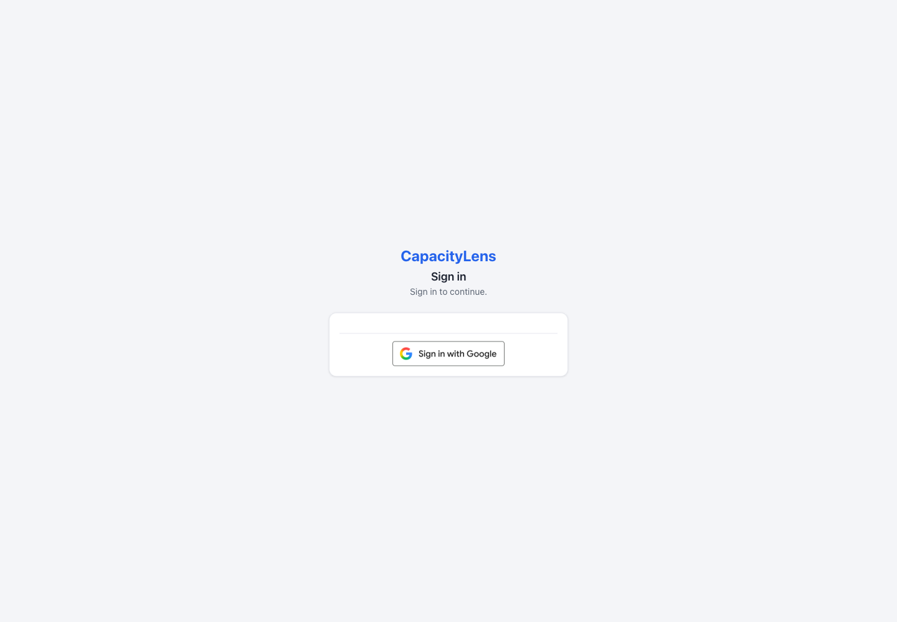

# Require company sign-in



CapacityLens supports Google Workspace and Microsoft Entra ID as company sign-in
providers. You can run them alongside passwords, or require people to use a
configured company provider. GitHub is an experimental option in mixed mode and
cannot satisfy company-provider-required sign-in.

## Configure and check a provider

Choose Google, Microsoft, or both. Follow [Set up Google or Microsoft
sign-in](/company-login/set-up-company-login) to register each application,
register its exact callback address, and set its server credentials. Microsoft
also requires a tenant-specific Entra registration and working SMTP settings for
first connections that need mailbox proof.

Set `SMALLSASS_ACCOUNT_MODE=password-and-sso` while both password and company sign-in
should remain available. Restart CapacityLens and check that the expected
provider buttons appear. Complete a sign-in with an allowed account before
asking teammates to connect.

## Connect existing accounts

Each person signs in to their existing CapacityLens account, opens **Account →
Security**, and chooses **Connect Google** or **Connect Microsoft** for the
configured provider. The local email must already be verified, and the provider
must prove the same address. Microsoft may send a one-time link to that mailbox;
open and confirm it in the browser that started the connection within 15
minutes. Returning Microsoft sign-in uses the saved identity and does not repeat
mailbox proof.

CapacityLens never combines accounts just because their email addresses match.
Explicitly connecting the provider preserves the existing person's memberships,
role and scheduled work. New people still need an unused, addressed invitation;
provider sign-in alone does not admit them to a company.

## Require a company provider

Keep `SMALLSASS_ACCOUNT_DEPLOYMENT_PROFILE=self-hosted-mixed` while preparing
the change. With Google, Microsoft, or both configured, run the read-only
all-company check against the current database:

```bash
pnpm --filter capacitylens-server cutover:preflight -- /path/to/capacitylens.db
```

The check accepts a verified connection through either configured company
provider, including when both Google and Microsoft are enabled. Every existing
sign-in account needs a verified company-provider connection, and each company
needs active members and an active Owner. Open password signup must be disabled.

Read the top-level `ready` result and `issues` list to decide whether you can
switch off passwords. Each issue includes a stable reason code and an explanation.
The same provider-connection and company checks run when the server starts.
The `diagnostics` list contains repair details for each configured company
provider, whether you have one or several. These provider-specific details may
flag a missing connection to one provider even when another provider satisfies
the overall check; they do not add restrictions to the top-level decision.
Resolve the blocking issues while still in mixed mode, then rerun the check
before changing the profile.

The preflight result is evidence for the operator; it does not switch modes.
If a finding needs identity or membership repair, the guarded
`cutover:repair` command supports narrowly scoped operations: removing one
exact provider link, deprovisioning a credential-only or providerless identity
that has no active company memberships, assigning an existing active member
as Owner of an ownerless company, or erasing a company with no active members.
Some operations permanently remove identity or company data. Preserve a backup
and follow the command's exact target checks; do not use it to work around a
preflight finding you do not understand. It locks and checks the database,
refuses unless the server is stopped and the exact `--confirm-server-stopped`
flag is supplied, and records successful repairs in the audit outbox. The
command requires the mixed profile, password mode and a current supported
schema; it refuses ambiguous identities and unsafe targets.

After preflight reports ready, set:

```dotenv
SMALLSASS_ACCOUNT_MODE=sso-only
SMALLSASS_ACCOUNT_DEPLOYMENT_PROFILE=self-hosted-sso-only
```

Keep the credentials for at least one company provider configured. On restart,
CapacityLens requires a company-provider session for sign-in and invitation
acceptance. Password sign-in and GitHub cannot satisfy this requirement. There
is no in-app member-readiness panel. Verify provider access directly before
selecting this mode; CapacityLens also checks that the configured
company-provider requirement is valid when it starts.

## Restore password sign-in

If a provider becomes unavailable or a person cannot use their connected
identity, set both values and restart the server:

```dotenv
SMALLSASS_ACCOUNT_MODE=password-and-sso
SMALLSASS_ACCOUNT_DEPLOYMENT_PROFILE=self-hosted-mixed
```

This restores the password entrance for local-password accounts while leaving
company sign-in available. It does not reset a password or change provider
connections. Use the ordinary password-reset process for a lost password. A
sole Owner who cannot use an available sign-in method can use the stopped-server
[Owner password recovery procedure](/self-hosting/incidents#the-sole-owner-has-lost-their-password).

For provider registration, invitations, linking and Microsoft mailbox proof,
see [Set up Google or Microsoft sign-in](/company-login/set-up-company-login).
