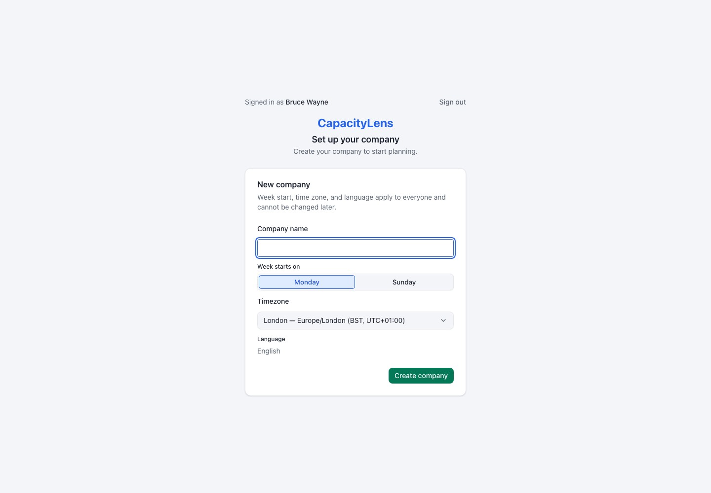
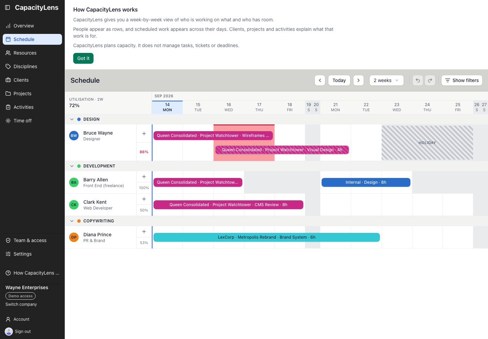

# Make your first schedule useful

This guide takes the first [Owner](/reference/glossary) from a new installation to a useful
schedule. Allow about ten minutes after the server is running.

## Prerequisites

- Finish one of the [installation routes](/getting-started/install).
- In [password mode](/reference/glossary#password-mode), get the one-time Owner setup value from
  the person who installed CapacityLens.
- In [company login](/reference/glossary#company-login) mode, ask the operator to add your verified
  email to the first-owner bootstrap list and configure the provider before you begin.

## Steps

1. **Set up the first Owner.** Open your CapacityLens address and choose the sign-in route that
   matches the installation.

   - In **password mode**, enter **Your name**, **Work email**, **Create a password** and the
     **Owner setup token** supplied during installation. This creates your personal sign-in for
     this installation and gives you the Owner role. The token authorises first-owner setup; it
     does not create a company. You can invite other people later.
   - With **company login** configured, choose the **Continue with _your provider_** button and use
     the verified email on the operator's first-owner bootstrap list. This route creates or signs
     in the first Owner through your organisation's provider, so it does not use a CapacityLens
     password or the password-mode setup token.

   CapacityLens closes public registration as soon as this succeeds. Later teammates join through
   an [invite](/reference/glossary).

   ::: warning
   Do not rely on `admin@admin.admin`. That development-only login is disabled in production.
   The personal sign-in you create here is the first production Owner.
   :::

2. **Create your company.** CapacityLens opens **Set up your company** automatically. Enter the
   company name and choose **Week starts on**, **Timezone** and **Language**.

   The company name identifies the company and can be changed later. The three calendar choices
   are shared by everyone and fixed after creation. **Week starts on** controls the first day and
   order of each displayed week. **Timezone** sets the company-wide calendar boundary used for
   **Today** and date-based scheduling; it does not rewrite the date ranges you enter. Working-day
   rules still come from the company's and each person's working days. **Language** is the shared
   display language (English is currently available). Pick the team's conventions before creating
   the company. CapacityLens then opens the empty Schedule.

   

3. **Understand what CapacityLens plans.** Read **How CapacityLens works** above the page. It
   explains that people are rows, scheduled work spans their days, and clients, projects and
   activities say what the work is for. CapacityLens plans capacity; it does not manage tasks,
   tickets or deadlines.

   This explanation does not block the application. Choose **Got it** when finished. You can reopen
   it at any time from **How CapacityLens works** in the sidebar.

   The screenshot below is a populated example that shows where the explanation sits above the
   schedule; a newly created company starts with an empty schedule.

   

4. **Choose how to populate the company.** The **Getting started** panel offers two routes.

   - Choose **Import CapacityLens data** only when you have an export that should replace this
     company's data. Opening Import does not count as progress; the imported records must provide
     the outcomes below.
   - Choose **Set up manually** to work through the three outcomes in the app.

5. **Add someone to the schedule.** Follow that link to **Resources**, then add a person whose
   capacity you want to plan. A [person](/reference/glossary) is a schedulable row. A
   [member](/reference/glossary) is someone who can sign in. They are separate: you can schedule a
   freelancer who never signs in, and inviting a teammate does not automatically add them to the
   schedule.

6. **Add work to schedule.** Open **Activities** and add the work you need.

   - For studio work such as planning, select **Internal**. You do not need a client or project.
   - For shared work, add an **[All projects](/reference/glossary#all-projects)** activity. When you
     allocate it, choose **No specific project** to leave the booking unattributed, or choose an
     active project whose client is also active to attribute that booking. An All-projects booking
     cannot be attributed to an inactive project or client.
   - For project-specific client work, create the active client and project first, then add a
     project activity.

7. **Schedule the first piece of work.** Return to **Schedule**. Click an empty cell on the person's
   row, or drag across several days. Choose the activity and save the [allocation](/reference/glossary).

   The **Getting started** panel closes when all three outcomes exist: a person, coherent work and
   an allocation connecting them. Imported data follows the same rule.

8. **Use the optional paths when they help.** **Review Settings** is useful when your company works
   differently from the defaults. **Invite your team** opens Team & access for an Owner or Admin.
   **Show me around** gives a five-stop tour without changing pages. None of these is required to
   complete the first schedule.

## What's next

See [The schedule](/guide/the-schedule) for day-to-day planning, or [Invite your
team](/getting-started/invite-your-team) when other people need to sign in.
