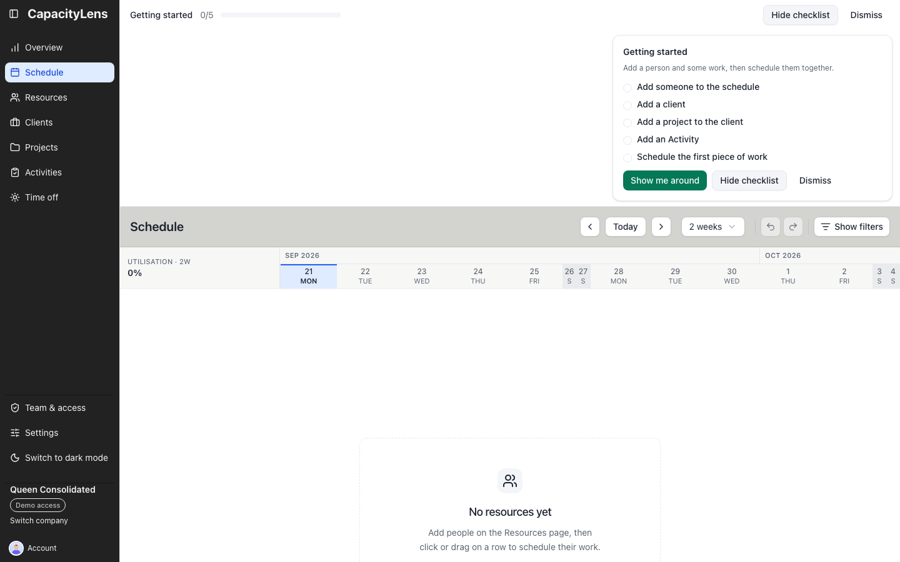

# Choose your first task

## Make your first schedule useful

When a company is new, **Getting started** shows five milestones: add someone to the schedule,
add a client, add a project to that client, add an Activity, and schedule the first piece of work.
Each step completes from the company's records, including imported data. You can create records
in any order. Internal work is available at any time, though it does not complete the client or
project steps.

The 0–5 progress bar appears across the application, including Settings. The checklist opens on
Schedule while setup is incomplete and can be shown or hidden from the bar on any page. At 5/5 it
starts closed, but stays available until an Owner or Admin dismisses it. If work remains, dismissal
asks for confirmation. Dismissing hides
the guidance for everyone in that company. Editors can view and toggle the checklist; Viewers do
not see it.

CapacityLens setup is shared between three people. The technical installer makes the
service available, the Owner creates the company and appoints an Admin, and the Admin
prepares members and scheduling data. One person can hold all three responsibilities,
but you only need the guide for the job you are doing now.

## I want to understand the product

Read [What is CapacityLens?](/getting-started/what-is-capacitylens) for a one-page
explanation, then [Make your first booking](/getting-started/quick-start) in an existing company.

## I am the first Owner

Follow [Owner setup](/owner/). You can appoint an Admin and stop without preparing the schedule.

## I am the Admin

Follow [Admin and settings](/admin/) to invite teammates, add people, choose settings,
prepare work, and make the first booking.

## I am joining an existing team

Follow [Day-to-day usage](/using/) to accept an invitation, read the schedule, and complete
the tasks your role allows.

## I am installing or operating the service

Use [Technical installation](/installation/) for a new service and [Self-hosted
operations](/operations/) after handover.

## What's next

[Choose your guide from the documentation home](/#choose-your-guide).
