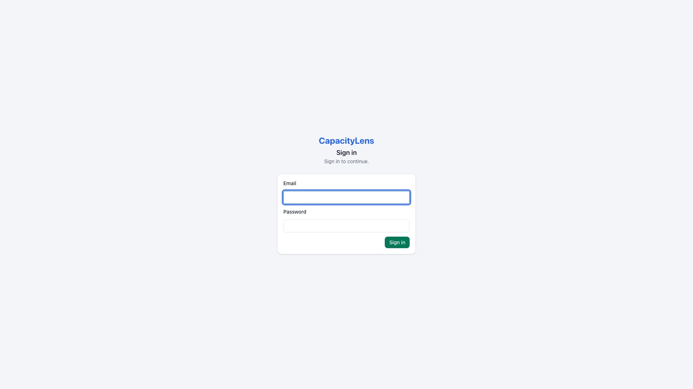
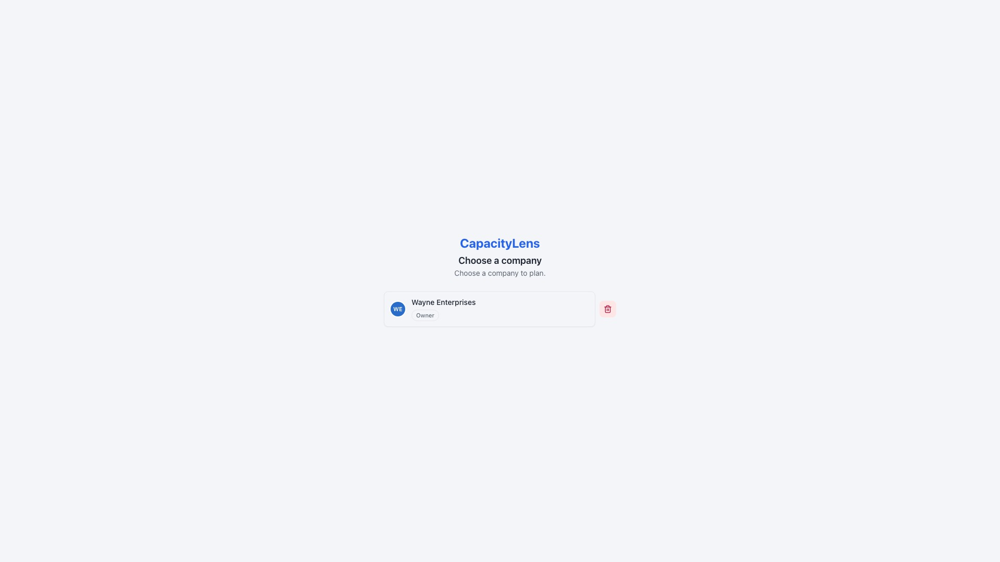
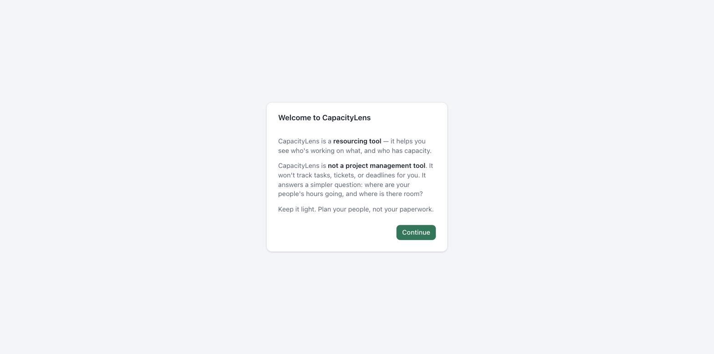

# Install CapacityLens

This is the quick path: four lines of configuration and three screens to a working
install with real sign-in, real persistence, and one [Owner](/reference/glossary). It
takes about five minutes on a machine that already has Docker or Node
installed. For TLS, backups and the full production treatment, see
[Self-hosting](/self-hosting/) once you're past this page.

::: tip
Just want to look around first? [Try the demo](/getting-started/try-the-demo) instead —
no configuration, no install.
:::

## Prerequisites

- Docker, or Node.js with [pnpm](https://pnpm.io) — either way to run the app, covered in
  [Install with Docker](/self-hosting/install-with-docker).
- A way to generate two random strings for the `.env` file. Run
  `openssl rand -base64 48` for each one, or if you don't have `openssl`, use a password
  manager's password generator set to 32 characters or more.

## Steps

1. **Fill in the `.env` file** (~2 minutes). Copy `.env.example` to `.env` and set four
   values:

   ```bash
   SMALLSASS_ACCOUNT_MODE=password
   SMALLSASS_ACCOUNT_SECRET=<random 32+ chars>      # session signing
   SMALLSASS_ACCOUNT_PUBLIC_URL=https://plan.example.com
   SMALLSASS_ACCOUNT_SETUP_TOKEN=<random 32+ chars> # claims the Owner seat, used once
   ```

   All the data lives in one [SQLite](/reference/glossary) file next to the app — there's
   no separate database to install. See
   [Install with Docker](/self-hosting/install-with-docker) for the full walkthrough of
   these settings.

2. **Start the server.** With Docker:

   ```bash
   docker compose up --build -d
   ```

   See [Install with Docker](/self-hosting/install-with-docker) for the full walkthrough,
   including what each service does. Running Node and pnpm directly instead? See
   [Install without Docker](/self-hosting/install-without-docker). Once it's running,
   visit your URL.

3. **Claim the Owner account** (~30 seconds). With an empty database, the sign-in wall
   becomes a "create the owner account" form: name, email, password, and the setup token
   from your `.env`. The moment it succeeds, self-registration closes — nobody else can
   join your instance without an [invite](/reference/glossary). Every later visit shows
   the plain sign-in screen instead.

   

4. **Create your company** (~10 seconds). One field. Creating the company also creates
   its built-in "Internal" client and your Owner [membership](/reference/glossary) in
   the same step.

   

5. **Read the 20-second orientation** (~20 seconds). Once per device, CapacityLens
   explains what it is — and what it isn't.

   

6. **Start planning.** The schedule opens with a Getting Started panel: add clients,
   projects and [people](/reference/glossary), then drag out allocations. No sample data
   is seeded in a real install — what you add is yours.

   

::: warning
Don't rely on `admin@admin.admin`. It's a bootstrap account CapacityLens uses only while
developers are building the app on their own laptop, and it's switched off automatically
the moment you run a real production install like this one. The Owner account you create
in step 3, with your own setup token, is the one that matters — there is no default
password to remember or change.
:::

::: tip
This quick path serves the app on `localhost`, with no TLS certificate. That's fine while
you're kicking the tyres, but before you put this install on the internet for real, read
[TLS and networking](/self-hosting/tls-and-networking). Real deployments set
`CAPACITYLENS_HTTPS=1` once the public origin is genuinely HTTPS — it's not needed yet.
:::

If the page is blank or shows an error instead of the sign-in screen, see
[When something goes wrong](/self-hosting/incidents).

## What's next

[First steps after installing](/getting-started/first-steps) walks through signing in and
finding your way around the schedule.
