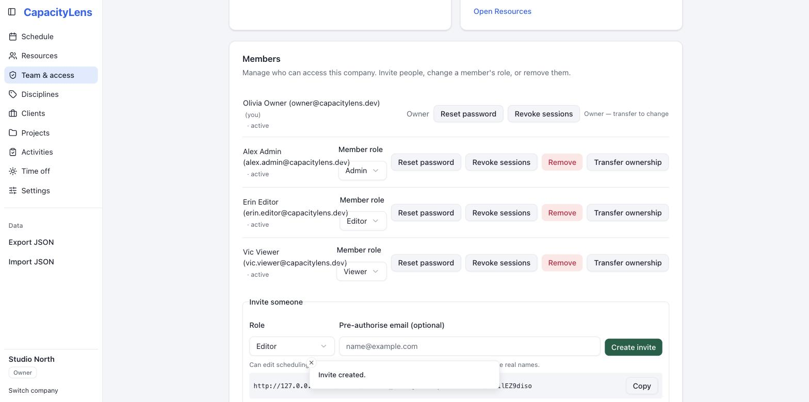
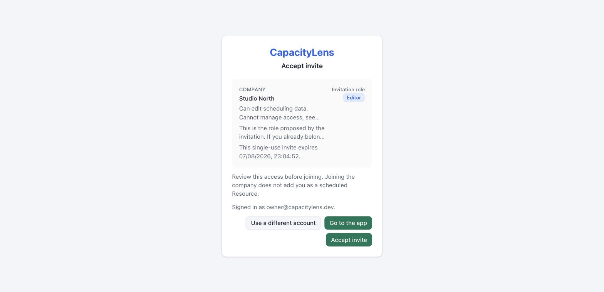

# Invite your team

This page covers getting someone else into CapacityLens: creating an invite, what they
see, and how they accept it. It takes about ten seconds on your side and roughly thirty
seconds on theirs. It's optional — a solo [Owner](/reference/glossary) can finish setting
up the schedule without inviting anyone, and can come back to this page later.

CapacityLens sends no invitation emails. You create a single-use link and paste it
wherever your team already talks — Slack, a text message, whatever's fastest.

::: tip
Inviting someone doesn't put them on the schedule, and adding someone to the schedule
doesn't give them a sign-in. These are separate records — see [Roles and
permissions](/getting-started/roles-and-permissions) for why.
:::

## Prerequisites

- You need the Owner or [Admin](/reference/glossary) role to invite people. A Viewer or
  Editor can still open **Team & access** and see their own role and what it allows —
  they just see a note there that an Owner or Admin handles invitations, instead of the
  "Invite someone" panel. See [Roles and
  permissions](/getting-started/roles-and-permissions).

## Create an invite

1. Open **Team & access**. Your own access is summarised at the top of the page; select
   **See full capabilities** if you want the full list of what your role can and can't do.

   

2. Choose a role in the "Invite someone" panel. The consequences of that role are spelled
   out in plain language underneath it, and you can optionally pre-authorise a specific
   email address.

3. Copy the one-time link. It's shown exactly once — the server keeps only a hash of it —
   so copy it now and send it to the [person](/reference/glossary).

   

## What the invitee sees

The invite link opens outside the normal sign-in wall, so the recipient can safely
preview what they're joining before anything happens: your company name, the proposed
role, what that role can and can't do, and when the link expires. Just opening the link
never changes [membership](/reference/glossary).

From there:

- Someone who already has a CapacityLens sign-in signs in and explicitly accepts the
  invite.
- Someone new creates a password sign-in and accepts in the same step.

Either way, they land directly on your schedule with their role visible.

## Pending invites

Invites that haven't been accepted yet stay listed on **Team & access** as pending, in
their own panel below your members. Owners and Admins can see this list; other roles only
see their own access.

## Managing someone who already joined

Your members are listed in a table showing their name, role and last sign-in. Two controls
sit at the end of each row:

- The **pencil** changes that person's role, with the consequences spelled out before you
  save.
- The **gear** opens the rest: reset their password, sign them out everywhere, disable or
  archive them, or remove them from the company.

**Disable** and **archive** both stop someone opening the company immediately while
keeping their role and history — use them when someone leaves, goes on long-term leave, or
you need access shut off right now. They stay in the list with a badge, and **Restore
access** in the same menu puts them back exactly as they were. Removing someone, by
contrast, is permanent: they'd need a fresh invitation to return.

"Last login" reads **Unknown** when there's no recent sign-in on record. It's honest about
what it knows: CapacityLens can't tell "hasn't signed in for a long time" apart from
"never signed in", so it doesn't claim either.

## Common questions

**I lost the link before sending it — can I get it back?** No. CapacityLens shows a
one-time link's token exactly once and stores only a hash of it afterwards, so nobody —
including you — can retrieve the original link again. Revoke the invite on **Team &
access** and create a new one instead; the old link stops working as soon as you revoke
it.

**Can I run more than one company on this install?** Not by default — a fresh install
allows exactly one company. An administrator can turn on `CAPACITYLENS_MULTI_ACCOUNT` to
allow more; see [Configuration](/self-hosting/configuration).

## What's next

[Roles and permissions](/getting-started/roles-and-permissions) explains exactly what
each role can see and do, so you can pick the right one next time.
