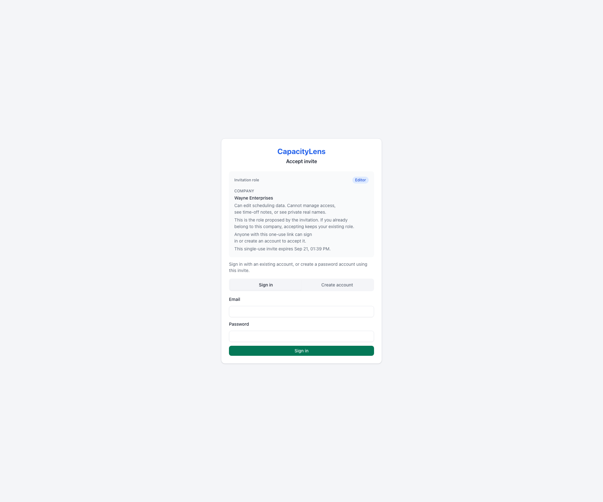
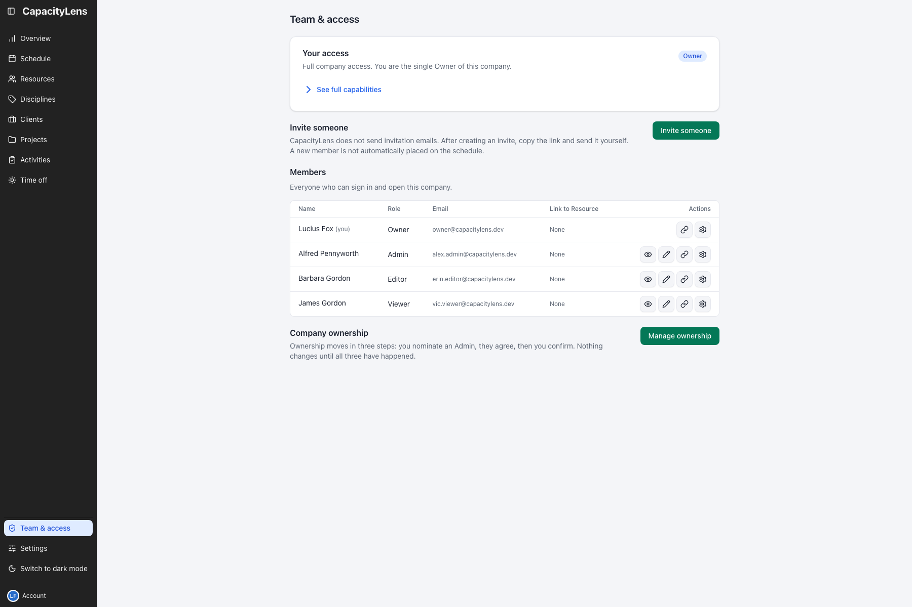
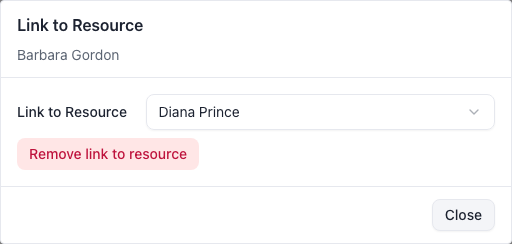

# Invite your team

This page covers getting someone else into CapacityLens: creating an invite, what they
see, and how they accept it. It takes about ten seconds on your side and roughly thirty
seconds on theirs. It's optional — a solo [Owner](/reference/glossary) can finish setting
up the schedule without inviting anyone, and can come back to this page later.

CapacityLens sends no invitation emails. You create a single-use link and paste it
wherever your team already talks — Slack, a text message, whatever's fastest.

::: tip
Adding someone to the schedule doesn't give them a sign-in. An invitation can optionally
link its recipient to an existing scheduled person, but does not create one. These are
separate records — see [Roles and
permissions](/getting-started/roles-and-permissions) for why.
:::

## Prerequisites

- You need the Owner or [Admin](/reference/glossary) role to invite people. A Viewer or
  Editor can still open **Team & access** and see their own role and what it allows —
  they just see a note there that an Owner or Admin handles invitations, instead of the
  "Invite someone" panel. See [Roles and
  permissions](/getting-started/roles-and-permissions).

## Create an invite

1. Open **Team & access**. Your own access is summarised at the top of the page; select
   **See full capabilities** if you want the full list of what your role can and can't do.

2. Select **Invite someone**, above the member table, to open the centered invite dialog. Choose a
   role in the dialog. The consequences of that role are spelled out in plain language underneath
   it. **Email** is optional for password sign-in and required on company-login-only installs.

3. Optionally choose **Link to Resource**, or leave **No Resource linked** selected.
   This proposes an existing person Resource without reserving it. The recipient cannot see this
   selection. If the person is no longer available when the invitation is accepted, the
   member can still join; Team & access shows **Resource link needs attention**. Choose
   **Choose another person** or **Dismiss** there.

   

4. Select **Create invite**, then **Copy** the one-time link. It's shown exactly once — the server keeps only a hash of it —
   so copy it now and send it to the [person](/reference/glossary). The confirmation stays beside
   the link. CapacityLens does not send it for you. Closing the dialog clears the link; if you
   close it before the invite finishes creating, a notice says the link was not shown. If you
   lose it, revoke the invite and create another one.

## What the invitee sees

The invite link opens outside the normal sign-in wall, so the recipient can safely
preview what they're joining before anything happens: your company name, the proposed
role, what that role can and can't do, and when the link expires. Just opening the link
never changes [membership](/reference/glossary).

From there:

- Already have a sign-in? Choose **Sign in**, enter your email and password, then check the
  signed-in identity and select **Accept invite**. Choose **Use a different account** if needed;
  the invitation stays open.
- New to this install? Choose **Create account**, enter your name, email and a new password,
  then select **Create account and accept**. Only this choice asks for your name.
- Use company login? Choose your configured provider, then review and accept the invitation.

The role description is shown in full. Expiry uses your local date and time, without seconds.
An email-bound invitation shows the part before `@`, followed by `@…` (for example,
`selina.kyle@…`). The domain stays hidden. Enter your full email address to sign in or create
an account. Ask the sender if the hint is not enough to identify the address; entering a
different one cannot change who the invitation is for.

Either way, they land directly on your schedule with their role visible.

## Pending invites

Invites that haven't been accepted yet stay listed on **Team & access** as pending, in
their own bordered table above your members. It uses the same **Name**, **Role**, **Email**,
**Link to Resource** and **Actions** columns as the member table. An invite has no name, and a
proposed Resource stays marked pending until the invite is accepted. Owners and Admins can see this
list; other roles only see their own access. Invitations are ordered Owner, Admin, Editor, then
Viewer, with consistent email and creation-order tie-breakers.

## Managing someone who already joined

Your members are listed by **Name**, **Role**, **Email**, **Link to Resource** and **Actions**.
Owners come first, followed by Admins, Editors and Viewers; ties remain stable by display name.
Long email addresses shorten visually, but the complete address remains available to select and in
the native hover label.

- The **pencil** changes that person's role, with the consequences spelled out before you
  save.
- **More actions** opens a centered dialog with the remaining permitted actions: reset their
  password, sign them out everywhere, disable or archive them, or remove them from the company.

The **Link to Resource** column shows the member's association. Select the member's link icon
to open the centered Resource selector directly. Choosing a person saves immediately. If a link
already exists, **Remove link to resource** removes it immediately; closing the dialog never
reverses a completed change. See [Link a person to a member](/guide/people-and-placeholders#link-a-person-to-a-member).

**Disable** and **archive** both stop someone opening the company immediately while
keeping their role and history — use them when someone leaves, goes on long-term leave, or
you need access shut off right now. They stay in the list with a badge, and **Restore
access** in the same dialog puts them back exactly as they were. Removing someone, by
contrast, is permanent: they'd need a fresh invitation to return.

## Common questions

**I lost the link before sending it — can I get it back?** No. CapacityLens shows a
one-time link's token exactly once and stores only a hash of it afterwards, so nobody —
including you — can retrieve the original link again. Revoke the invite on **Team &
access** and create a new one instead; the old link stops working as soon as you revoke
it.

**Can I run more than one company on this install?** Not by default — a fresh install
allows exactly one company. An administrator can turn on `CAPACITYLENS_MULTI_ACCOUNT` to
allow more; see [Configuration](/self-hosting/configuration).

## What's next

[Roles and permissions](/getting-started/roles-and-permissions) explains exactly what
each role can see and do, so you can pick the right one next time.
