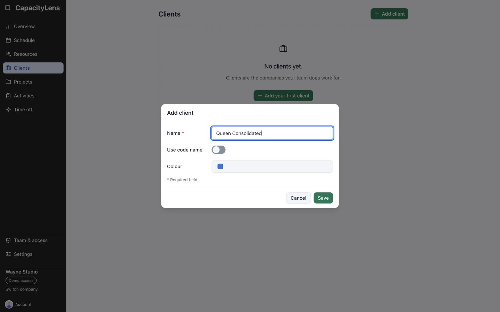
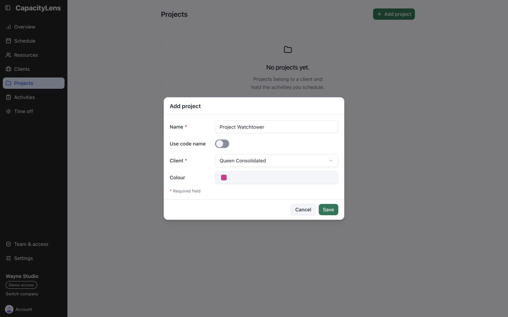
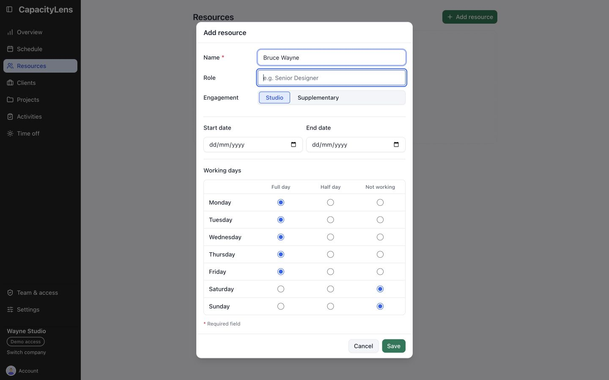
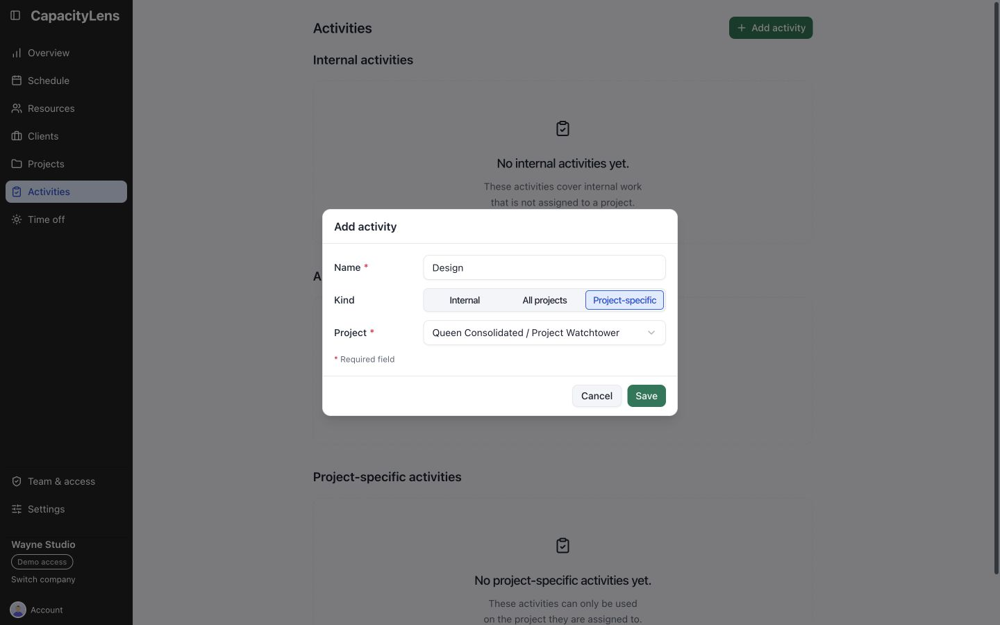
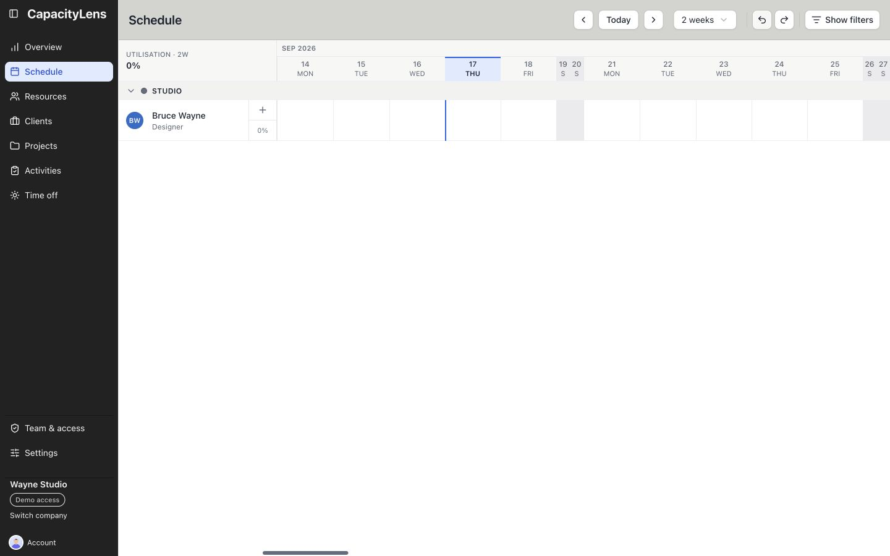
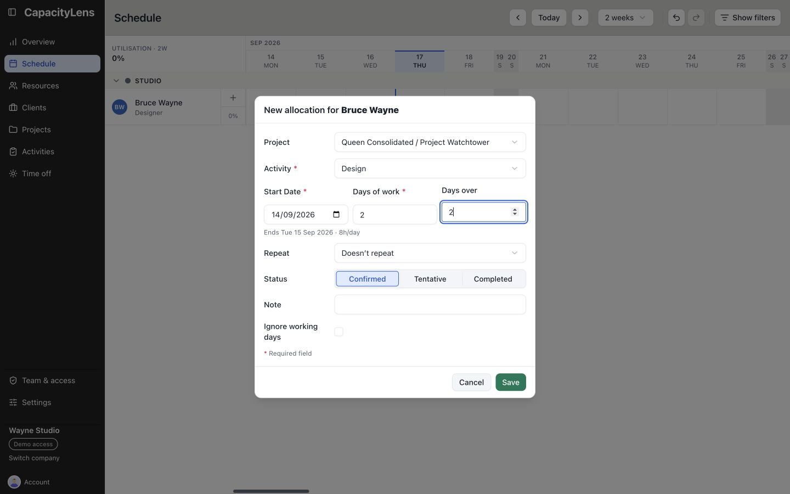
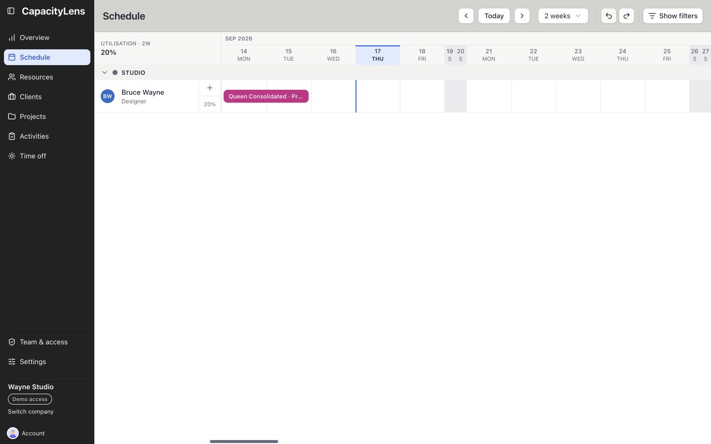
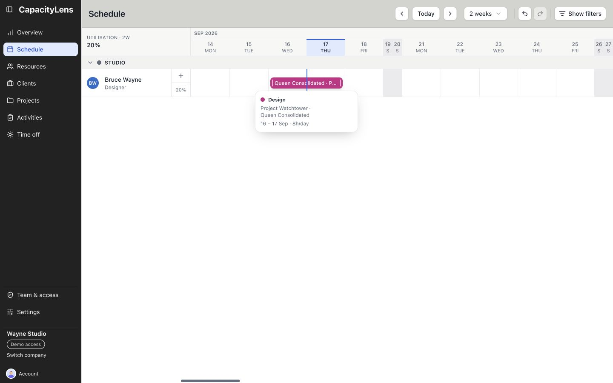

# Make your first booking

Use this guide when your company already exists and you have Editor, Admin or Owner access.
It takes about five minutes.

With Viewer access, start with [Read the schedule](/using/read-the-schedule).

## Client

Open **Clients**, select **Add client**, enter the name and save.

## Project

Open **Projects**, select **Add project**, choose the client, enter the project name and save.

## Resource

Open **Resources** and select **Add resource**. Enter the person's details and working
pattern, then save.

Adding a person makes them schedulable. It does not give them a sign-in. An Owner or
Admin can [invite them separately](/admin/invite-teammates).

## Activity

Open **Activities**, select **Add activity**, choose **Project-specific**, select the project,
enter the activity name and save.

## First booking

Open **Schedule**. Drag across empty working days in the person's row, or select one empty
cell for a one-day booking.

Choose the project and activity, then save.

## Move the booking

Drag the saved bar to another date or person. Use **Undo** to put it back.

## What's next

Learn how to [read the schedule](/using/read-the-schedule), or continue with the
[day-to-day guide](/using/) for the tasks you will use most often.
