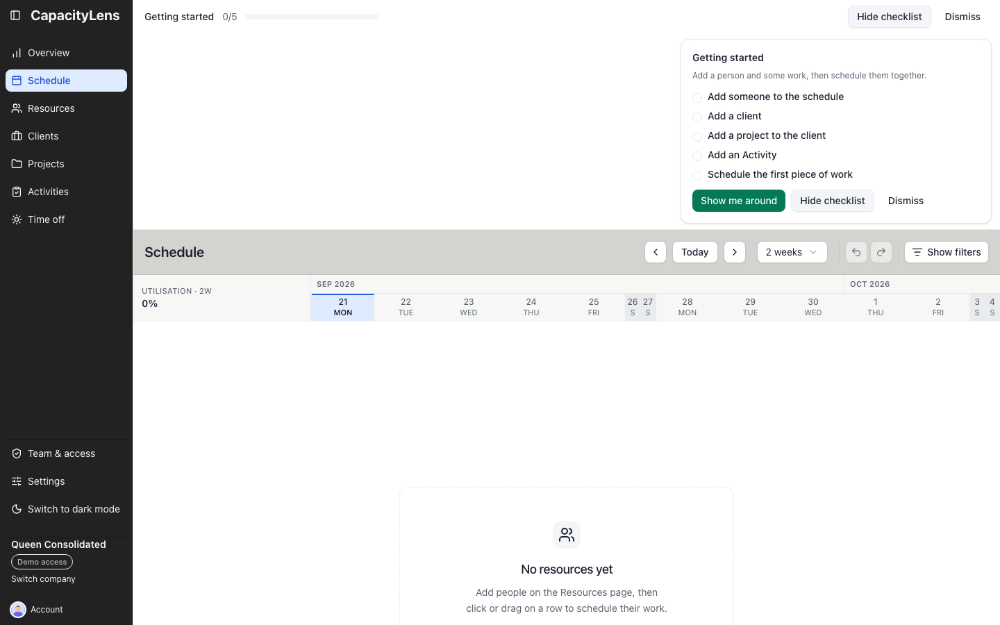
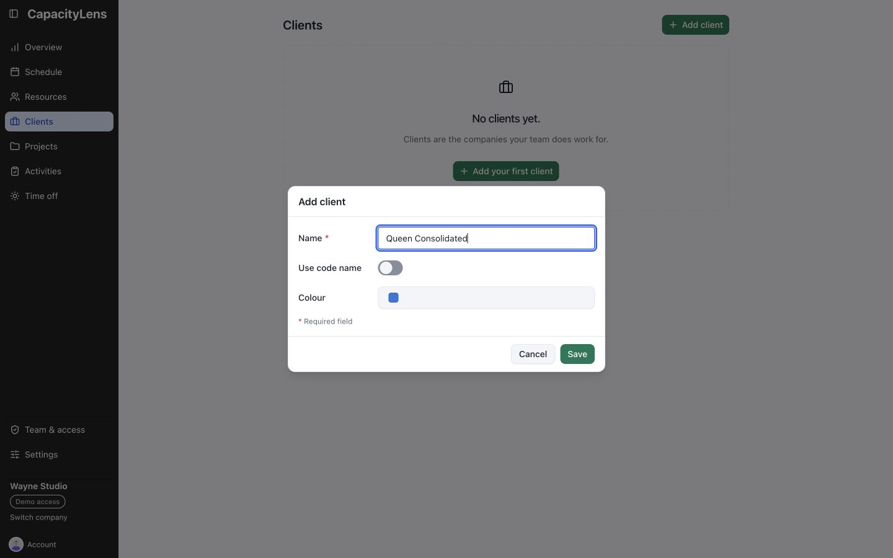
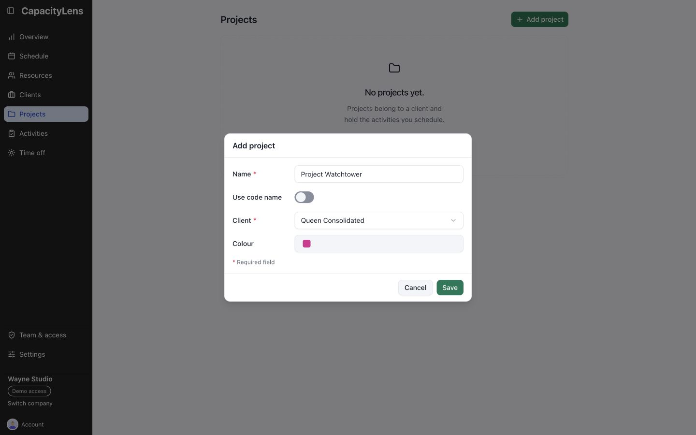
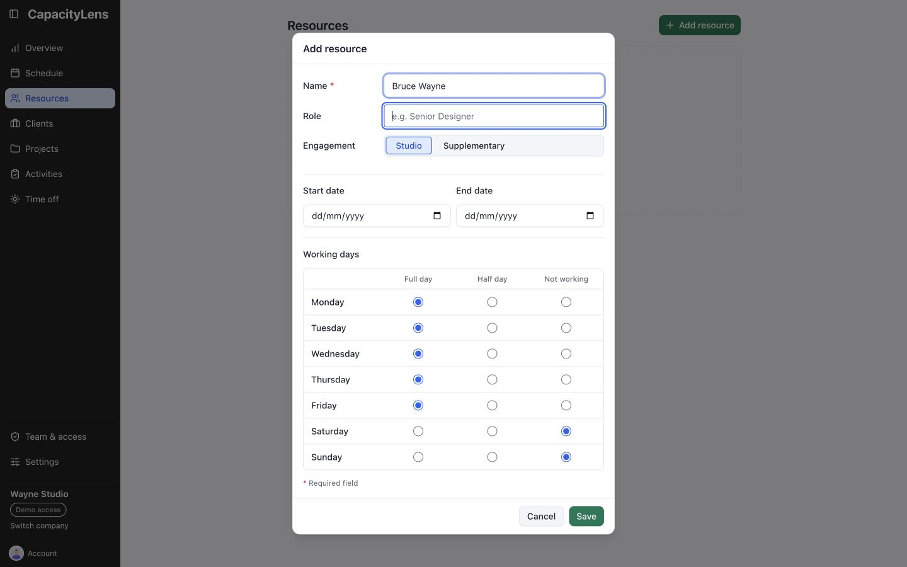
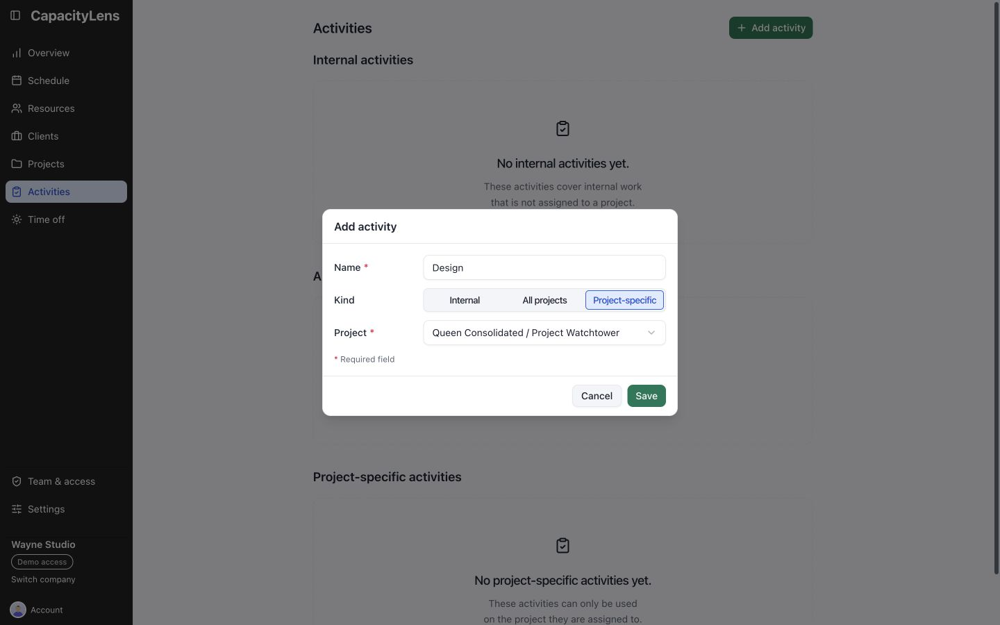
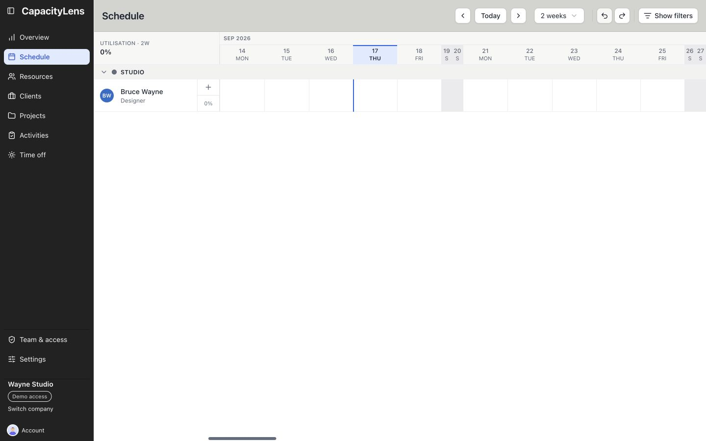
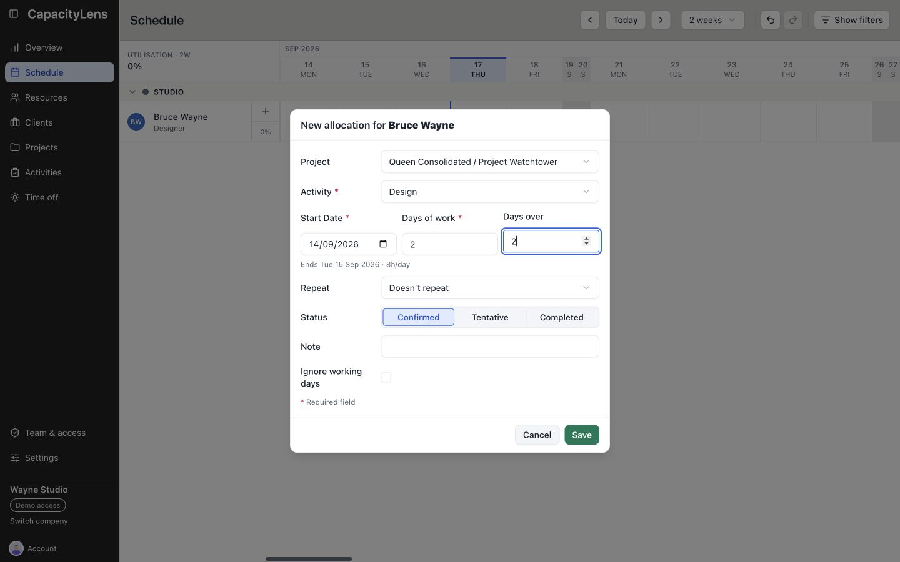
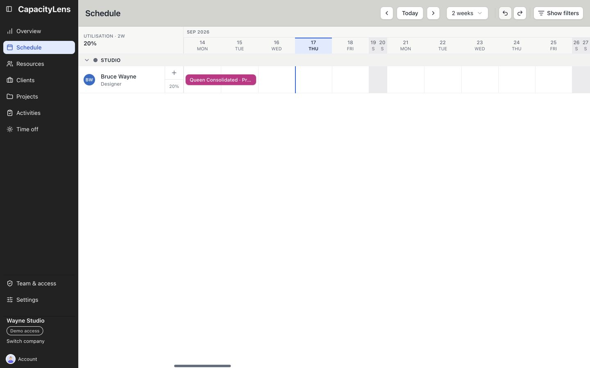
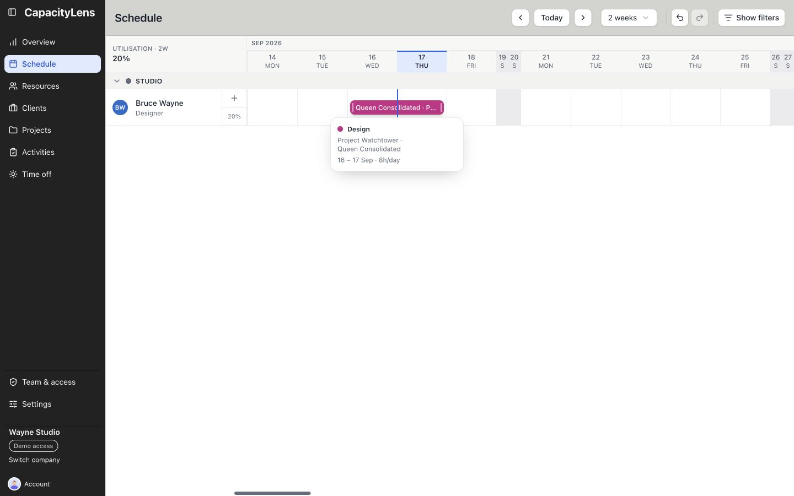

# Make your first booking

Use this guide when your company already exists and you have Editor, Admin or Owner access.
It takes about five minutes.

With Viewer access, start with [Read the schedule](/using/read-the-schedule).

## Make your first schedule useful

When a company is new, **Getting started** shows five milestones: add someone to the schedule,
add a client, add a project to that client, add an Activity, and schedule the first piece of work.
Each step completes from the company's records, including imported data. You can create records
in any order. Internal work is available at any time, though it does not complete the client or
project steps.

The 0–5 progress bar appears across the application, including Settings. The checklist opens on
Schedule while setup is incomplete and can be shown or hidden from the bar on any page. At 5/5 it
starts closed, but stays available until an Owner or Admin dismisses it. If work remains, dismissal
asks for confirmation. Dismissing hides
the guidance for everyone in that company. Editors can view and toggle the checklist; Viewers do
not see it.

Owners, Admins and Editors can select **Show me around** for a short tour that starts with their
role and continues through lower role sections. It opens Schedule first if they are on another page.
Viewers do not see this launcher. See
[Roles and permissions](/getting-started/roles-and-permissions#take-a-role-based-tour) for what each
role sees.

To see a working schedule before entering your own data, an Owner or Admin can choose **Settings,
Example data, Add example data**. It adds two people, a client, a project and a few bookings, and
is offered only while the company has no people, clients, projects or allocations.

## Client

Open **Clients**, select **Add client**, enter the name and save.

## Project

Open **Projects**, select **Add project**, choose the client, enter the project name and save.

## Resource

Open **Resources** and select **Add resource**. Enter the person's details and working
pattern, then save.

Adding a person makes them schedulable. It does not give them a sign-in. An Owner or
Admin can [invite them separately](/admin/invite-teammates).

## Activity

Open **Activities**, select **Add activity**, choose **Project-specific**, select the project,
enter the activity name and save.

## First booking

Open **Schedule**. Drag across empty working days in the person's row, or select one empty
cell for a one-day booking.

Choose the project and activity, then save.

## Move the booking

Drag the saved bar to another date or person. Use **Undo** to put it back.

## What's next

Learn how to [read the schedule](/using/read-the-schedule), or continue with the
[day-to-day guide](/using/) for the tasks you will use most often.
