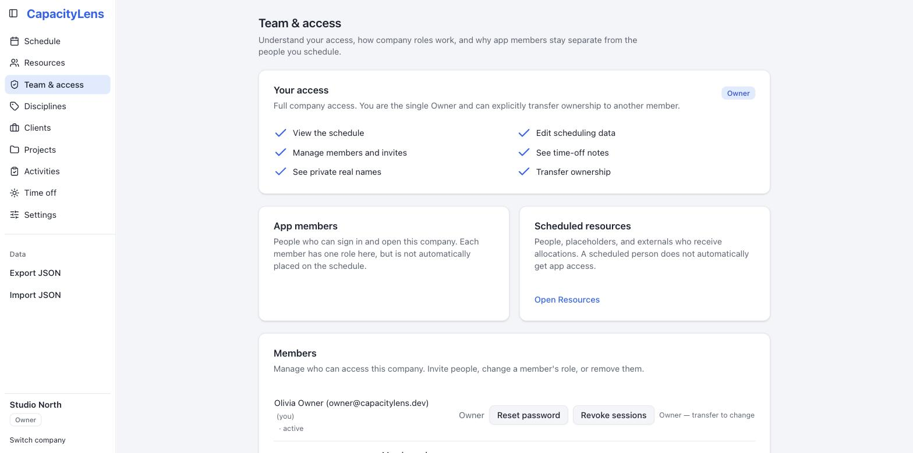

# Roles and permissions

CapacityLens has four roles, strictly nested: **Viewer < Editor < [Admin](/reference/glossary)
< [Owner](/reference/glossary)**. Every [member](/reference/glossary) gets the same
navigation — a role changes what's editable and visible inside each page, and that's
enforced on the server, not just hidden in the interface. This page explains what each
role can do and clears up a common point of confusion: the difference between having a
sign-in, being a member of a company, and being on the schedule.

## The three kinds of "person"

CapacityLens keeps three things separate that can all look like "a
[person](/reference/glossary)" in the interface:

- A **sign-in identity** — the email and password (or company login) someone uses to
  reach CapacityLens at all. One identity can belong to several companies.
- A **member** — a sign-in identity's role in one specific company, created by [inviting
  them](/getting-started/invite-your-team). This controls what they can see and do in
  that company.
- A **person** on the schedule — a schedulable resource that can receive allocations and
  time off. Adding a person doesn't give them a sign-in, and inviting a member doesn't put
  them on the schedule.

Most agencies end up with a few members and many people: you schedule freelancers and
contractors without ever creating a sign-in for them. See the
[glossary](/reference/glossary) for precise definitions of these and other terms used
throughout these docs.

## Roles in one table

| Capability                                     |  Viewer  |  Editor  | Admin | Owner |
| ---------------------------------------------- | :------: | :------: | :---: | :---: |
| See the schedule                               |   Yes    |   Yes    |  Yes  |  Yes  |
| Create and edit scheduling data                |    —     |   Yes    |  Yes  |  Yes  |
| Change ordinary company settings               |    —     |   Yes    |  Yes  |  Yes  |
| See time-off notes                             |    —     |    —     |  Yes  |  Yes  |
| See private client/project real names          |    —     |    —     |   —   |  Yes  |
| List members and manage invites                |    —     |    —     |  Yes  |  Yes  |
| Disable, archive or restore a member           |    —     |    —     |  Yes  |  Yes  |
| Export the schedule                            | Redacted | Redacted | Full  | Full  |
| Import, delete the company, transfer ownership |    —     |    —     |   —   |  Yes  |

There is exactly one Owner per company, and Owner can't be assigned through an invite or
an ordinary role change — only through an explicit ownership transfer to an existing
member. Ownership transfer has no screen of its own yet: the per-member button was
removed because it doesn't belong on every row, and its replacement is still being
designed. Until then, transferring ownership needs a self-hosting admin (see [A company
has no Owner](/self-hosting/incidents#a-company-has-no-owner) for the related recovery
tool). An Admin can invite, remove, disable or change the role of any other member, but
can't touch the Owner — and nobody, not even the Owner, can disable or archive the Owner
or themselves. Disabling or archiving someone stops them opening the company straight
away while keeping their role and history, and it can be undone from the same menu. Those
people leave the main member list and move into the **No longer active** group beneath it,
which stays closed until you open it. If a company somehow ends up with no Owner at all, see [A company has
no Owner](/self-hosting/incidents#a-company-has-no-owner) — CapacityLens repairs that
automatically in almost every case.

## Details

**Export.** An export is redacted the same way the screen is:

| What the export contains     | Viewer / Editor | Admin      | Owner      |
| ---------------------------- | --------------- | ---------- | ---------- |
| Archived and deleted rows    | Left out        | Included   | Included   |
| Private client/project names | Code names      | Code names | Real names |

So an Admin's export holds the full set of rows, but only an Owner's export contains
the real private client and project names.

**Offline snapshots.** [Offline access](/guide/offline-access) always behaves like a
Viewer, no matter your real role — while a cached snapshot is shown, creating, editing,
deleting, importing and changing membership are all unavailable for everyone. The
snapshot reflects whatever that person could see the last time they were online: a
non-owner's snapshot uses code names, while an owner's may contain real private names —
so protect an owner's device accordingly.

## What's next

You've now covered sign-in, installing, first steps, invites and roles. Head to [The
schedule](/guide/the-schedule) to start building out your team's week.
