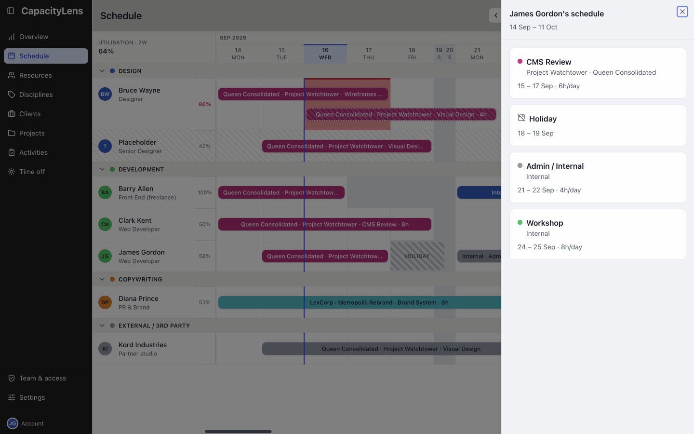

# What is CapacityLens?

CapacityLens is your team's shared schedule. It shows planned work and time off, week by
week.

Agencies use it to find available people and avoid overbooking them.

## Your work

On **Schedule**, select the avatar beside your name to open your own schedule.

The [day-to-day guide](/using/) explains how to read the plan and use the pages available
to you.

If you arrange work for the team, [make the first booking](/getting-started/quick-start).

CapacityLens focuses on capacity planning rather than timesheets or task tracking. It is
[open-source software](/open-source).

## What's next

[Choose the guide for your job](/#choose-your-guide), or follow the [Quick
start](/getting-started/quick-start) to place work on the schedule.
