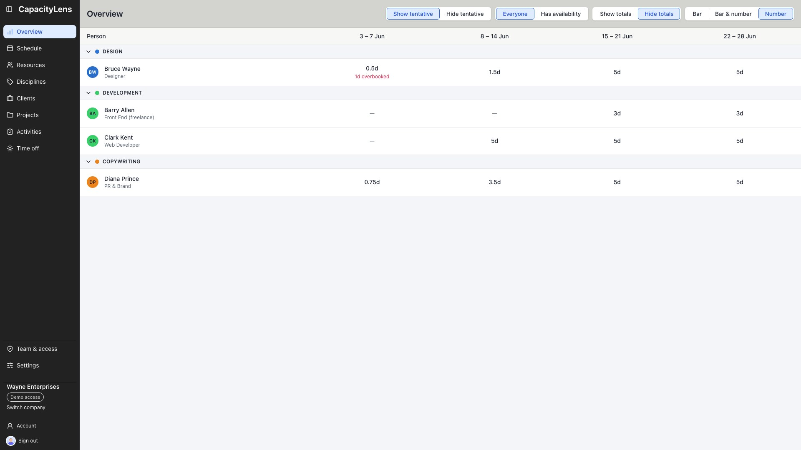
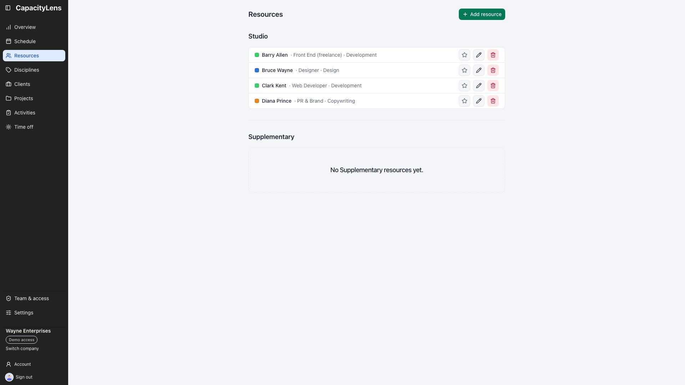
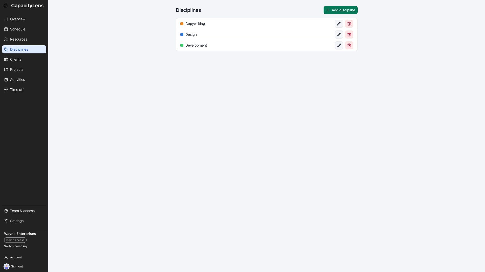
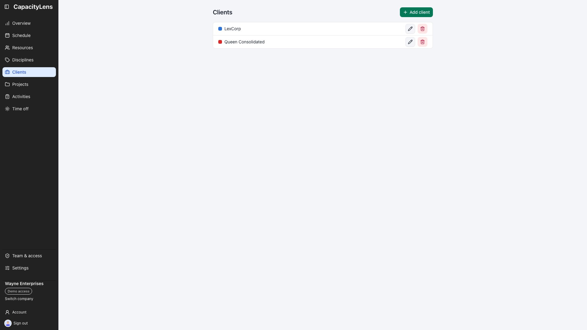
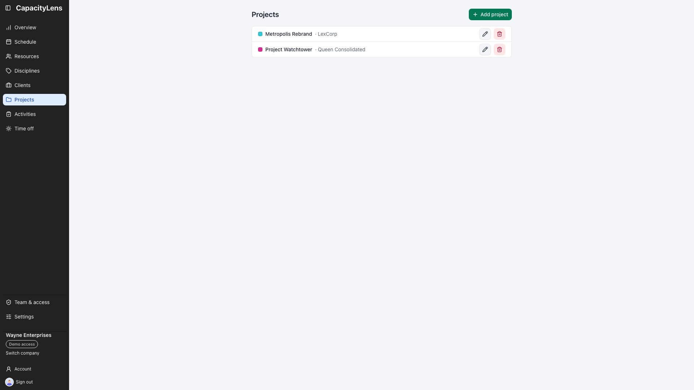
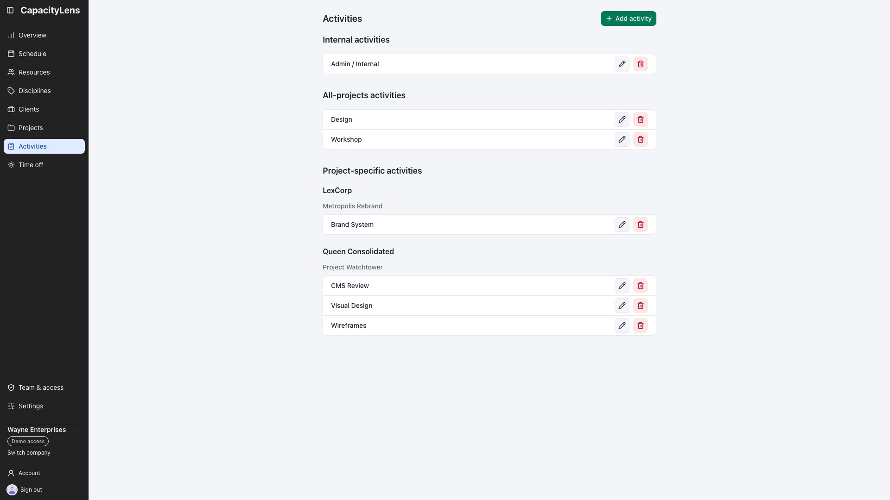
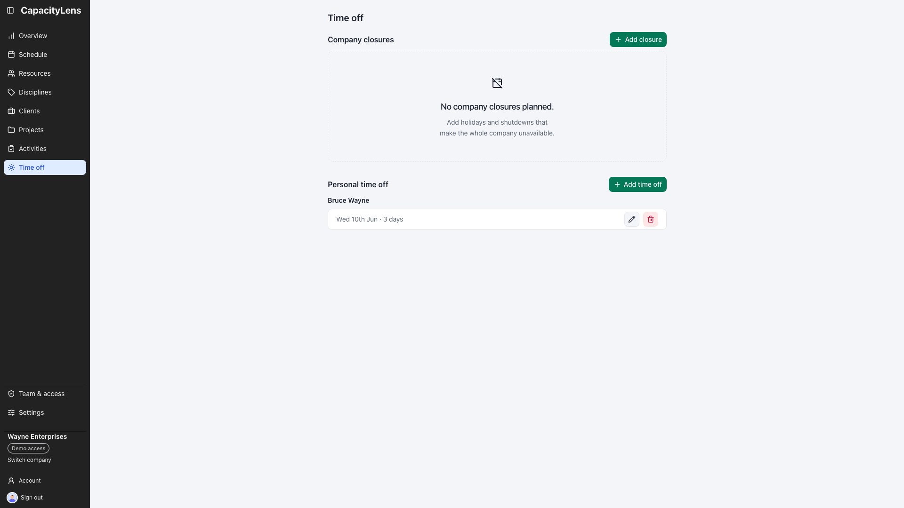
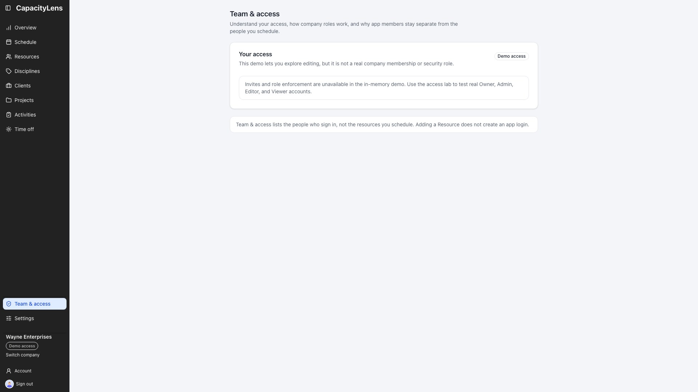
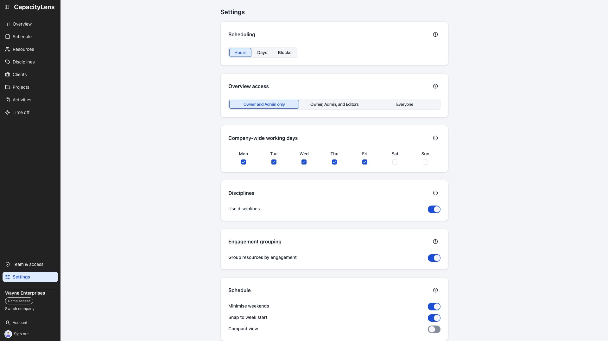
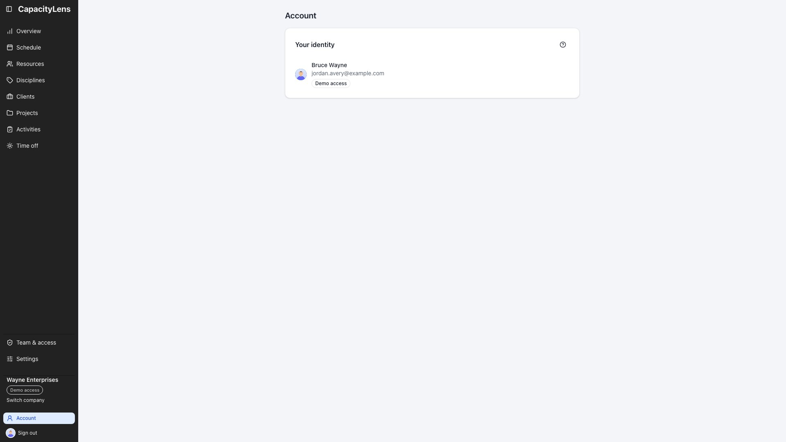

# See every application page

This visual tour shows every application destination with the Wayne Enterprises demo data. Use it
to recognise the page you need before you start planning work.

## Overview

**Overview** compares each person's remaining capacity across four company weeks.

## Schedule

**Schedule** is the day-by-day planning grid for allocations, utilisation and time off.

## Resources

**Resources** lists the people and placeholders available for scheduling.

## Disciplines

**Disciplines** manages the coloured groups used for people and schedule rows.

## Clients

**Clients** manages the organisations whose projects appear in allocations.

## Projects

**Projects** keeps each project alongside its client.

## Activities

**Activities** separates internal, all-projects and project-specific work.

## Time off

**Time off** lists company closures and personal time away from work.

## Team and access

**Team & access** explains your access and, outside the demo, manages members and invitations.

## Settings

**Settings** contains company-wide planning rules and device preferences.

## Account

**Account** shows your signed-in identity and personal account controls.

## What's next

[The schedule](/guide/the-schedule) explains daily planning. [Projects and allocations](/guide/projects-and-allocations)
shows how clients, projects and activities fit together.
