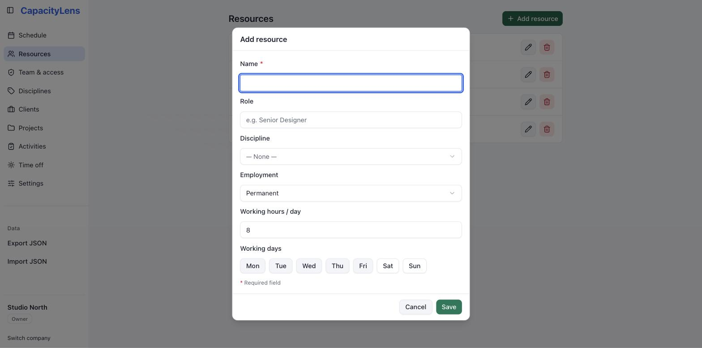
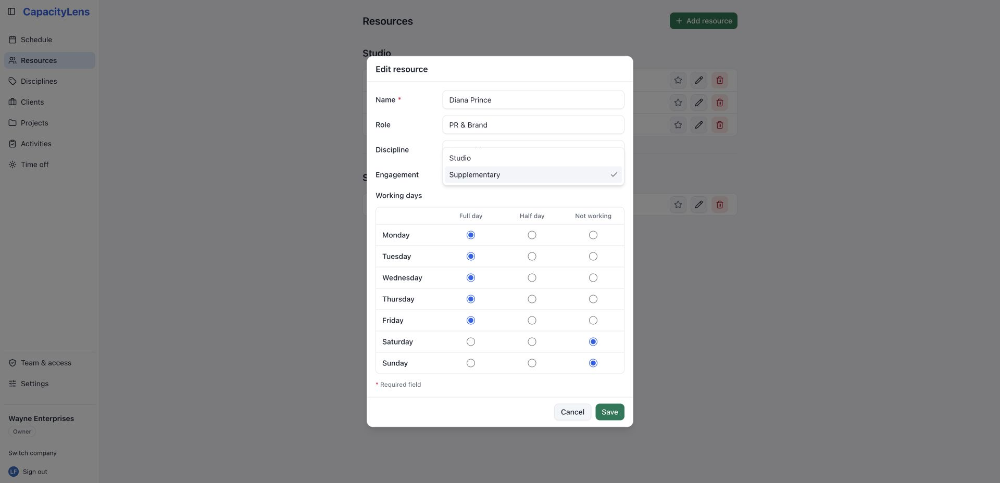
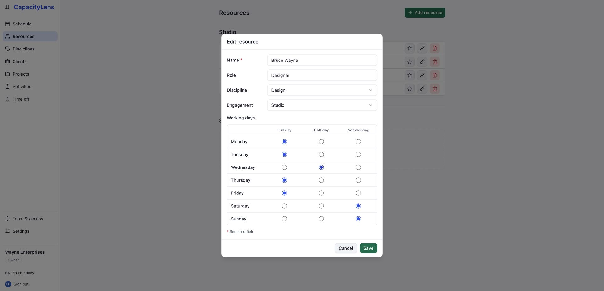
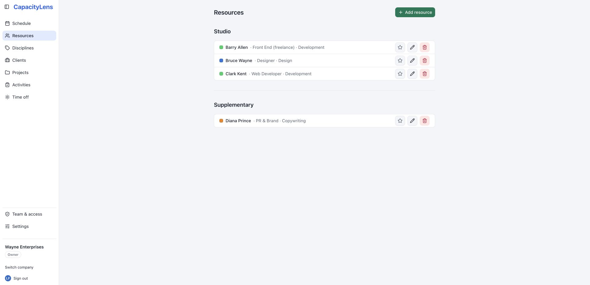
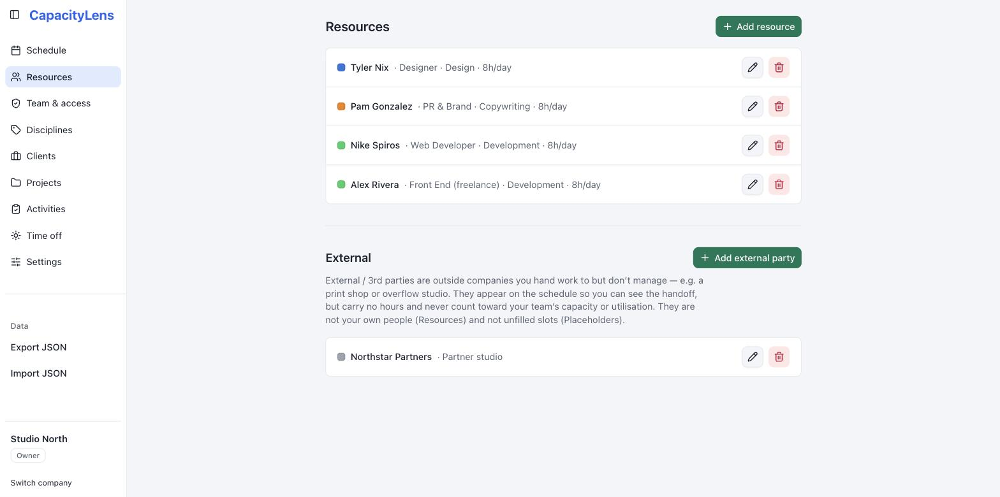

# People and placeholders

Anyone who appears on [the schedule](/guide/the-schedule) is a
[person](/reference/glossary) — added on the **Resources** page. This page covers adding
real people and editing their details, using placeholders for roles you haven't filled,
booking [external parties](/reference/glossary) you hand work to but don't manage, and
archiving someone who leaves.

::: tip
A person on the schedule doesn't get a CapacityLens sign-in, and inviting a
[member](/reference/glossary) doesn't put them on the schedule. These are deliberately
separate — see [Roles and permissions](/getting-started/roles-and-permissions).
:::

## Add a person

1. Open **Resources**.
2. Click **Add resource**.
3. Fill in the fields below and save.

At normal dialog widths, the resource details use compact label-and-control rows. They stack
vertically on a narrow screen, while the **Working days** grid remains full width.

- **Name** — required.
- **Role** — a free-text label, for example "Senior Designer". Optional.
- **Discipline** — which group this person shows under on the schedule, and where their
  colour comes from. Only shown if your company uses
  [disciplines](/reference/glossary), which is the default. Disciplines themselves are
  created and coloured on the standalone **Disciplines** page in the main navigation,
  not here — see [Settings](/guide/settings) for the on/off switch.
- **Engagement** — choose **Studio** for someone regarded as part of the core studio or
  **Supplementary** for additional capacity. This is separate from both their contract status and
  their discipline, and it doesn't change how utilisation is worked out.
- **Working days** — use the compact radio grid to choose **Full day**, **Half day** or
  **Not working** for every day from Monday to Sunday. A full day is eight hours, a half
  day is four hours and a non-working day is zero hours.

Working days drive the utilisation figures directly: CapacityLens compares that fixed
8/4/0-hour pattern with the person's bookings to decide whether they're over capacity.
The days that count are those in both this pattern and the company's
[global working days](/guide/settings#global-working-days) — a day outside either holds no
capacity for this person. Set the pattern correctly, or the overwork indicators on
[the schedule](/guide/the-schedule#reading-overwork) will be wrong for that person.

Open **Engagement** to choose between the two company-facing groups. The current choice
has a tick. Saving **Supplementary** moves the person into that section immediately; it
does not change their discipline, role or working days.

The new row appears on the schedule immediately, ready for allocations and time off.
There's no account to create and nothing for the person to sign in to.

## Edit a person

1. Open **Resources**.
2. Click the edit icon next to the person's row.
3. Change any field and save.

For example, if someone goes part-time, open their row and change the relevant days to
**Half day** or **Not working**. Existing allocations aren't rewritten, but every
utilisation figure you see after saving reflects their new working pattern.

Existing working patterns are preserved after upgrading: a day that was selected remains
a full day, and a day that was unselected remains not working.

## Find people quickly

By default, the Resources page separates people into **Studio** and **Supplementary** sections,
followed by the existing Placeholders and External sections. An Editor, Admin or Owner can turn
**Group resources by engagement** off in [Settings](/guide/settings) to combine people into one
list. Rows in each section are alphabetical, while the Disciplines page is alphabetical too.

People and external parties have a star beside their edit and archive actions. Select it
to add that row to the company's favourites; the star fills yellow and the row moves to
the top of its engagement section while favourites and non-favourites each stay alphabetical. The
schedule likewise keeps Studio before Supplementary within each discipline and favourites first
inside each partition. When grouping is off, favourites lead the combined People list and each
discipline instead. The External group keeps its own favourites-first order.
Favourites are shared company data, so everyone sees the same order. Placeholders cannot
be favourited.

## Placeholders

A [placeholder](/reference/glossary) is a slot on the schedule for a role you know is
coming but haven't hired or assigned yet — "a Design Lead" instead of a named person.
Placeholders are off by default; an Owner or Admin turns them on for the company in
[Settings](/guide/settings).

Once turned on, the Resources page shows a separate **Placeholders** section with its
own **Add placeholder** button. A placeholder's name is optional — you can leave it
blank and it shows by its role instead — but it must be bound to a project, since a
placeholder only makes sense as capacity you're planning to book against specific work.
Placeholder rows carry a small "placeholder" badge so they're never mistaken for a real
person, and the same hatched styling carries through to their row on the schedule.

Turning placeholders off in Settings doesn't delete them — it hides the section, the
schedule rows and the assignee picker entry, and everything reappears if you turn the
setting back on.

## External parties

An [external party](/reference/glossary) is an outside company you hand work to but
don't manage — a print shop, an overflow studio, a freelance agency you brief rather
than schedule directly. They can appear on the schedule so you can see the handoff, but
they carry no hours and never count toward your team's capacity or utilisation.

Use an external party instead of a placeholder when the work is genuinely leaving your
team — there's no working-hours or working-days figure to set, because there's no
capacity to track. Use a placeholder instead when you're planning to fill the work with
someone on your own team's capacity, even if you haven't hired or named them yet.

External parties are off by default; an Owner or Admin turns them on for the company in
[Settings](/guide/settings).

1. Open **Resources**.
2. Under **External**, click **Add external party**.
3. Fill in **Company** (required) and, optionally, a **Descriptor** — for example
   "Print" or "Overflow dev" — and save.

Turning external parties off in Settings hides the section and its rows the same way
placeholders do, without deleting anything.

## Archive someone who leaves

Deleting a person outright isn't the first step — removing a row from the Resources
list archives it instead. Archiving hides the person from the schedule and the assignee
picker but keeps their history, so past allocations and reports aren't rewritten.

1. Open **Resources**.
2. Click the delete icon next to the person's row.
3. Confirm **Archive resource?**

To bring someone back, or to permanently delete an archived record after the appropriate
waiting period, use **Archived & deleted** in [Settings](/guide/settings).

## What's next

[Projects and allocations](/guide/projects-and-allocations) covers booking a person's
time against real work, and [Time off](/guide/time-off) covers marking them unavailable.
