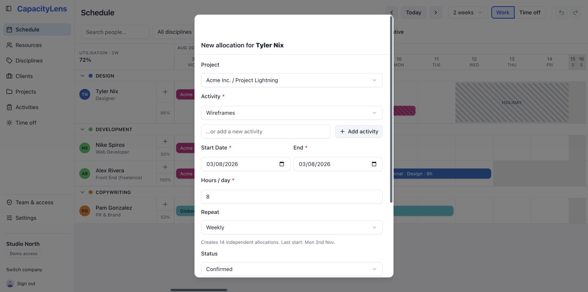

# Projects and allocations

Work in CapacityLens hangs off a simple shape: a client owns projects, and a project
owns the [activities](/reference/glossary) people are actually booked against. This page
covers setting that up and creating the [allocations](/reference/glossary) that appear
as bars on [the schedule](/guide/the-schedule).

## Clients and projects

1. Open **Clients**.
2. Click **Add client**, then give it a name and a colour.
3. Open **Projects**.
4. Click **Add project**. Every project belongs to a client, so choose one from the
   list.

Every company starts with one built-in client called **Internal** for non-billable
work — general admin, internal meetings, anything that isn't client work. It can't be
renamed or deleted, and its colour on the schedule is controlled from
[Settings](/guide/settings).

If a client or project name shouldn't be visible to most of the team — an
unannounced prospect, for example — turn on its "use a code name" option when you
create or edit it. Everyone below Owner sees a generic code name instead of the real
one; only the Owner sees both. See [Roles and permissions](/getting-started/roles-and-permissions)
for what each role can see.

### Activities

Under **Activities**, an activity is the specific thing a person is booked to do, and
it comes in three kinds:

- **Project-specific** — belongs to one project.
- **Internal** — non-billable work that isn't tied to a project.
- **Cross-project** — work that applies across projects, like general account
  management.

## Create an allocation

There are two ways to book a person's time on the schedule:

1. Click the **+** button on their row, which opens the allocation form pre-filled
   with the visible week.
2. Draw it directly: click and drag across the days you want on that person's row.

Either way, fill in the project or activity and save. If the activity you need doesn't
exist yet, an "Add activity" option inside the same form can create it on the spot —
unless your company has turned that convenience off in [Settings](/guide/settings).

For regular work, choose **Weekly**, **Every 2 weeks**, **Every 3 weeks**, **Every 4
weeks** or **Monthly** under **Repeat**. The form shows how many independent allocations
it will create over the next three calendar months and the final start date. Save once
to create the complete group. One Undo removes that group; after creation, you can edit
or delete each allocation independently. Leave **Doesn’t repeat** selected for a single
allocation.

## Edit, move and remove allocations

- **Move** a bar by dragging it to a different set of days, or drop it on another
  person's row to reassign the work.
- **Resize** a bar from either edge to change its start or end date.
- **Open** a bar to change its status between tentative, confirmed and completed, or
  to duplicate or delete it. Deleting can be undone from the toolbar, or with
  Ctrl/Cmd+Z.

## How allocation granularity works

An allocation is a date range plus how much of the day it takes — there's no
hour-by-hour calendar and nothing resembling a timesheet to fill in. How you enter that
effort depends on your company's scheduling mode, set in [Settings](/guide/settings):

- **Hours** (the default) — set a start date, an end date and hours per day directly.
- **Days** — say how many days of work you need and how many days to spread them over;
  CapacityLens works out the hours per day for you.
- **Blocks** — book someone for a span of days with no hours at all, for work that
  shouldn't count toward the utilisation figures.

Whichever mode you use, CapacityLens is planning capacity, not logging time worked —
there's nothing to submit at the end of the week.

That's as fine-grained as scheduling gets — there are no budgets, timesheets or
hour-by-hour calendars. [What is CapacityLens?](/getting-started/what-is-capacitylens)
explains why those lines are drawn where they are.

## What's next

[Time off](/guide/time-off) covers marking someone unavailable, which the allocation
form will warn you about if it overlaps a booking.
