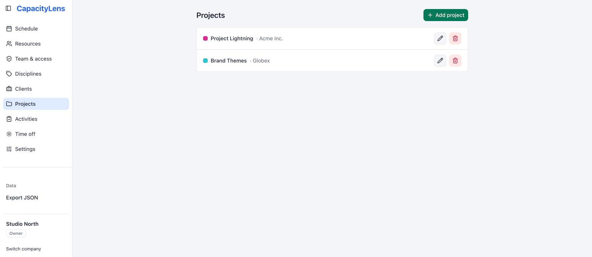
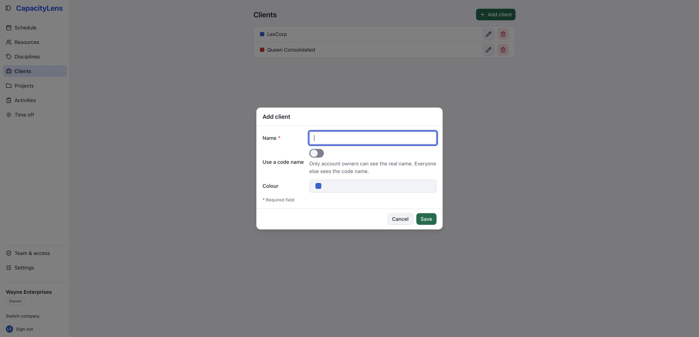
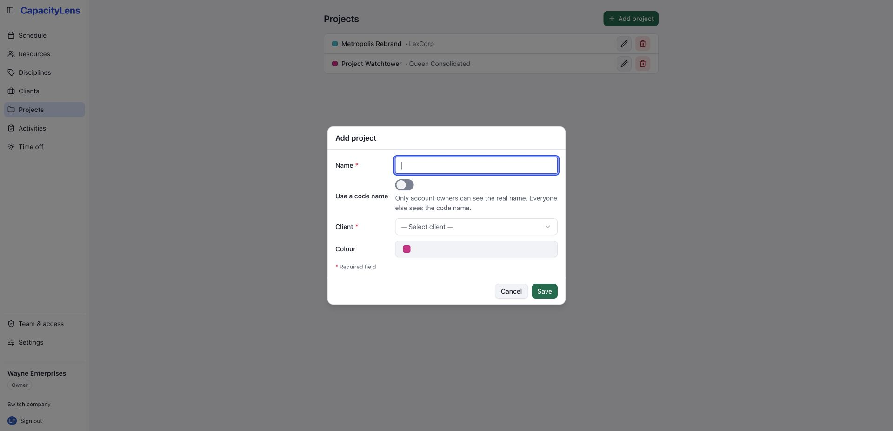
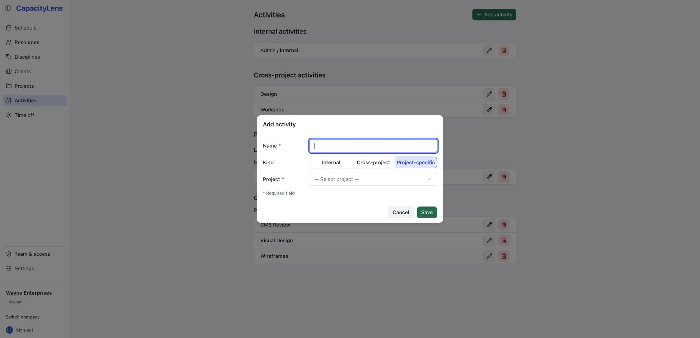
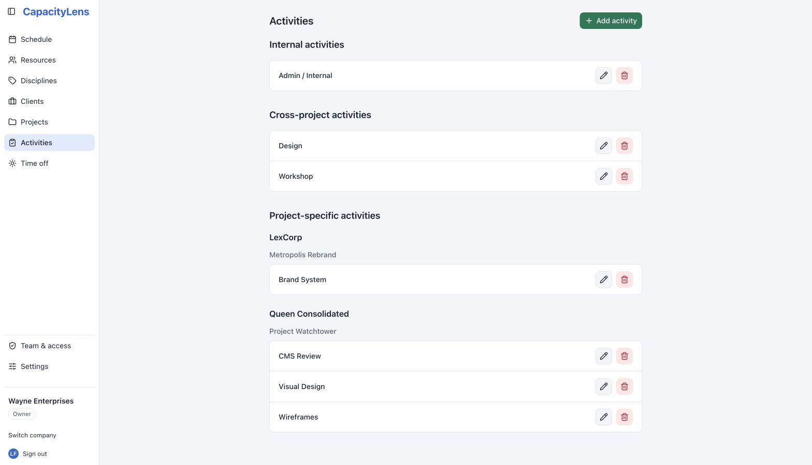
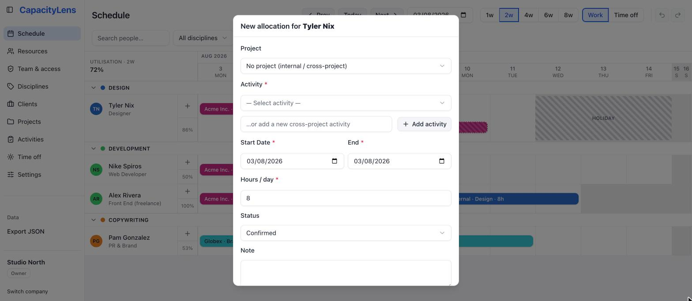
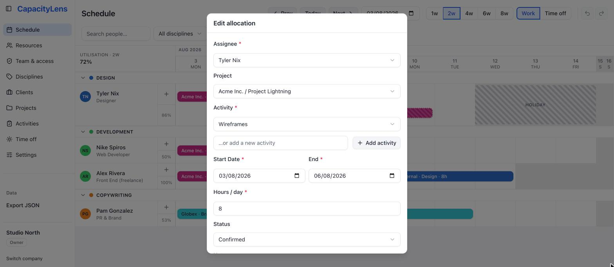

# Projects and allocations

Work in CapacityLens hangs off a simple shape: a client owns projects, and a project
owns the [activities](/reference/glossary) people are actually booked against. This page
covers setting that up and creating the [allocations](/reference/glossary) that appear
as bars on [the schedule](/guide/the-schedule).

## Clients and projects

1. Open **Clients**.
2. Click **Add client**, then give it a name and a colour.
3. Open **Projects**.
4. Click **Add project**. Every project belongs to a client, so choose one from the
   list.

The Clients and Projects pages keep their rows alphabetical. A project is sorted by its
project name; its client appears as supporting information underneath.

Every company starts with one built-in client called **Internal** for non-billable
work — general admin, internal meetings, anything that isn't client work. It can't be
renamed or deleted, and its colour on the schedule is controlled from
[Settings](/guide/settings).

If a client or project name shouldn't be visible to most of the team — an
unannounced prospect, for example — turn on its "use a code name" option when you
create or edit it. Everyone below Owner sees a generic code name instead of the real
one; only the Owner sees both. See [Roles and permissions](/getting-started/roles-and-permissions)
for what each role can see.

### Activities

Under **Activities**, an activity is the specific thing a person is booked to do, and
it comes in three kinds:

- **Internal** — non-billable work that isn't tied to a project.
- **Cross-project** — work that applies across projects, like general account
  management.
- **Project-specific** — belongs to one project.

Internal and cross-project activities are alphabetical. Project-specific activities are
grouped in client, project and then activity order, with each client and project name
shown once as a heading rather than repeated on every row.

## Create an allocation

There are two ways to book a person's time on the schedule:

1. Click the **+** button on their row, which opens the allocation form pre-filled
   with the visible week.
2. Draw it directly: click and drag across the days you want on that person's row.

Either way, choose **Internal**, **Any Project**, or a real project. Internal and Any
Project show only internal and cross-project activities respectively; real projects
follow after a divider in client-and-project order and show only their own activities.
Every resulting activity list is alphabetical. If the activity you need doesn't exist
yet, an "Add activity" option inside the same form can create it in the selected scope —
unless your company has turned that convenience off in [Settings](/guide/settings).

Status is a compact **Confirmed**, **Tentative** or **Completed** choice. Notes are
single-line.

Leave **Ignore working days** unchecked to follow the person's effective working week — the days
in both the company's [global working days](/guide/settings#global-working-days) and their own
pattern. Check it when the allocation must use every calendar day in its date span, including
company and personal non-working weekdays. Either way, a new allocation must start on an effective
working day that isn't covered by the person's time off — the checkbox never changes where a new
allocation may begin. To place work over closed days, create it starting on an open day with the
checkbox ticked, then drag or extend it onto the closed days.
External-party allocations already use literal calendar spans, so they do not show this checkbox.
On a regular-width screen, the form keeps its labels in a narrow left column and aligns the controls
on the right. On a narrow screen, each label stacks above its control so nothing is clipped.

For regular work, choose **Weekly**, **Every 2 weeks**, **Every 3 weeks**, **Every 4
weeks** or **Monthly** under **Repeat**, then set the required **Repeat until** date. The
cutoff cannot be before today or the allocation start, must include at least one repeat,
and can be no more than six calendar months after the allocation starts. The form shows
the inclusive cutoff, how many linked allocations it will create and the final start date;
an occurrence may finish after the cutoff when it starts on or before it. Save once to
create the complete group. One Undo removes that group; after creation, you can edit each
occurrence independently. Deleting a linked occurrence lets you remove only that occurrence
or it and every future occurrence in the same series. Leave **Doesn’t repeat** selected for
a single allocation.

## Edit, move and remove allocations

- **Move** a bar by dragging it to a different set of days, or drop it on another
  person's row to reassign the work. A vertical reassignment keeps its start date: if that
  date is outside either the company or person's working pattern, the drop is rejected and
  the original allocation stays put. An allocation with **Ignore working days** enabled may
  use those dates literally.
- **Resize** a bar from either edge to change its start or end date.
- **Open** a bar to change its status between tentative, confirmed and completed, or
  to duplicate or delete it. Duplicate is available for unlinked allocations, but not
  occurrences in a linked repeat series. Deleting can be undone from the toolbar, or
  with Ctrl/Cmd+Z.

## How allocation granularity works

An allocation is a date range plus how much of the day it takes — there's no
hour-by-hour calendar and nothing resembling a timesheet to fill in. How you enter that
effort depends on your company's scheduling mode, set in [Settings](/guide/settings):

- **Hours** (the default) — set a start date, an end date and hours per day directly.
- **Days** — say how many days of work you need and how many days to spread them over;
  CapacityLens works out the hours per day for you.
- **Blocks** — book someone for a span of days with no hours at all, for work that
  shouldn't count toward the utilisation figures.

Whichever mode you use, CapacityLens is planning capacity, not logging time worked —
there's nothing to submit at the end of the week.

That's as fine-grained as scheduling gets — there are no budgets, timesheets or
hour-by-hour calendars. [What is CapacityLens?](/getting-started/what-is-capacitylens)
explains why those lines are drawn where they are.

## What's next

[Time off](/guide/time-off) covers marking someone unavailable, which the allocation
form will warn you about if it overlaps a booking.
