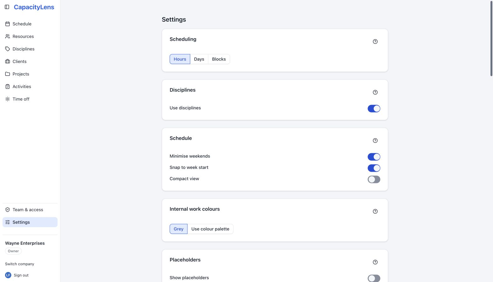
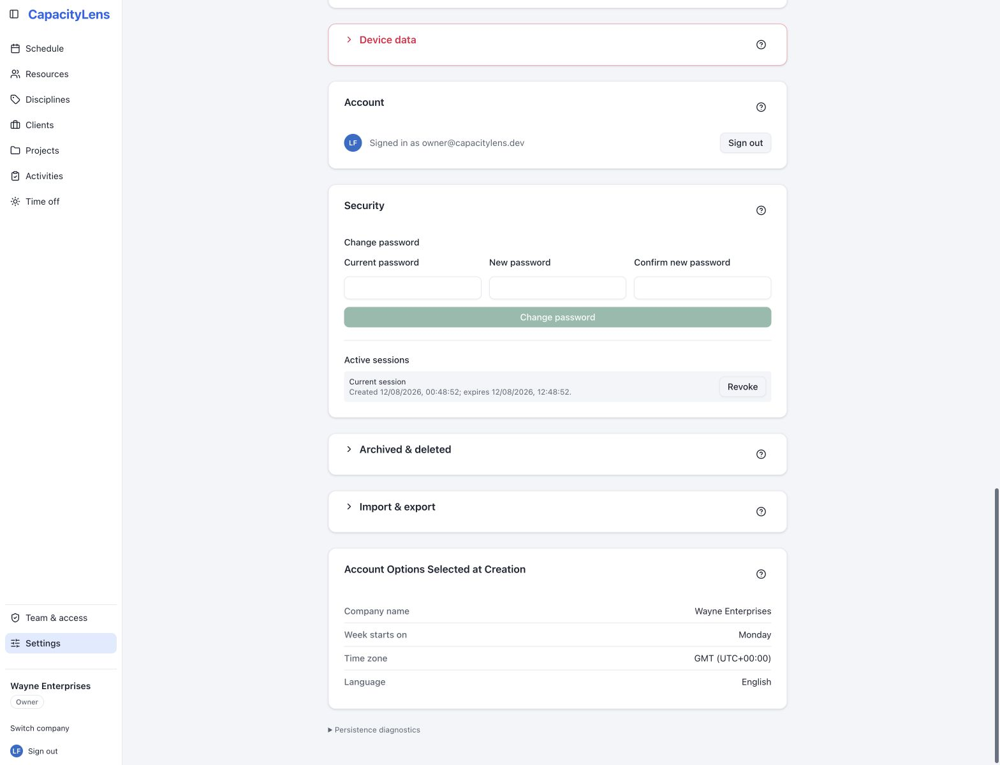

# Settings

Settings is one scrollable page of plain-language switches — no tabs, no separate admin
console. Most settings apply to the whole company; a few apply only to your own device.
This page covers the two switches worth understanding early, plus a map of everything
else. Each section has a question-mark button labelled **About &lt;section&gt;**: hover it
for that short label, or activate it to open the fuller explanation without keeping that
text on the page.

## Global working days

**Global working days** is the company's shared working week. Seven abbreviated
weekday headings sit in one row with their checkboxes directly underneath, beginning with the first
day of the company's configured week. New companies select the first five days. You can select any
combination, but at least one day must stay checked: when only one remains, its checkbox is
disabled with an explanation until another day is selected.

Each person works the days that are ticked here **and** in their own working pattern. Days outside
that combination hold no capacity: allocations skip them, they count for nothing in utilisation,
and on such a start date the lane does not show the hover **+**, clicking or beginning a draw does
nothing, and a typed start date, a duplicate or a reassignment is rejected with the same rule. A
draw that begins on an allowed date may still cross blocked dates. The per-allocation
**Ignore working days** checkbox makes that allocation use every calendar day in its span and lets
an existing allocation be dragged or extended onto closed days — it never changes where a new
allocation may start — and time off stays a separate, visible conflict.

Changing the selection recalculates capacity, utilisation and conflicts for existing allocations.
Allocation dates never move, but work on newly non-working days no longer counts unless the
allocation has Ignore working days enabled.

## Internal work visibility

Two switches under **Internal work**, both on by default, control whether internal and
non-billable work shows up on the schedule at all:

- **Show internal projects**
- **Show internal activities**

Turning either off hides the matching bars from the schedule — useful if some of your
team only wants to see client work. It doesn't change capacity: hidden internal work
still counts toward a person's [utilisation](/reference/glossary), so someone who's
fully booked with internal work still shows as fully booked. Nothing is deleted, and the
bars come back the moment you turn the switch back on.

## Inline activity creation

When you're booking an allocation and the [activity](/reference/glossary) you need
doesn't exist yet, the allocation form normally lets you add it on the spot without
leaving the form. That
convenience is controlled by **Inline activity creation** under **Activity creation**,
on by default. Turning it off means everyone has to create new activities from the
**Activities** page first, then pick from the existing list when they allocate — useful
if you'd rather keep activity names tidy and reviewed.

## Everything else on the page

The rest of Settings, roughly top to bottom:

| Section                       | What it controls                                                                                                                                                                                                                                                                                                                       |
| ----------------------------- | -------------------------------------------------------------------------------------------------------------------------------------------------------------------------------------------------------------------------------------------------------------------------------------------------------------------------------------- |
| Scheduling                    | Whether allocations are entered as Hours, Days or Blocks — see [Projects and allocations](/guide/projects-and-allocations).                                                                                                                                                                                                            |
| Global working days           | The company's shared working week. A person's capacity covers the days ticked here and in their own pattern; new work must start on such a day, and at least one day must stay selected.                                                                                                                                                |
| Disciplines                   | Whether people are grouped by [discipline](/reference/glossary) (Design, Development, and so on) across the app. On by default. Disciplines themselves — their names and colours — are created on the standalone **Disciplines** page in the main navigation, not here; see [People and placeholders](/guide/people-and-placeholders). |
| Engagement grouping           | Whether Resources separates Studio and Supplementary people. On the schedule, those bands hold people outside a discipline and become the main groups when disciplines are off. On by default; favourites stay first inside each engagement group. See [People and placeholders](/guide/people-and-placeholders).                                                                                         |
| Schedule (this device)        | Minimise weekends, snap to week start, and compact view — your own display preferences, not shared with teammates.                                                                                                                                                                                                                     |
| Internal work colours         | Whether internal work uses grey bars (default) or the same colour palette as everything else.                                                                                                                                                                                                                                          |
| Placeholders                  | Whether unfilled [placeholder](/reference/glossary) slots are available. Off by default. See [People and placeholders](/guide/people-and-placeholders).                                                                                                                                                                                |
| External                      | Whether [external parties](/reference/glossary) — outside companies you hand work to but don't manage, like print shops — are available. Off by default. See [People and placeholders](/guide/people-and-placeholders).                                                                                                                |
| Allocation bars (this device) | Whether bars show the client name and project name ahead of the activity name.                                                                                                                                                                                                                                                         |
| Utilisation                   | Which utilisation figures appear on the schedule: total, per-discipline and personal.                                                                                                                                                                                                                                                  |
| Appearance (this device)      | Light, dark, or match your system theme.                                                                                                                                                                                                                                                                                               |
| Offline access                | Keep the last company you opened available on this device for seven days, read only. See [Offline access](/guide/offline-access).                                                                                                                                                                                                      |
| Device data                   | Clear everything CapacityLens has stored on this device.                                                                                                                                                                                                                                                                               |
| Account                       | Your sign-in email and a sign-out button.                                                                                                                                                                                                                                                                                              |
| Security                      | Change your password and review your active sign-in sessions, in password mode.                                                                                                                                                                                                                                                        |
| Archived & deleted            | A closed-by-default disclosure for restoring something you archived or permanently deleting it. See [People and placeholders](/guide/people-and-placeholders).                                                                                                                                                                         |
| Import & export               | A closed-by-default disclosure for downloading this company's data as JSON or replacing it from an earlier export. Importing asks you to confirm first.                                                                                                                                                                                |
| Account Options Selected at Creation | A compact, read-only summary of the company name, week start, time zone and language. These values were selected when the company was created.                                                                                                                                                                                   |

**Device data**, **Archived & deleted** and **Import & export** are independent
disclosures and start closed. Opening one does not close another. Destructive actions
still explain their consequences in the confirmation dialog.

::: tip
Sections marked "this device" only affect your own browser. Everything else is shared
by the whole company and needs Editor access or above to change.
:::

## What's next

[People and placeholders](/guide/people-and-placeholders) and
[Projects and allocations](/guide/projects-and-allocations) cover the two switches
above in more detail.
