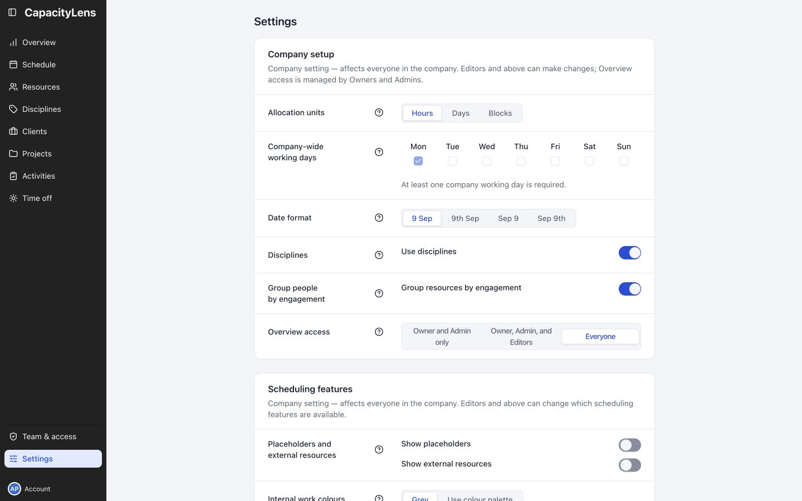
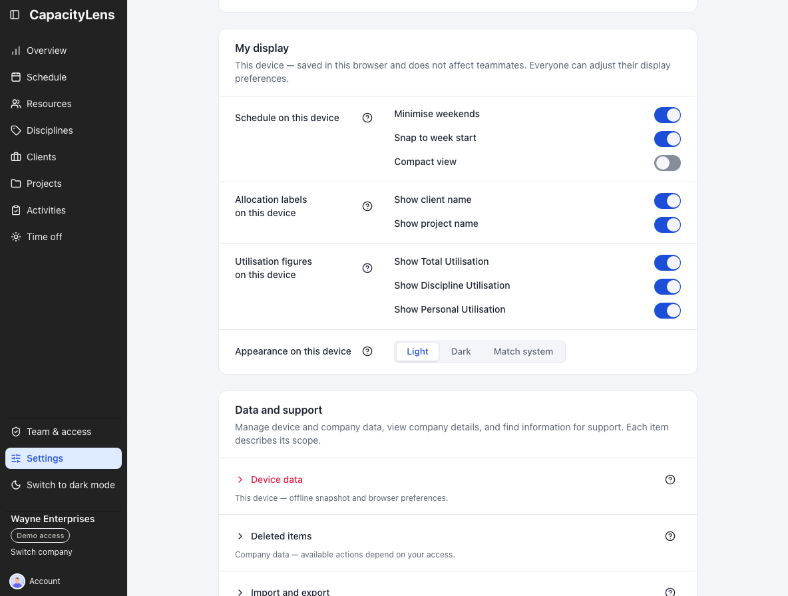
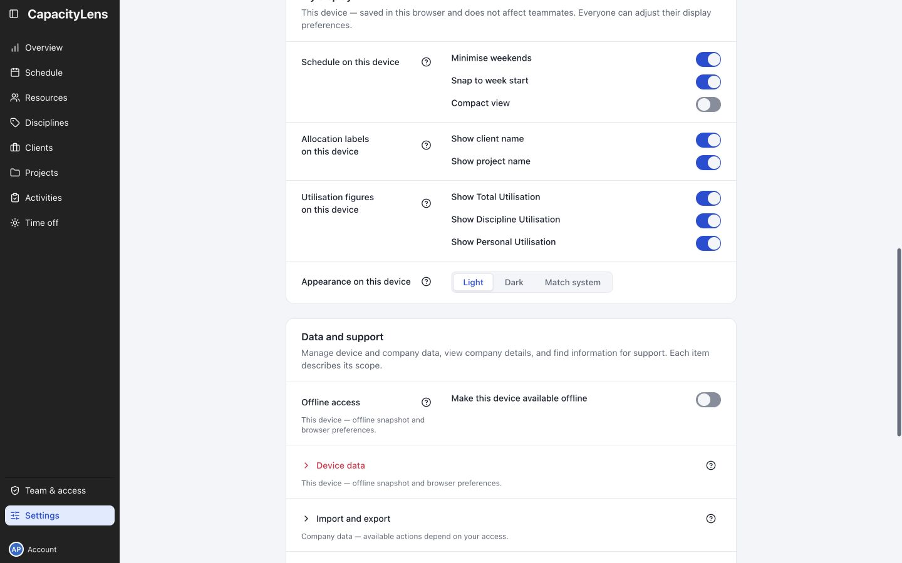

# Settings

Open **Settings** to find company rules, scheduling features and display preferences on one
scrollable page. Four groups are always present; a fifth appears during company-login cutover:

| Group | Scope and access |
| --- | --- |
| Company setup | Allocation units, working days, date format, disciplines, engagement grouping and Overview access. Editors and above can change planning settings; only Owners and Admins manage Overview access. |
| SSO cutover readiness | A conditional member-readiness table shown when strict company login is configured. Owners and Admins can use its repair actions during mixed-mode staging. |
| Scheduling features | Company-wide visibility and behaviour options. Editors and above can change them. |
| My display | Preferences saved in this browser. Everyone can adjust them without changing a teammate's display. |
| Data and support | Device data, company data, read-only company details and support information. Each row states its scope; available actions depend on your access. |

Labels and controls sit beside each other on wide screens and stack on narrow screens.
Each row has a question-mark button labelled **About &lt;section&gt;**: hover it
for that short label, or activate it to open the fuller explanation without keeping that
text on the page.

## Company setup

These settings affect everyone in the company. Editors and above can change them, except
**Overview access**, which is managed by Owners and Admins.

### Allocation units

Choose whether allocations are entered as **Hours**, **Days** or **Blocks**. New companies
start with Days; existing choices are preserved. See [Projects and allocations](/guide/projects-and-allocations).

### Company-wide working days

**Company-wide working days** is the company's shared working week. Seven abbreviated
weekday headings sit in one row with their checkboxes directly underneath, beginning with the first
day of the company's configured week. New companies select the first five days. You can select any
combination, but at least one day must stay checked: when only one remains, its checkbox is
disabled with an explanation until another day is selected.

Each person works the days that are ticked here **and** in their own working pattern. Days outside
that combination hold no capacity: allocations skip them, they count for nothing in utilisation,
and on such a start date the lane does not show the hover **+**, clicking or beginning a draw does
nothing, and a typed start date, a duplicate or a reassignment is rejected with the same rule. A
draw that begins on an allowed date may still cross blocked dates. The per-allocation
**Ignore working days** checkbox makes that allocation use every calendar day in its span and lets
an existing allocation be dragged or extended onto closed days — it never changes where a new
allocation may start — and time off stays a separate, visible conflict. A person's optional
**Start date** and **End date** add an inclusive
date boundary: capacity is zero outside the range, existing load remains visible, and Ignore
working days does not bypass it. New or placement-changing work outside the range is rejected, while
metadata edits and existing conflicting allocations remain allowed.

For example, if the company works Monday to Friday and Bruce Wayne works Monday, Wednesday and
Friday, his capacity and ordinary allocations use Monday, Wednesday and Friday.

Changing the selection recalculates capacity, utilisation and conflicts for existing allocations.
Allocation dates never move, but work on newly non-working days no longer counts unless the
allocation has Ignore working days enabled.

### Date format

**Date format** sets how planning dates read for everyone in the company: **9 Sep**,
**9th Sep**, **Sep 9** or **Sep 9th**. It applies to single calendar dates and ranges,
including dates on the Schedule and Time off pages. Editors and above can change it; a
Viewer sees the control disabled. The choice can be undone and takes effect without a reload.
It belongs to the company, but is not included in the JSON downloaded from **Import and export**.
Importing scheduling data preserves the destination company's settings, including its date format.
Compact weekday dates on the Time off page always retain the ordinal: with **9 Sep** selected,
a Wednesday appears as **Wed 9th Sep**.

A range crossing a year normally shows the year at both ends. The narrow week headings on
Overview are the deliberate exception: neighbouring columns provide the year context, so those
headings omit it.

Dates attached to server events use your browser's locale and local time zone instead.
These include session creation and expiry, password-reset expiry, invitation expiry in the
administration list and on the invite acceptance page, ownership-transfer deadlines, ownership
outcome dates and the offline banner's last-updated time. Your time zone decides which local day
or hour the instant falls on, while your browser locale decides the date order. The administration
list's invitation expiry or an ownership outcome may show only the date; it still follows this
viewer-local rule. Existing date-and-time displays, including invite acceptance and offline
last-updated, keep their time. CapacityLens never takes the date by cutting it from the stored UTC
timestamp.

### Disciplines

**Use disciplines** groups people by [discipline](/reference/glossary), such as Design or Development,
across the app. It is off for a newly created company. Create discipline names and colours on the
standalone **Disciplines** page in the main navigation. See [People and placeholders](/guide/people-and-placeholders).

### Group people by engagement

Choose whether Resources separates Studio and Supplementary people. On the schedule, those bands
hold people outside a discipline and become the main groups when disciplines are off. This is on
by default; favourites stay first inside each engagement group. See [People and placeholders](/guide/people-and-placeholders).

### Overview access

Overview is limited to Owners and Admins by default. An Owner or Admin can choose
**Owner and Admin only**, **Owner, Admin, and Editors**, or **Everyone** under **Overview
access**. The setting controls both the sidebar link and direct access to the page. See
[Find capacity across four, eight or twelve weeks](/guide/capacity-overview).

## SSO cutover readiness

When a strict company-login provider is configured, Owners and Admins see **SSO cutover
readiness** as its own Settings group after Company setup. Its **Member**, **Role**, **Status**, and
**Actions** table reports whether every active member has connected the configured provider and
keeps failures visible until they are resolved. **Correct email** and **Remove incorrect link** retain their
confirmation and recent-sign-in checks. The section refreshes when you enter Settings, change
company or change the configured provider. See
[Move from passwords to single sign-on](/company-login/move-to-single-sign-on).

## Scheduling features

These company-wide options control which scheduling features are available. Editors and above
can change them.

<!-- Compatibility anchor for existing links to resourcing options. -->

### Placeholders and external resources

**Placeholders and external resources** are company settings with two independent switches. A
**Placeholder** is an unfilled role or tentative person you can use to plan future capacity
before someone is assigned. An **External resource** is a third party — such as a partner agency,
freelancer, supplier or subcontractor — that represents work leaving your team and carries no
capacity. Each option is off by default, and turning one off hides its existing data without
deleting it.

### Internal work colours

Choose whether internal work uses **Grey** bars (the default) or **Use colour palette**, which
shows its saved palette colours.

### Internal work visibility

Two switches under **Internal work**, both on by default, control whether internal and
non-billable work shows up on the schedule at all:

- **Show internal projects**
- **Show internal activities**

Turning either off hides the matching bars from the schedule — useful if some of your
team only wants to see client work. It doesn't change capacity: hidden internal work
still counts toward a person's [utilisation](/reference/glossary), so someone who's
fully booked with internal work still shows as fully booked. Nothing is deleted, and the
bars come back the moment you turn the switch back on.

### Inline activity creation

New activities normally start on the **Activities** page, where your team can agree and
reuse consistent names. The allocation form still lets everyone pick an existing
[activity](/reference/glossary).

To let people create an activity without leaving an allocation, turn on **Inline
activity creation** under **Activity creation**. This workspace setting is off by
default. Turning it on adds the inline **Add activity** controls for everyone who can
edit allocations; turning it off again hides only those controls and does not remove
activities or allocations.

### Allocation task field

Turn on **Show task field in schedule** to add an optional single-line **Task** description to the
allocation editor. It is off by default. Enabled task text appears above Notes in schedule details
and the person's schedule drawer. Turning the setting off hides the field and text without deleting
it, so re-enabling the setting restores existing tasks.

## My display

Everyone can adjust these preferences. They are saved in this browser and do not change a
teammate's display.

### Schedule on this device

The three switches under **My display → Schedule on this device** change how the grid is drawn in this browser. They
are device preferences, not company data, so they do not change a teammate's schedule or
travel with an export:

- **Minimise weekends** narrows Saturday and Sunday so the working week gets more room.
  Weekend work still appears in those columns.
- **Snap to week start** returns the left edge to the company's first day of the week
  after free horizontal scrolling settles.
- **Compact view** reduces the vertical spacing so more people fit on screen. It changes
  no allocations or capacity.

### Allocation labels on this device

Choose whether allocation bars show the client name and project name ahead of the activity name.

### Utilisation figures on this device

Choose which utilisation figures appear on this browser's schedule: total, per-discipline and personal.

### Appearance on this device

Choose **Light**, **Dark** or **Match system** for this browser's colour scheme.
For a quick explicit switch between light and dark, use the moon or sun button directly below
**Settings** in the sidebar. The button remains available when the sidebar is collapsed.

## Data and support

This group combines device maintenance, company data, read-only company details and support
information. Each row states its scope, and available actions depend on your access.

**Device data**, **Deleted items** and **Import and export** are independent disclosures and start
closed. Opening one does not close another. Destructive actions explain their consequences in the
confirmation dialog.

### Offline access

Keep the last company you opened available on this device for seven days, read only.
See [Offline access](/guide/offline-access).

### Device data

Clear CapacityLens preferences and opt-in offline snapshots from this browser, leaving company
data on the server unchanged.

### Deleted items

Permanently delete items after their 30-day retention period. Archived items are restored or
deleted from the bottom of their Resources, Clients, Projects or Activities page.
See [People and placeholders](/guide/people-and-placeholders).

<!-- Compatibility anchor for existing links to import and export. -->

### Import and export

**Export JSON** downloads scheduling records for the current company. **Import JSON** replaces
those records after confirmation; in signed-in server deployments, only an Owner can import.
The destination company's settings, including date format, stay unchanged. Browser preferences
are not part of this file.

### Company details {#calendar}

This read-only summary shows the company name, week start, time zone and language.

The company's week start and time zone apply to the whole team. Week start controls the
order of days and where each week begins. Time zone is selected during company creation from a
searchable list of supported IANA zones, with the browser's local zone preselected. It determines
which calendar date counts as "today".

Both choices are frozen after the company is created. Settings shows them in the
read-only **Data and support → Company details** summary so everyone can check the
company-wide values, but nobody can change them there.

### Build details

The **Build details** row provides support context without exposing company data. A stamped
deployment shows its build revision and, when configured, a **Send feedback** link. Server mode
also includes the collapsed **Persistence diagnostics** disclosure with process-local save and
reload counters. These counters reset when a new persistence lifecycle starts.

### Diagnostics

At the bottom of this group, **Diagnostics** provides a **Copy diagnostics** action for a support
report in both server and demo builds. The copied projection includes the app version, validated
build revision when available, deployment mode and export schema. Server connectivity, database
schema, persistence and backup health are listed separately; demo builds and unavailable server
values show **Unknown** or **Unavailable**. It contains no company or member data, identifiers,
paths, hostnames, secrets, invite or session values, raw errors or other server response fields.

The Diagnostics row records the **Snapshot observed** time when the server response arrives, or
when its failure is observed. **Copy diagnostics** copies that same snapshot and does not request a
fresh report, so the support note describes one clear observation rather than a live stream.

## Your personal account

Your personal account is outside the **Data and support** group. It is reached through the
sidebar's **Account** row.

Open **Account** at the bottom of the sidebar to review your identity and the security controls
available for your sign-in method. Real and demo sessions can also **Sign out** from that page.
With one accessible company, real authentication hides the company context and switch; with two
or more, the sidebar retains them. These are personal controls, separate from the company settings
on this page. Your identity picture is also personal. When your identity provider supplies one,
the **Account** page shows it; a company administrator does not set it while creating or editing a
resource.

If a selected company cannot be loaded, a recovery screen hides the previously open company's
data. **Retry** loads the selected company again without changing your selection, or you can choose
another company.

For local-password identities, Account offers **Change password** in a dialog. It shows multi-factor
authentication status when the operator requires it. Company single sign-on shows its connection
without a local password control. A long email is truncated, and its full address is available on hover or keyboard focus. Active
session details are hidden. Demo mode identifies the fictional persona; installations with
sign-in off have no credential controls or sign-out action.

## What's next

[People and placeholders](/guide/people-and-placeholders) and
[Projects and allocations](/guide/projects-and-allocations) cover team structure and
booked work in more detail.
