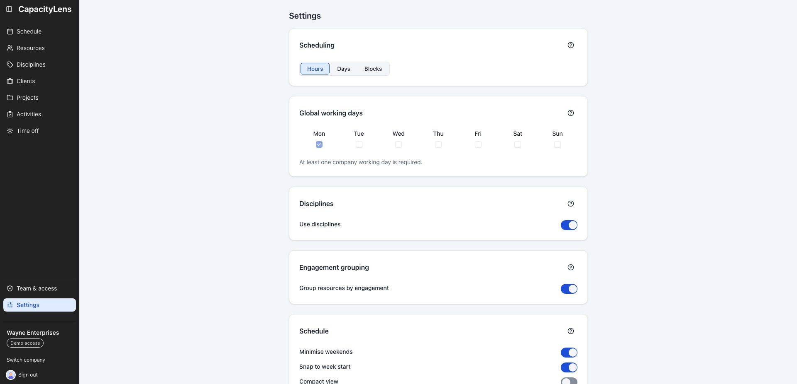
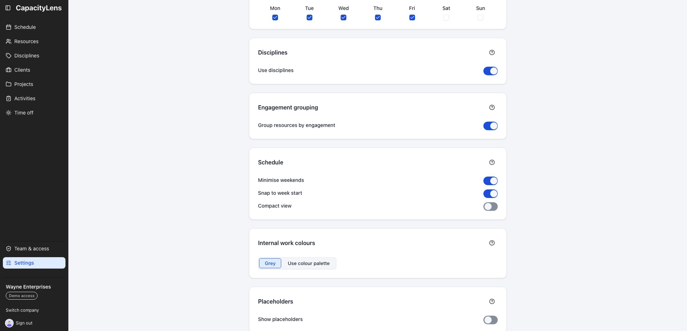
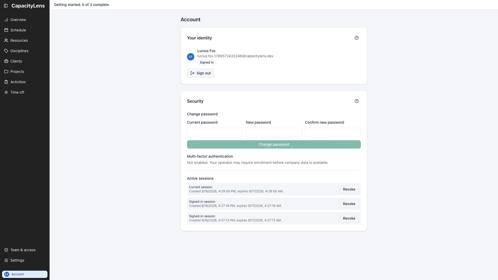

# Settings

Settings is one scrollable page of plain-language switches — no tabs, no separate admin
console. Most settings apply to the whole company; a few apply only to your own device.
This page covers the controls worth understanding early, plus a map of everything else.
Each section has a question-mark button labelled **About &lt;section&gt;**: hover it
for that short label, or activate it to open the fuller explanation without keeping that
text on the page.

## Diagnostics

At the bottom of Settings, **Diagnostics** provides a **Copy diagnostics** action for a support
report in both server and demo builds. The copied projection includes the app version, validated
build revision when available, deployment mode and export schema. Server connectivity, database
schema, persistence and backup health are listed separately; demo builds and unavailable server
values show **Unknown** or **Unavailable**. It contains no company or member data, identifiers,
paths, hostnames, secrets, invite or session values, raw errors or other server response fields.

## Company-wide working days

**Company-wide working days** is the company's shared working week. Seven abbreviated
weekday headings sit in one row with their checkboxes directly underneath, beginning with the first
day of the company's configured week. New companies select the first five days. You can select any
combination, but at least one day must stay checked: when only one remains, its checkbox is
disabled with an explanation until another day is selected.

Each person works the days that are ticked here **and** in their own working pattern. Days outside
that combination hold no capacity: allocations skip them, they count for nothing in utilisation,
and on such a start date the lane does not show the hover **+**, clicking or beginning a draw does
nothing, and a typed start date, a duplicate or a reassignment is rejected with the same rule. A
draw that begins on an allowed date may still cross blocked dates. The per-allocation
**Ignore working days** checkbox makes that allocation use every calendar day in its span and lets
an existing allocation be dragged or extended onto closed days — it never changes where a new
allocation may start — and time off stays a separate, visible conflict. A person's optional
**Start date** and **End date** add an inclusive
date boundary: capacity is zero outside the range, existing load remains visible, and Ignore
working days does not bypass it. New or placement-changing work outside the range is rejected, while
metadata edits and existing conflicting allocations remain allowed.

For example, if the company works Monday to Friday and Bruce Wayne works Monday, Wednesday and
Friday, his capacity and ordinary allocations use Monday, Wednesday and Friday.

Changing the selection recalculates capacity, utilisation and conflicts for existing allocations.
Allocation dates never move, but work on newly non-working days no longer counts unless the
allocation has Ignore working days enabled.

## Schedule on this device

The three switches under **Schedule** change how the grid is drawn in this browser. They
are device preferences, not company data, so they do not change a teammate's schedule or
travel with an export:

- **Minimise weekends** narrows Saturday and Sunday so the working week gets more room.
  Weekend work still appears in those columns.
- **Snap to week start** returns the left edge to the company's first day of the week
  after free horizontal scrolling settles.
- **Compact view** reduces the vertical spacing so more people fit on screen. It changes
  no allocations or capacity.

## Additional resourcing options

**Additional resourcing options** are company settings with two independent switches. A
**Placeholder** is an unfilled role or tentative person you can use to plan future capacity
before someone is assigned. An **External resource** is a third party — such as a partner agency,
freelancer, supplier or subcontractor — that represents work leaving your team and carries no
capacity. Each option is off by default, and turning one off hides its existing data without
deleting it.

## Internal work visibility

Two switches under **Internal work**, both on by default, control whether internal and
non-billable work shows up on the schedule at all:

- **Show internal projects**
- **Show internal activities**

Turning either off hides the matching bars from the schedule — useful if some of your
team only wants to see client work. It doesn't change capacity: hidden internal work
still counts toward a person's [utilisation](/reference/glossary), so someone who's
fully booked with internal work still shows as fully booked. Nothing is deleted, and the
bars come back the moment you turn the switch back on.

## Inline activity creation

New activities normally start on the **Activities** page, where your team can agree and
reuse consistent names. The allocation form still lets everyone pick an existing
[activity](/reference/glossary).

To let people create an activity without leaving an allocation, turn on **Inline
activity creation** under **Activity creation**. This workspace setting is off by
default. Turning it on adds the inline **Add activity** controls for everyone who can
edit allocations; turning it off again hides only those controls and does not remove
activities or allocations.

## Allocation task field

Turn on **Show task field in schedule** to add an optional single-line **Task** description to the
allocation editor. It is off by default. Enabled task text appears above Notes in schedule details
and the person's schedule drawer. Turning the setting off hides the field and text without deleting
it, so re-enabling the setting restores existing tasks.

## Calendar

The company's week start and time zone apply to the whole team. Week start controls the
order of days and where each week begins. Time zone is selected during company creation from a
searchable list of supported IANA zones, with the browser's local zone preselected. It determines
which calendar date counts as "today".

Both choices are frozen after the company is created. Settings shows them in the
read-only **Account Options Selected at Creation** summary so everyone can check the
company-wide values, but nobody can change them there.

## Your personal account

Open **Account** near **Switch company** and **Sign out** at the bottom of the sidebar to
review your identity and the security controls available for your sign-in method. These are
personal controls, separate from the company settings on this page.

In password mode, Account includes password changes, reported multi-factor authentication
status and active sessions. Company single sign-on shows its connection and session controls
without a local password form. Demo mode identifies the fictional persona; installations with
sign-in off have no credential controls. **Sign out** remains in the sidebar.

## Capacity Overview access

Capacity Overview is limited to Owners and Admins by default. An Owner or Admin can choose
**Owner and Admin only**, **Owner, Admin, and Editors**, or **Everyone** under **Capacity Overview
access**. The setting controls both the sidebar link and direct access to the page. See
[Find capacity for the next four weeks](/guide/capacity-overview).

## Everything else on the page

The rest of Settings, roughly top to bottom:

| Section                       | What it controls                                                                                                                                                                                                                                                                                                                       |
| ----------------------------- | -------------------------------------------------------------------------------------------------------------------------------------------------------------------------------------------------------------------------------------------------------------------------------------------------------------------------------------- |
| Scheduling                    | Whether allocations are entered as Hours, Days or Blocks. New companies start with Days; existing choices are preserved — see [Projects and allocations](/guide/projects-and-allocations).                                                                                                                                                                                                            |
| Capacity Overview access      | Who can open the four-week Capacity Overview. Owners and Admins manage this setting; Owner and Admin is the default. See [Find capacity for the next four weeks](/guide/capacity-overview).                                                                                                                                              |
| Company-wide working days    | The company's shared working week. A person's capacity covers the days ticked here and in their own pattern; new work must start on such a day, and at least one day must stay selected.                                                                                                                                                |
| Disciplines                   | Whether people are grouped by [discipline](/reference/glossary) (Design, Development, and so on) across the app. Off for a newly created company. Disciplines themselves — their names and colours — are created on the standalone **Disciplines** page in the main navigation, not here; see [People and placeholders](/guide/people-and-placeholders). |
| Engagement grouping           | Whether Resources separates Studio and Supplementary people. On the schedule, those bands hold people outside a discipline and become the main groups when disciplines are off. On by default; favourites stay first inside each engagement group. See [People and placeholders](/guide/people-and-placeholders).                                                                                         |
| Schedule (this device)        | Three browser-only display preferences described in [Schedule on this device](#schedule-on-this-device).                                                                                                                                                                                                                               |
| Internal work colours         | Whether internal work uses grey bars (default) or the same colour palette as everything else.                                                                                                                                                                                                                                          |
| Additional resourcing options | Whether unfilled [placeholder](/reference/glossary) roles and [external parties](/reference/glossary) — partner agencies, freelancers, suppliers or subcontractors — are available. Each switch is independent and off by default. See [People and placeholders](/guide/people-and-placeholders). |
| Allocation bars (this device) | Whether bars show the client name and project name ahead of the activity name.                                                                                                                                                                                                                                                         |
| Utilisation                   | Which utilisation figures appear on the schedule: total, per-discipline and personal.                                                                                                                                                                                                                                                  |
| Appearance (this device)      | Light, dark, or match your system theme.                                                                                                                                                                                                                                                                                               |
| Offline access                | Keep the last company you opened available on this device for seven days, read only. See [Offline access](/guide/offline-access).                                                                                                                                                                                                      |
| Device data                   | Clear everything CapacityLens has stored on this device.                                                                                                                                                                                                                                                                               |
| Deleted items                 | A closed-by-default disclosure for permanently deleting items after their 30-day retention period. Archived items are restored or deleted from the bottom of their Resources, Clients, Projects or Activities page. See [People and placeholders](/guide/people-and-placeholders).                                                                                                                     |
| Import & export               | A closed-by-default disclosure for downloading this company's data as JSON or replacing it from an earlier export. Importing asks you to confirm first.                                                                                                                                                                                |
| Account Options Selected at Creation | A compact, read-only summary of the company name, week start, time zone and language. Week start and time zone affect the whole team but are frozen after company creation; see [Calendar](#calendar).                                                                                                                             |
| Diagnostics                   | Review and copy a privacy-safe, point-in-time snapshot of app and observable server status for support reports. It is not a live monitor.                                                                                                                                                                                           |

**Device data**, **Deleted items** and **Import & export** are independent
disclosures and start closed. Opening one does not close another. Destructive actions
still explain their consequences in the confirmation dialog.

The Diagnostics card records the **Snapshot observed** time when the server response arrives, or
when its failure is observed. **Copy diagnostics** copies that same snapshot and does not request a
fresh report, so the support note describes one clear observation rather than a live stream.

::: tip
Sections marked "this device" only affect your own browser. Everything else is shared
by the whole company. Editable company settings need Editor access or above; the calendar
summary is read only because those choices are frozen after company creation.
:::

## What's next

[People and placeholders](/guide/people-and-placeholders) and
[Projects and allocations](/guide/projects-and-allocations) cover team structure and
booked work in more detail.
