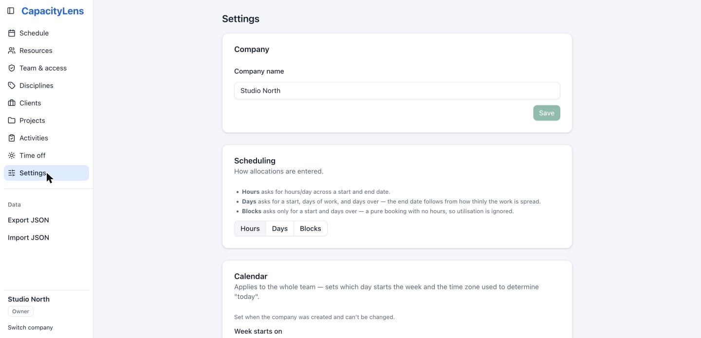
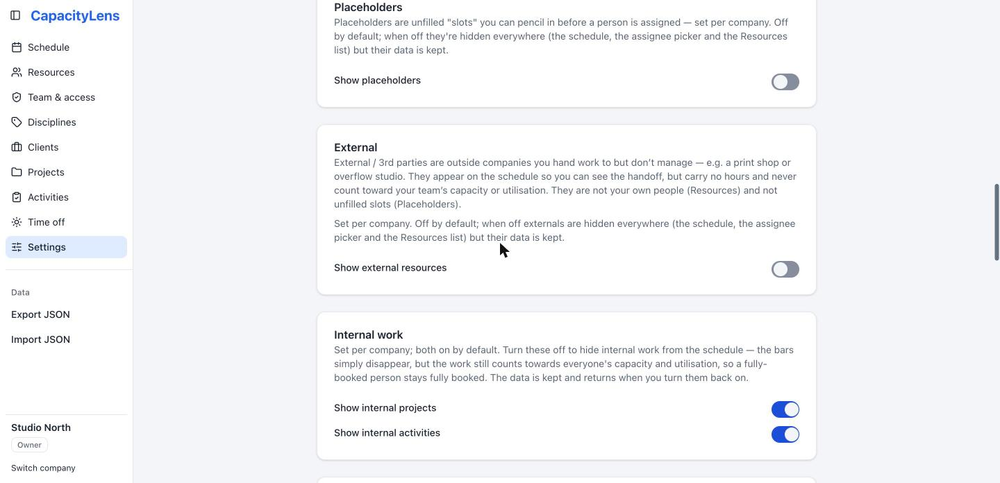

# Settings

Settings is one scrollable page of plain-language switches — no tabs, no separate admin
console. Most settings apply to the whole company; a few apply only to your own device.
This page covers the two switches worth understanding early, plus a map of everything
else.

## Internal work visibility

Two switches under **Internal work**, both on by default, control whether internal and
non-billable work shows up on the schedule at all:

- **Show internal projects**
- **Show internal activities**

Turning either off hides the matching bars from the schedule — useful if some of your
team only wants to see client work. It doesn't change capacity: hidden internal work
still counts toward a person's [utilisation](/reference/glossary), so someone who's
fully booked with internal work still shows as fully booked. Nothing is deleted, and the
bars come back the moment you turn the switch back on.

## Inline activity creation

When you're booking an allocation and the [activity](/reference/glossary) you need
doesn't exist yet, the allocation form normally lets you add it on the spot without
leaving the form. That
convenience is controlled by **Inline activity creation** under **Activity creation**,
on by default. Turning it off means everyone has to create new activities from the
**Activities** page first, then pick from the existing list when they allocate — useful
if you'd rather keep activity names tidy and reviewed.

## Everything else on the page

The rest of Settings, roughly top to bottom:

| Section                       | What it controls                                                                                                                                                                                                                                                                                                                       |
| ----------------------------- | -------------------------------------------------------------------------------------------------------------------------------------------------------------------------------------------------------------------------------------------------------------------------------------------------------------------------------------- |
| Company                       | The company's display name.                                                                                                                                                                                                                                                                                                            |
| Scheduling                    | Whether allocations are entered as Hours, Days or Blocks — see [Projects and allocations](/guide/projects-and-allocations).                                                                                                                                                                                                            |
| Calendar                      | Week start, timezone and language. Set once when the company is created and frozen after, so "today" means the same thing for everyone.                                                                                                                                                                                                |
| Disciplines                   | Whether people are grouped by [discipline](/reference/glossary) (Design, Development, and so on) across the app. On by default. Disciplines themselves — their names and colours — are created on the standalone **Disciplines** page in the main navigation, not here; see [People and placeholders](/guide/people-and-placeholders). |
| Schedule (this device)        | Minimise weekends, snap to week start, and compact view — your own display preferences, not shared with teammates.                                                                                                                                                                                                                     |
| Internal work colours         | Whether internal work uses grey bars (default) or the same colour palette as everything else.                                                                                                                                                                                                                                          |
| Placeholders                  | Whether unfilled [placeholder](/reference/glossary) slots are available. Off by default. See [People and placeholders](/guide/people-and-placeholders).                                                                                                                                                                                |
| External                      | Whether [external parties](/reference/glossary) — outside companies you hand work to but don't manage, like print shops — are available. Off by default. See [People and placeholders](/guide/people-and-placeholders).                                                                                                                |
| Allocation bars (this device) | Whether bars show the client name and project name ahead of the activity name.                                                                                                                                                                                                                                                         |
| Utilisation                   | Which utilisation figures appear on the schedule: total, per-discipline and personal.                                                                                                                                                                                                                                                  |
| Appearance (this device)      | Light, dark, or match your system theme.                                                                                                                                                                                                                                                                                               |
| Offline access                | Keep the last company you opened available on this device for seven days, read only. See [Offline access](/guide/offline-access).                                                                                                                                                                                                      |
| Device data                   | Clear everything CapacityLens has stored on this device.                                                                                                                                                                                                                                                                               |
| Account                       | Your sign-in email and a sign-out button.                                                                                                                                                                                                                                                                                              |
| Security                      | Change your password and review your active sign-in sessions, in password mode.                                                                                                                                                                                                                                                        |
| Archived & deleted            | Restore something you archived, or permanently delete it. See [People and placeholders](/guide/people-and-placeholders).                                                                                                                                                                                                               |
| Import & export               | Download this company's data as a JSON file, or replace it from a file you exported earlier. Importing replaces everything in this company, so it asks you to confirm first. Most people never need it.                                                                                                                                |

Every switch on this page comes with its own plain-language explanation of what it
changes and what happens to your data if you turn it back off — nothing here deletes
data, it just changes what's shown.

::: tip
Sections marked "this device" only affect your own browser. Everything else is shared
by the whole company and needs Editor access or above to change.
:::

## What's next

[People and placeholders](/guide/people-and-placeholders) and
[Projects and allocations](/guide/projects-and-allocations) cover the two switches
above in more detail.
