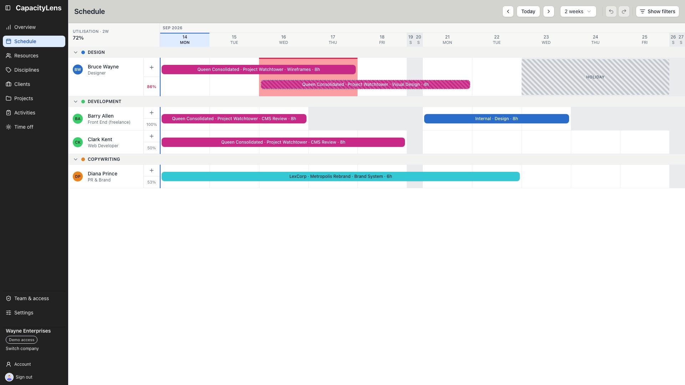
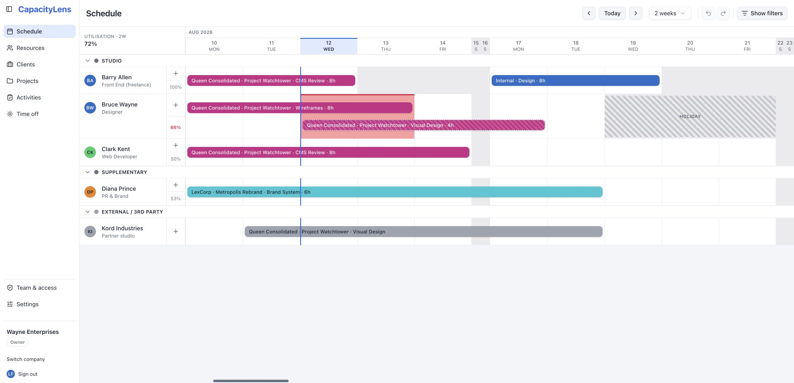
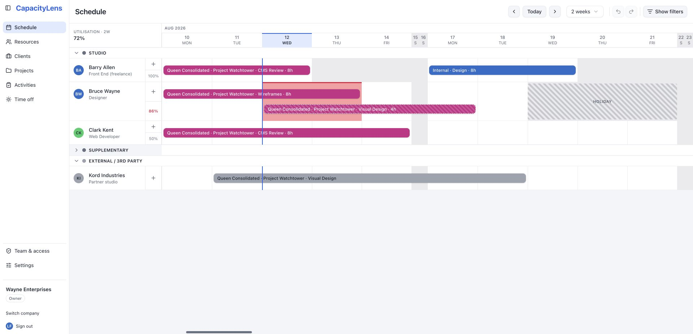
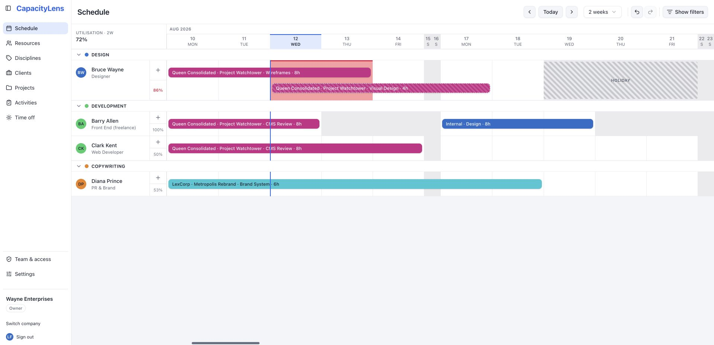
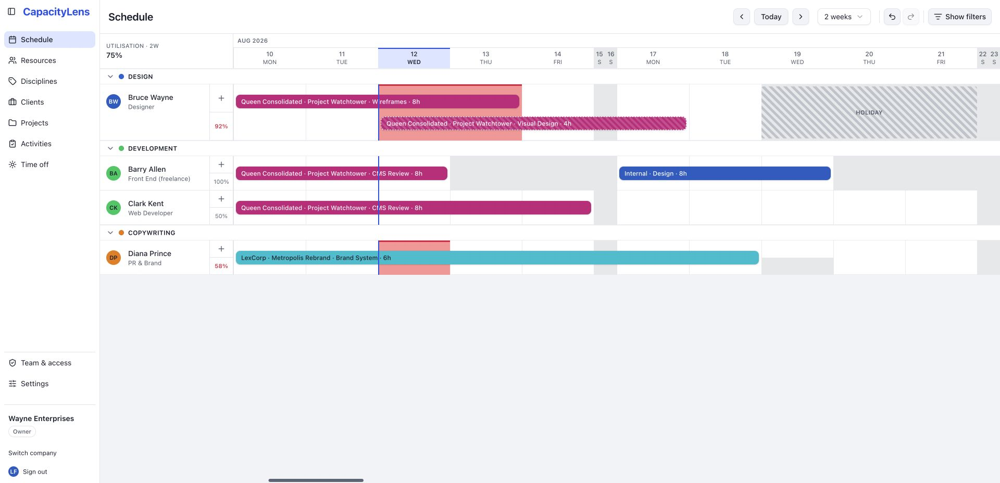
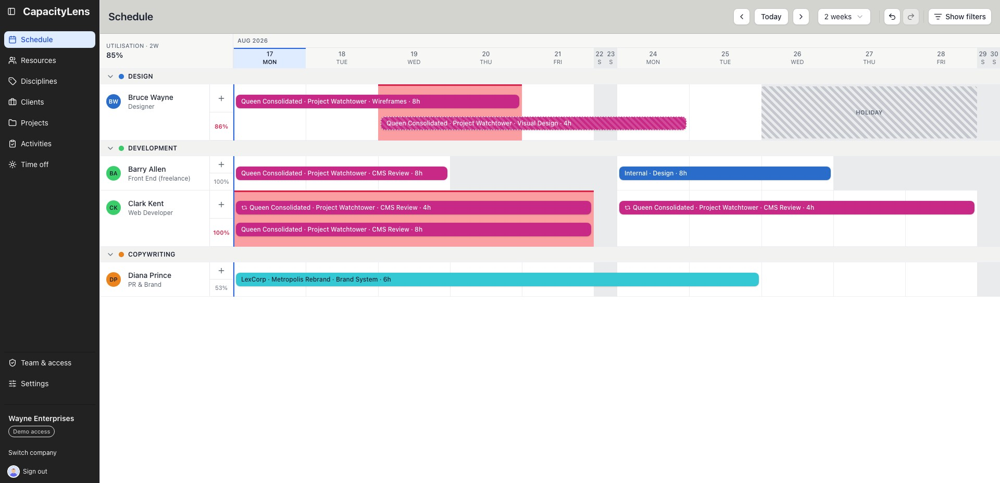
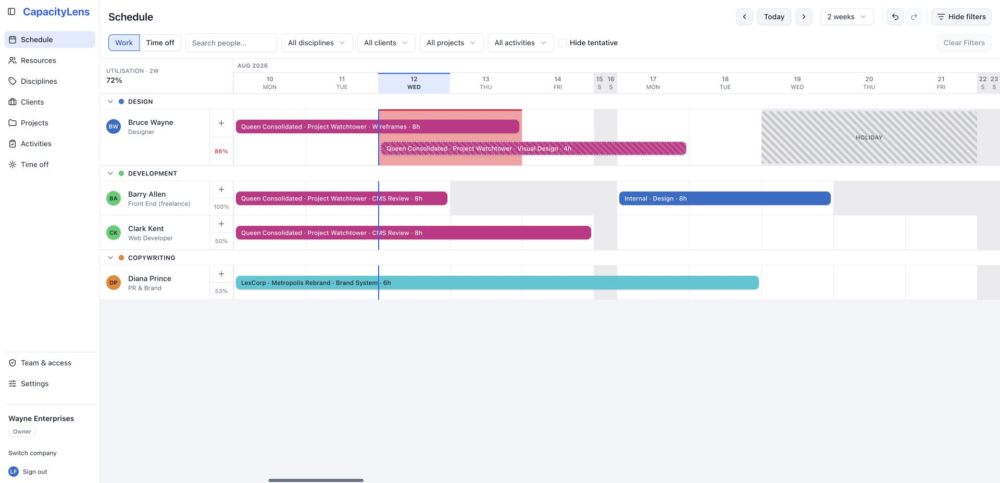
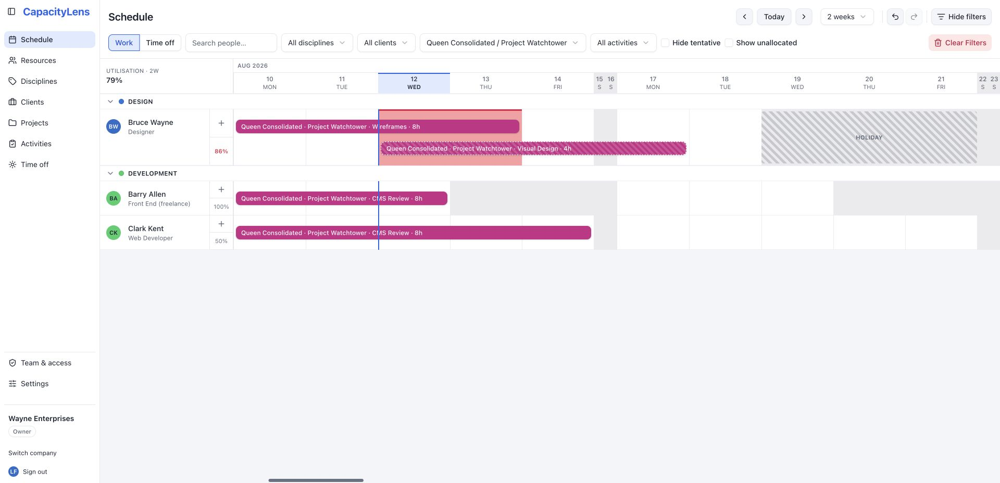
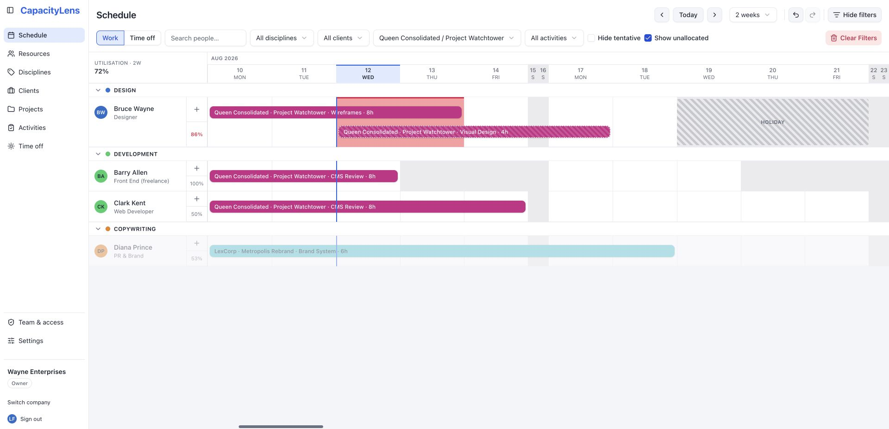

# The schedule

The schedule is the one screen CapacityLens is built around: every person, every
allocation and every day of time off, all on a single zoomable grid. This page explains
what you're looking at so you can read [utilisation](/reference/glossary) at a glance
instead of clicking around to check.

## Rows: your people

Each row is one [person](/reference/glossary) — a real teammate, a freelancer, or a
[placeholder](/reference/glossary) for a role you haven't filled yet. Rows are grouped
under a [discipline](/reference/glossary) heading (Design, Development, and so on) when
your company uses disciplines, which is the default. A group header can be collapsed to
`{count} hidden`, and shows an average utilisation figure for everyone in it when that
figure is turned on in Settings.

Each row starts with an avatar and name, with the person's role shown underneath. A
placeholder row is labelled with the word "Placeholder" instead of a name, and has a
faint diagonal hatch on its header so it reads as unfilled at a glance.

People marked as favourites stay at the top of their discipline, in alphabetical order.
Everyone else follows alphabetically, then placeholders. Favourite external parties lead
the separate External group. Favourites are shared with everyone in the company rather
than being a personal display preference.

When disciplines are turned off, the same people move into **Studio** and
**Supplementary** bands. **External / 3rd party** stays last. If disciplines are on but a
person has not been assigned to one yet, that person also falls back to their Studio or
Supplementary band after the discipline groups.

Select a group heading to collapse it when you need more vertical space. The heading
stays visible and reports how many rows are hidden; select it again to expand the group.

## Columns: the visible weeks

Columns are days, grouped into a zoomable range of one, two, four, six or eight weeks
at a time — the **Weeks visible** dropdown in the toolbar switches between them. Use the
arrow buttons (hover for "Back one week" / "Forward one week") to pan a week at a time,
and **Today** to jump back to the current week.

Weekend columns get a faint tint when you're zoomed in close enough to see individual
days clearly. In the one- and two-week views, each month and year starts above the first visible
day it describes. Wider views keep a compact month label in sight as you scroll.

At the same close zoom levels, a person's **Half day** is shown by tinting the bottom
half of that day's cell. The full cell remains available for clicking, drawing and
editing work; the tint is a capacity cue, not a smaller interaction target. Time off or
a fully non-working day still fills the whole cell.

## Allocation bars

An [allocation](/reference/glossary) — a person booked on a project for a date range —
shows as a coloured bar spanning the days it covers, coloured by project or
[activity](/reference/glossary).
Three statuses are visible directly on the bar:

- **Confirmed** — a plain, solid bar. This is the default when you create one.
- **Tentative** — the same bar with a dashed border and a light diagonal hatch, so
  work that isn't locked in yet still stands out from confirmed work.
- **Completed** — the bar's label gets a checkmark prefix.

Depending on your device preferences, a bar's label can also show the client and
project name ahead of the activity name, plus the hours booked per day. Companies that
plan in Blocks don't book hours at all — see
[Projects and allocations](/guide/projects-and-allocations) for how the different
scheduling modes work.

Allocations created together with **Repeat** show a small repeat cue at the start of
each linked bar. Hover or focus the bar to see the last surviving date in that series.
The cue marks the link between occurrences; each occurrence can still be edited on its
own.

## Reading overwork

CapacityLens never makes you run a report to find out who's overbooked:

- A **utilisation percentage** sits beside each row, and can also be shown as a
  company-wide total and a per-discipline average — all three are switches in
  [Settings](/guide/settings). A person's own percentage turns bold and red as soon as
  they're booked over capacity within the next 14 days, regardless of what's currently
  zoomed into view.
- Any day where a person is booked for more than they're available gets a red band
  under the bars for that day, so the exact day that tips someone over capacity is
  obvious without doing the maths yourself.

::: tip
The utilisation percentage itself is worked out over whatever date range is currently
visible — one, two, four, six or eight weeks. Zoom out to two weeks and a person's
percentage will usually drop, because it's now averaged over more days; zoom back to one
week and it rises again. That's expected, not a bug: the percentage always answers "how
booked is this person over the weeks I'm looking at right now?" The red over-capacity
warning is separate and doesn't move when you zoom — it always looks at the fixed next
14 days, so someone can show red even while you're viewing a wider, less-full-looking
range.
:::

## Time off on the same canvas

[Time off](/guide/time-off) — holiday, sick leave or unpaid leave — is drawn on the same
grid as work, as a hatched block with no project colour, so a person's real availability
is always visible in one place rather than hidden in a separate calendar.

Choosing **Everyone** in the time-off workflow creates one company-wide closure. It is
an assignee choice, not a setting. The closure appears across every capacity-tracked
person and placeholder on the schedule, including people added later.

An Hours or Days allocation that exceeds the remaining availability gets the usual red
over-capacity band. Blocks deliberately carry no hours and keep utilisation at 0%, but
a Block that overlaps time off still gets the red conflict treatment so the clash cannot
disappear inside the holiday hatch. See [Time off](/guide/time-off#time-off-and-allocations)
for an example.

## Filtering and searching

Use **Show filters** at the right of the toolbar, after Undo and Redo, to open the filter
row. Select **Hide filters** when you want the extra vertical space back. Hiding the row
does not clear an active filter.

You can search people by name, filter by discipline, client, project or activity, or
hide tentative work. Selecting a client or project narrows the bars and rows to that
work. The active value stays visible in the row, and **Clear Filters** turns red so the
filtered state cannot be mistaken for the complete schedule.

After selecting a client, project or activity, turn on **Show unallocated** to bring
people with no matching work back into the result. Their rows are dimmed, which makes
them useful candidates to staff without implying they are already booked to the filter.

**Clear Filters** stays at the far right of the open row. It is quiet and disabled when
nothing is filtered, then turns red with a bin icon when a filter is active. One click
resets the search, every dropdown, **Hide tentative** and **Show unallocated**.

Every change on the schedule — dragging, resizing, deleting an allocation — can be
undone and redone from the toolbar, or with Ctrl/Cmd+Z, if you have edit access.

::: tip
Rows, colours and percentages update live as you drag. There's nothing to refresh and
nothing to recalculate — what you see is always current.
:::

## What's next

[People and placeholders](/guide/people-and-placeholders) covers who can appear on the
schedule, and [Projects and allocations](/guide/projects-and-allocations) covers how the
bars themselves get created.
