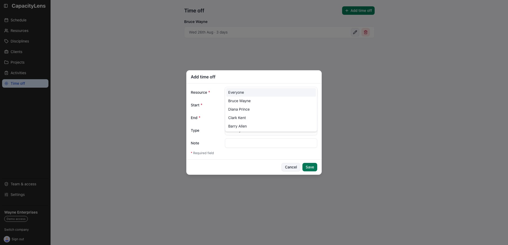
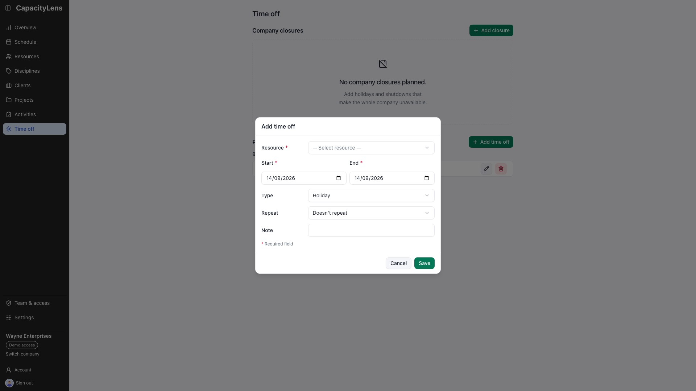
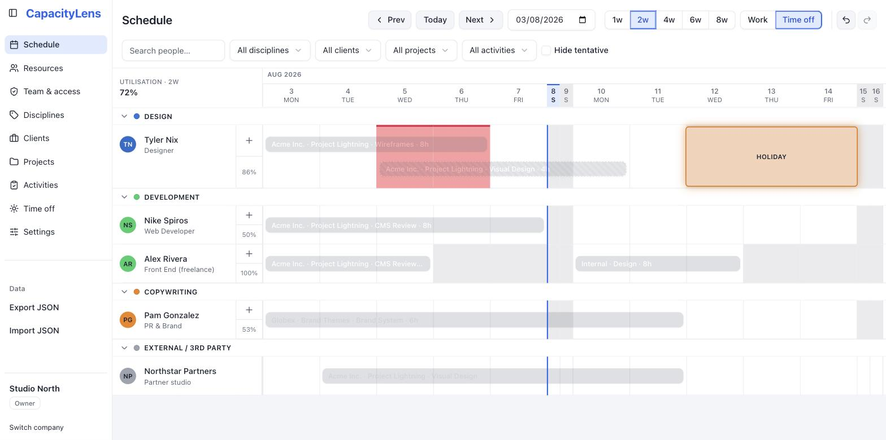
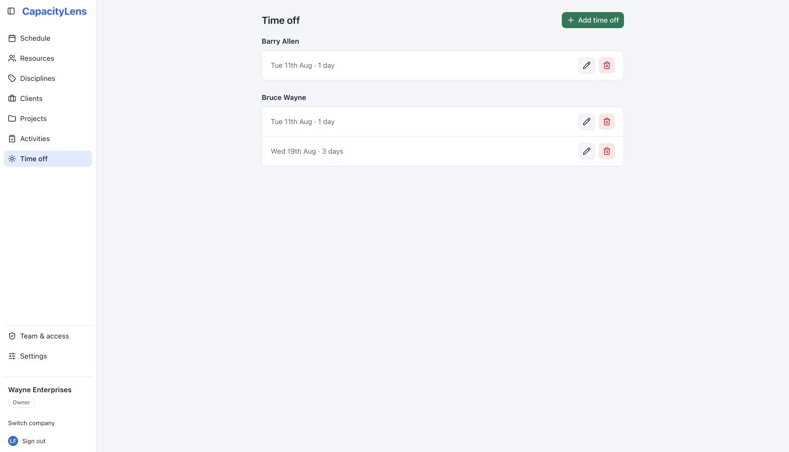
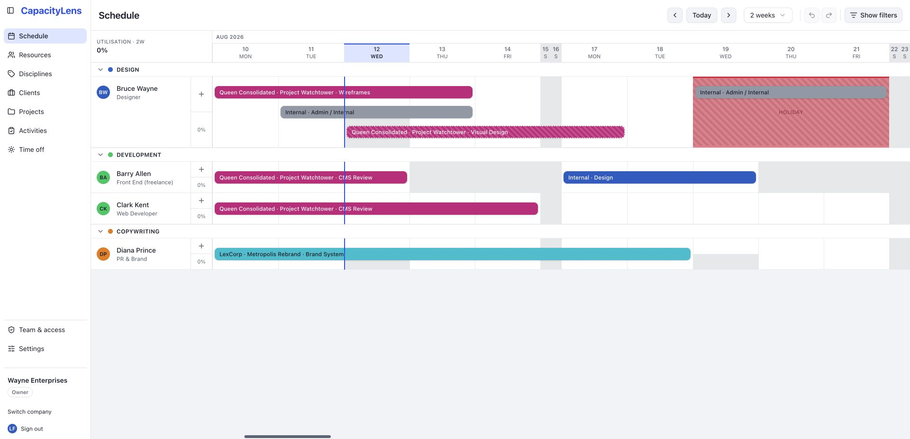

# Time off

[Time off](/reference/glossary) is a block on the schedule marking a
[person](/reference/glossary) unavailable, drawn on the same canvas as their work so
capacity never has to be checked against a separate calendar. This page covers
recording it and how it interacts with allocations.

## Record time off

1. Open **Time off** and click **Add time off** — or, on the schedule, switch the
   toolbar's draw mode from "Work" to "Time off" and drag across the days on a
   person's row.
2. Choose the person — or **Everyone**, for a company-wide closure — plus the start and
   end dates and a type. A person's entry can be holiday, sick, unpaid or other; an
   Everyone entry offers only holiday and other, because sick and unpaid leave are
   personal by nature.
3. Add a short, single-line note if you need to — for example, "Conference" or a return
   date. Notes are only visible to Admins and Owners; other roles see that time off
   exists without the detail. See
   [Roles and permissions](/getting-started/roles-and-permissions).

## Review current and upcoming time off

The Time off page is a forward-looking planning list. It shows an entry when its end date
is on or after the start of the current company week. Older entries stay stored but no
longer clutter the page.

Entries are grouped under each resource's name. An **Everyone** group for company-wide
entries comes first — its rows carry the type label, since no person heading tells a
holiday from an "other" closure. Resource groups follow alphabetically, each person's
entries ordered by date, and any entry whose person no longer exists falls into a final
"unknown" group. Placeholder time off follows the company's **Show placeholders**
setting.

## How it shows on the schedule

Time off renders as a hatched block on the person's row — no project colour, so it's
never mistaken for booked work. It sits in the same lane as allocation bars, which
means a quick glance at a row tells you whether someone is busy, off, or free.

[External parties](/reference/glossary) — outside companies like print shops or overflow
studios you hand work to but don't manage — can't have *personal* time off recorded
against them, since they carry no hours and no capacity on the schedule. A company-wide
closure still stops new external placements *starting* on its dates — the agency is
shut — but draws nothing on their rows. See
[People and placeholders](/guide/people-and-placeholders) for the difference between an
external party, a placeholder and a person.

## Company-wide time off

Choosing **Everyone** records one entry that applies to every capacity-tracked person and
placeholder — a bank holiday, or a whole-agency closure like a two-week Christmas
shutdown. New hires are covered automatically, because the closure belongs to the
company, not to a list of people.

On the affected dates everyone's availability drops to zero, but allocations keep their
dates and their hours. Work already planned across the closure therefore lights up red
instead of silently disappearing — that warning is the point. Deleting or shortening the
closure restores capacity; nothing about the allocations themselves has changed.

A closure is dated, not recurring: it is different from the company's
[global working days](/guide/settings#global-working-days), which normal allocations
simply skip. Days a closure covers still count as scheduled load, exactly like personal
time off, and **Ignore working days** never bypasses either. New allocations cannot
start on a closure date for anyone.

## Time off and allocations

Recording time off doesn't automatically remove or block overlapping allocations.
Instead, if you try to book someone on days they're already off, the allocation form
warns you that the booking overlaps their time off — so you can see the conflict and
decide, rather than have CapacityLens silently prevent it or silently ignore it.

Hours and Days allocations use the normal over-capacity calculation. A Block carries no
hours, so it leaves utilisation at 0%, but an overlap with time off still receives the
same red conflict treatment above the holiday hatch.

## What's next

Back to [The schedule](/guide/the-schedule) to see how time off and allocations read
together on the grid, or [Settings](/guide/settings) to see the company-wide switches
that affect what's visible.
