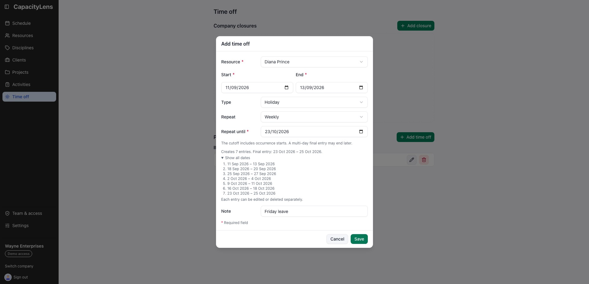
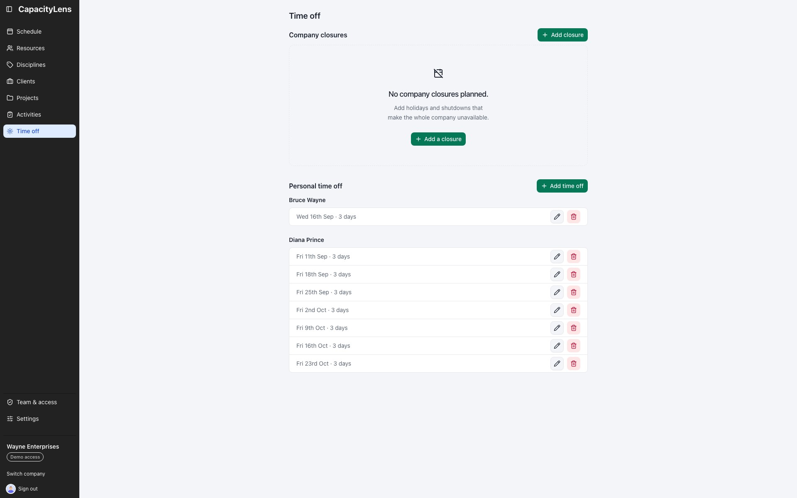
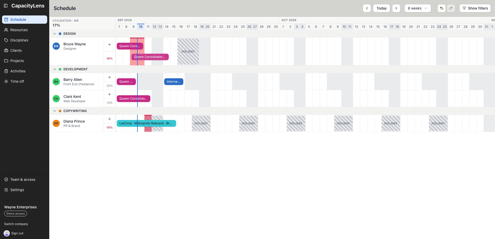
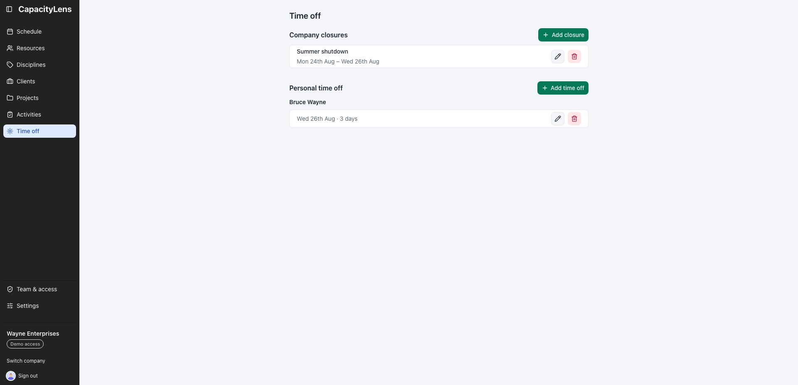

# Time off

[Time off](/reference/glossary) marks a [person](/reference/glossary) unavailable. A
company closure marks every person and placeholder unavailable at once. Both appear on
the same canvas as work, so capacity never has to be checked against a separate calendar.

## Record time off

1. Open **Time off** and click **Add time off** — or, on the schedule, switch the
   toolbar's draw mode from "Work" to "Time off" and drag across the days on a
   person's row.
2. Choose the person, start and end dates, and whether the entry is holiday, sick,
   unpaid or other.
3. Leave **Repeat** as **Doesn’t repeat**, or choose a weekly or monthly pattern and set
   **Repeat until**. The preview shows every entry that will be created.
4. Add a short, single-line note if you need to — for example, "Conference" or a return
   date. Notes are only visible to Admins and Owners; other roles see that time off
   exists without the detail. See
   [Roles and permissions](/getting-started/roles-and-permissions).
5. Check the final date range in the preview, then click **Save**.

## Repeat personal time off

Weekly repeats can run every one, two, three or four weeks. Monthly repeats can use the
same calendar date or the last matching weekday. Same-date repeats keep their original
anchor after a shorter month: 31 January becomes 28 February, then 31 March. For the
last-weekday pattern, start on the last Friday of January and choose **Monthly on the
last Friday** to avoid treating every fourth Friday as the last one. The start must
already be that month's last matching weekday; CapacityLens never moves the first entry
for you.

**Repeat until** includes an occurrence that starts on the cutoff. A multi-day entry may
therefore finish after it. The suggested cutoff is the final day of a twelve-calendar-month
window: the starting month plus the following eleven months. This is also the latest
allowed cutoff; you can choose an earlier date. Every repeat must create between 2 and
54 entries.

Each occurrence keeps the original whole-day calendar span. A Tuesday–Wednesday entry
always remains two consecutive dates, even across weekends, holidays or non-working days.
The preview and the saved entries use those same ranges. Overlapping time off is allowed
and is not merged or skipped.

Saving creates one undoable batch, but the entries are independent afterwards. The Time off
page shows a separate dated row, Edit button and Delete button for every occurrence. Editing or
deleting one does not change the others. Repeat controls appear only while adding time off;
editing an existing entry never regenerates its neighbours.

### Independent entries on one schedule

Independent entries do not create separate schedules. Every occurrence still belongs to the
person selected in the form. The Schedule page gathers all of that person's dated time off and
draws it on their one row, alongside their work. In the example below, the seven separate entries
for Diana Prince become seven hatched **Holiday** blocks on Diana's single schedule row.

Selecting, editing or deleting one block changes only that dated entry. The other blocks stay on
the same row because CapacityLens does not keep a hidden repeat series after saving. Use the Time
off page when you need the individual date list, and the Schedule when you need to see how all of
those dates affect the person's availability beside their allocations.

## Review current and upcoming time off

The Time off page is a forward-looking planning list. It shows an entry when its end date
is on or after the start of the current company week. Older entries stay stored but no
longer clutter the page.

The page separates **Company closures** from **Personal time off**. Closure rows show the
closure name and complete date span. Personal entries are grouped under each resource's
name; resource groups appear alphabetically, each person's entries are ordered by date,
and an entry whose person no longer exists falls into a final "unknown" group.
Placeholder time off follows the company's **Show placeholders** setting.

## How it shows on the schedule

Time off renders as a hatched block on the person's row — no project colour, so it's
never mistaken for booked work. It sits in the same lane as allocation bars, which
means a quick glance at a row tells you whether someone is busy, off, or free.

[External parties](/reference/glossary) — outside companies like print shops or overflow
studios you hand work to but don't manage — can't have personal time off recorded against
them, since they carry no hours and no capacity. Company closures do not cover them
either. See
[People and placeholders](/guide/people-and-placeholders) for the difference between an
external party, a placeholder and a person.

## Plan a company closure

In **Time off**, find **Company closures** and select **Add closure**. Enter the required
name and the start and end dates. A bank holiday can use one date; a Christmas shutdown
can span several. The dates are inclusive and literal, so a span through a weekend still
covers Saturday and Sunday.

One closure applies to every person and placeholder, including people added later. It
never applies to an external party and has no personal exception. On the schedule it is
drawn once as a named band across the covered rows, rather than repeated in every lane.
Personal time off remains visible when it overlaps the band.

On the affected dates every covered resource's availability drops to zero, but
allocations keep their dates and their hours. Work already planned across the closure
therefore lights up red instead of silently disappearing — that warning is the point.
Deleting or shortening the closure restores capacity; nothing about the allocations
themselves has changed.

A closure is dated, whole-day and not recurring. It is different from the company's
[global working days](/guide/settings#global-working-days), which normal allocations
simply skip. Days a closure covers still count as scheduled load, exactly like personal
time off, and **Ignore working days** never bypasses either. New allocations cannot
start on a closure date for a person or placeholder.

## Time off and allocations

Recording time off doesn't automatically remove or block overlapping allocations.
Instead, if you try to book someone on days they're already off, the allocation form
warns you that the booking overlaps their time off — so you can see the conflict and
decide, rather than have CapacityLens silently prevent it or silently ignore it.

Hours and Days allocations use the normal over-capacity calculation. A Block carries no
hours, so it leaves utilisation at 0%, but an overlap with time off still receives the
same red conflict treatment above the holiday hatch.

## What's next

Back to [The schedule](/guide/the-schedule) to see how time off and allocations read
together on the grid, or [Settings](/guide/settings) to see the company-wide switches
that affect what's visible.
