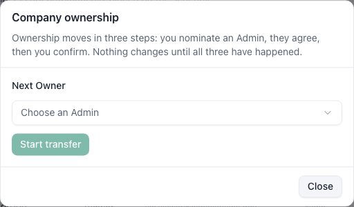

# Appoint an Admin

Open Team & access in the left menu and find Invite someone.

Set Role to Admin and enter the person's email. Leave No Resource linked selected unless their scheduled person already exists.

Select **Create invite**. When SMTP is configured and email sending is available, CapacityLens
emails the addressed invitation. If email is unavailable or sending fails, select **Copy** and send
the link privately. The link remains available either way.

## Hand over

After they accept, check that the members list shows their Admin role.

Send them the [Admin and settings guide](/admin/). They can complete the setup from here.

You remain the Owner. Appointing an Admin does not transfer ownership.

[Owner responsibilities](/owner/responsibilities)
