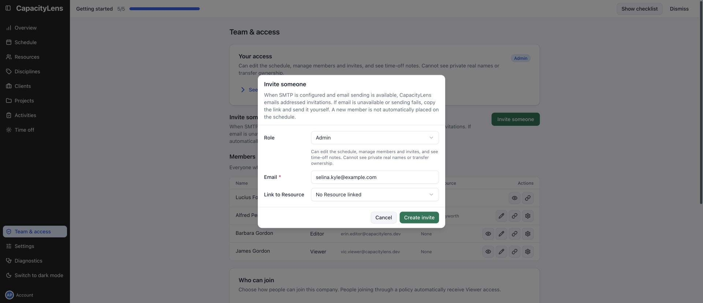
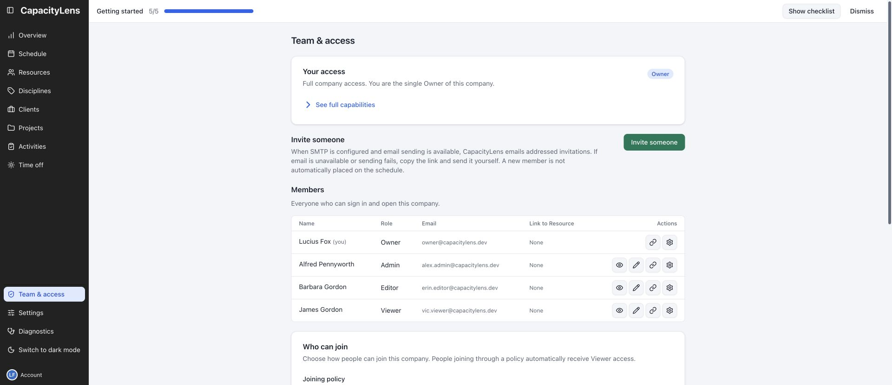

# Appoint an Admin

After creating the company, open **Team & access** in the left menu and select **Invite someone**.

Set **Role** to **Admin** and enter the person's email. Leave **No Resource linked** selected
unless their scheduled person already exists. An invitation gives sign-in access; it does not add
someone to the schedule. You can link an existing scheduled person without changing the new Admin's
role.

Select **Create invite**. When SMTP is configured and email sending is available, CapacityLens
emails the addressed invitation. If email is unavailable or sending fails, select **Copy** and send
the link privately. The link remains available either way.

## Hand over

After they accept, check **Team & access** and confirm their row shows **Admin**. If the invite is
still pending, ask whether they received the email or copied link. If delivery is unavailable, copy
the link from the invitation result. A lost link cannot be recovered: revoke that invite and create
a replacement.

Send them the [Admin and settings guide](/admin/). They can complete the setup from here.

You remain the Owner. Appointing an Admin does not transfer ownership.

[Owner responsibilities](/owner/responsibilities)
