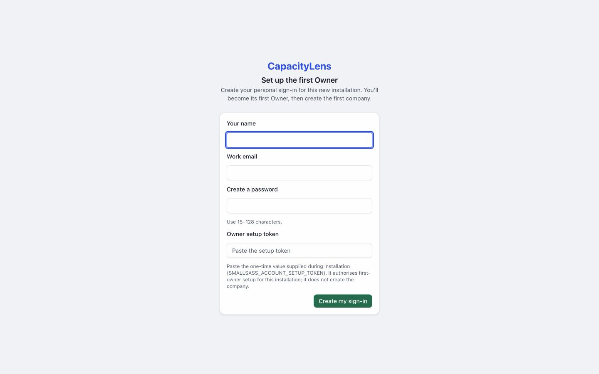
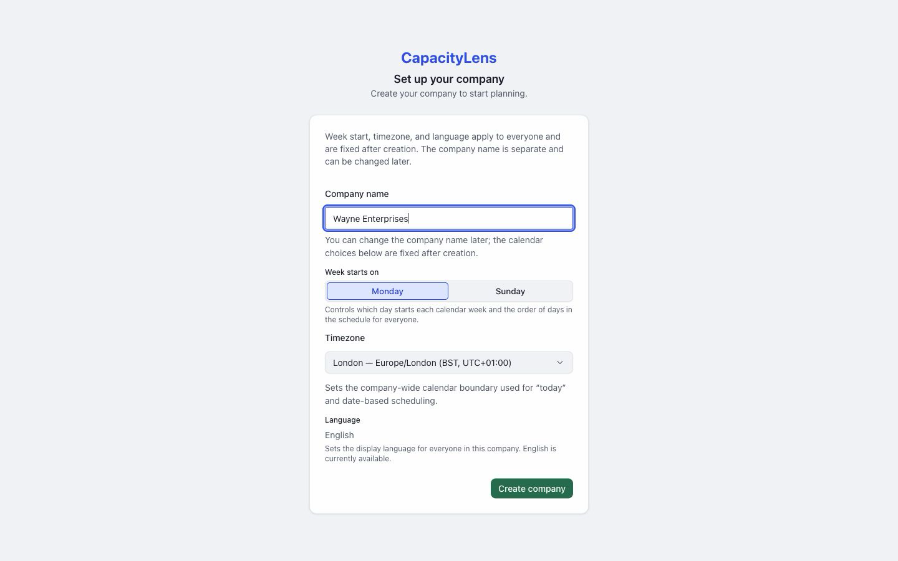

# Create your company

Open the CapacityLens address supplied by your installer.

For password sign-in, enter your name, work email, password and the Owner setup token supplied by the installer. Select Create my sign-in.

For company login, choose the configured provider and use the verified email approved by your installer.

## Create the company

The first-company form opens after sign-in. Enter the Company name.

Choose Week starts on and Timezone. These apply to everyone and cannot be changed after creation.

Language currently shows English; there is no language choice.

Select Create company to open Schedule.

[Appoint an Admin](/owner/appoint-an-admin)
