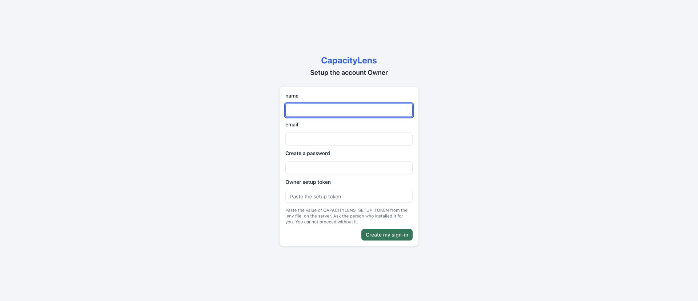

# Create your company

Open the CapacityLens address supplied by your installer.

When first Owner setup is open, the sign-in page says **Setup the account Owner**. For password
sign-in, enter your name, email and password, then paste the setup token supplied by the installer
into **Owner setup token**. The token is not shown again. Ask the installer for the token if you do
not have it or the form rejects it. Select **Create my sign-in**; CapacityLens signs you in and
opens **Set up your company**.

If the installer configured company login, choose that provider and use the email address the
installer approved for the first Owner. Follow any verification step the provider shows. If no
provider accepts your address, ask the installer to check the first-Owner setup before trying a
different identity.

## Create the company

The required company creation form opens after sign-in. Enter the **Company name**.

Choose **Week starts on** and **Timezone**. The timezone list is searchable and starts with your
browser's detected timezone. These calendar rules apply to everyone and cannot be changed after
creation, so agree them with your team before you create the company.

Language is a select with **English** as its only option. It is fixed for this installation.

On a server installation, **Start with example data** is selected by default for the
first company. Clear it to start with an empty schedule. The example adds fictional people, a
client, a project and sample planning records. If adding those records fails, the company is still
created; an Owner or Admin can try **Settings → Data and support → Example data** while the
company has no people, clients, projects or allocations. The in-memory demo does not show this
checkbox.

Select **Create company**. CapacityLens opens Schedule for the new company. Week start and
timezone are read-only under **Settings → Data and support → Company details**; Language remains
English for this installation.

[Appoint an Admin](/owner/appoint-an-admin)
