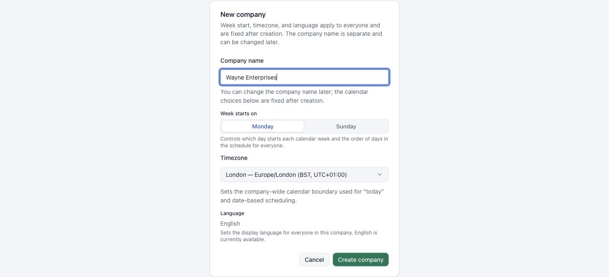

# Create your company

Open the CapacityLens address supplied by your installer.

For password sign-in, enter your name, email and password. Paste the value of
`CAPACITYLENS_SETUP_TOKEN` from the server `.env` file into Owner setup token. Ask the person
who installed CapacityLens if you need it. Select Create my sign-in.

For company login, choose the configured provider and use the verified email approved by your installer.

## Create the company

The first-company form opens after sign-in. The image shows the same form opened later from a company chooser. Enter the Company name.

Choose Week starts on and Timezone. These apply to everyone and cannot be changed after creation.

Language is a select with **English** as its only option. It is fixed for this installation.

**Start with example data** adds two people, a client, a project and a few bookings across this week and next, so the schedule is not empty. It is ticked by default for a first company; untick it to start empty. If the example data cannot be added, the company is still created and you can add it later under Settings.

Select Create company to open Schedule.

[Appoint an Admin](/owner/appoint-an-admin)
