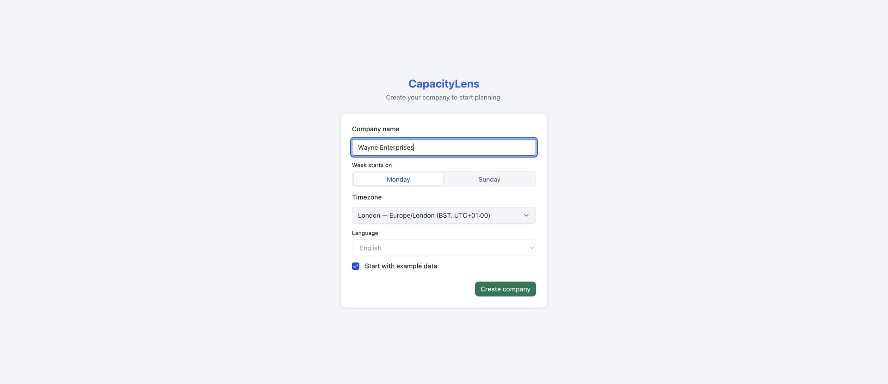

# Set up your company as the Owner

This guide is for the company's single Owner. The technical installer has given you the
CapacityLens address and your first-Owner sign-in route; you need to know who will handle
everyday company administration. Your shortest route is to create the company, appoint an Admin,
and confirm that they have joined. You can then stop: the Admin prepares the schedule without
needing you to add sample people or work first.

The Admin creates scheduled people and can associate them with members. A member can sign in; a
scheduled person has capacity to plan. Creating one never silently creates the other. If you will
administer the company yourself, follow the [Admin and settings guide](/admin/) after creating it.

## Set up

1. [Create your company](/owner/create-your-company) and choose the shared calendar rules.
2. [Appoint an Admin](/owner/appoint-an-admin) with a one-time invitation.
3. Check Team & access after the invitation is accepted, then send the
   [Admin and settings guide](/admin/).

## Later

- [Owner responsibilities](/owner/responsibilities): ownership transfer, import and company
  deletion stay with you.
- [Roles and permissions](/getting-started/roles-and-permissions) for what each role can see and
  do.
- [Owner FAQ](/owner/faq)
