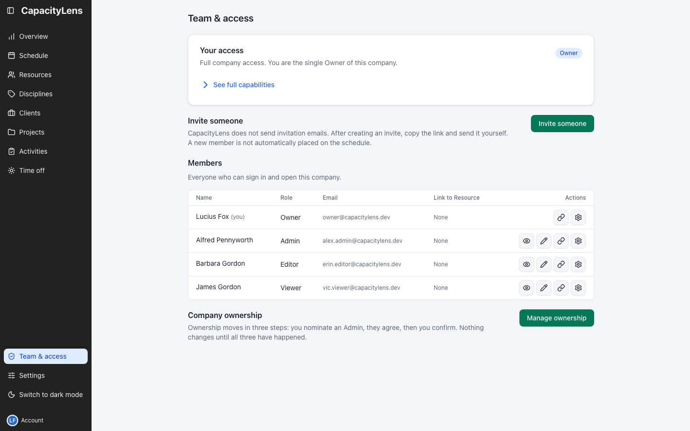
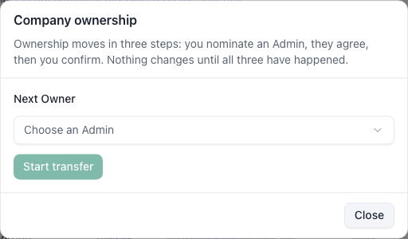

# Understand Owner responsibilities

Your Admin can run everyday setup. You keep the decisions that change company ownership or company data.

## Transfer ownership

Open Team & access, find Company ownership and select **Manage ownership**. In the modal, choose an
active Admin in Next Owner, then select Start transfer.

The nominee opens the same modal and selects Agree to become Owner. After they agree, you return to
Team & access, open **Manage ownership**, and select Confirm the transfer.

The transfer completes only after your confirmation. You become an Admin and the nominee becomes the Owner.

## Import or delete company data

Only the Owner can import scheduling data in a signed-in installation. Import replaces existing scheduling records; it is not a way to add a few new items.

[Import and export details](/guide/settings#import-and-export)

Only the Owner can delete the company. This removes the company for everyone and is separate from stopping an individual member's access.

[Roles and permissions](/getting-started/roles-and-permissions)

[Owner FAQ](/owner/faq)
