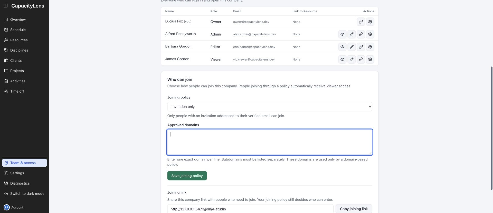
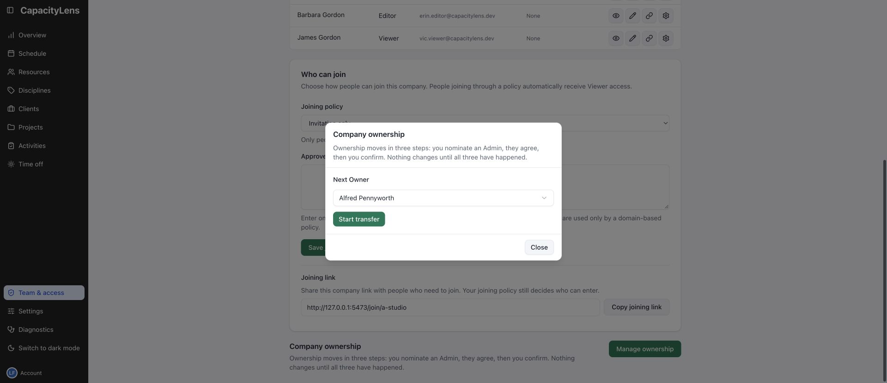
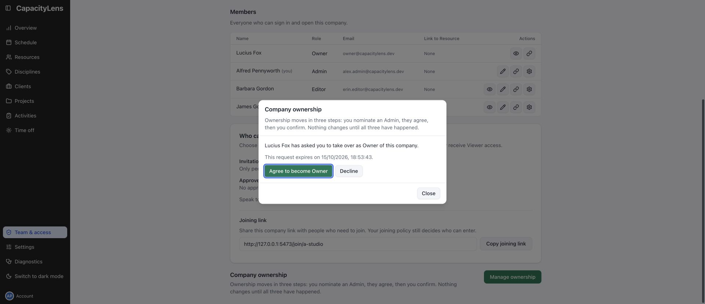
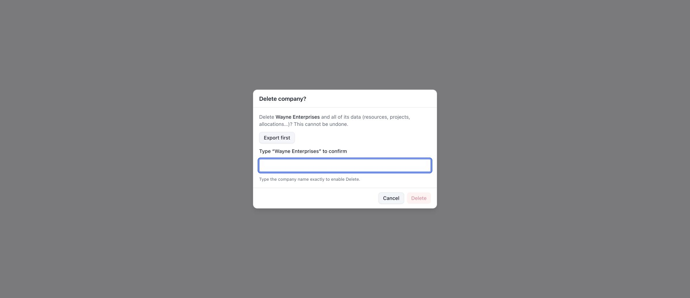

# Understand Owner responsibilities

Your Admin can run everyday setup, manage members and change ordinary company settings. The Owner
alone changes who may join, transfers ownership, imports a replacement schedule or deletes the
company. The service operator manages installation, backups, upgrades and company-login setup.

## Decide who can join

Open **Team & access → Who can join**. The current policy and approved domains are visible to both
Owners and Admins; only the Owner can change them. Choose the policy that fits how your company
admits members:

- **Invitation only** requires an addressed invitation.
- **Open registration** lets a person with a verified email join through the company link.
- **Approved domains** lets verified addresses from the domains you list join through that link.
- **Approved domains or invitation** allows those domains and addressed invitations for people
  outside them.

For either domain policy, enter each exact domain on its own line and select **Save joining policy**.
An empty or invalid domain list cannot be saved. Policy-based joins receive the **Viewer** role;
use an addressed invitation when someone needs Editor or Admin access. Share the company's **Joining
link** from this section. Owners and Admins can copy it. **Approved domains** admits only addresses
from the listed domains, including when an invitation is accepted. Changing the policy affects
future joins; it does not change current members or override **Disable Access**.

If a teammate cannot join, check the policy and domain spelling. They need a verified address that
meets the current policy, or an invitation addressed to their email. See [Join your team](/using/join-your-team)
for the member's steps.

## Transfer ownership

Open Team & access, find Company ownership and select **Manage ownership**. In the modal, choose an
active Admin in Next Owner, then select Start transfer.

The nominee opens the same modal and selects **Agree to become Owner** or **Decline**. If they agree,
you return to **Team & access → Manage ownership** and select **Confirm the transfer**. Only an
active Admin can be nominated. The nominee's agreement is theirs alone to give; the transfer does
not happen until you confirm.

Until confirmation, you remain the Owner and can **Cancel the transfer** or nominate another Admin
instead. The nominee can withdraw an agreement before you confirm. The request expires after seven
days and also ends if either person's membership changes. If a request ends while you are away,
open **Manage ownership** to see whether it was declined, cancelled, replaced, expired or invalidated.
If the request cannot load, select **Try again**. Sensitive transfer actions ask you to confirm your
sign-in; reading the request does not. On completion, you become an Admin and the nominee becomes
the Owner. If your access cannot refresh afterward, follow the recovery message before continuing.

## Import or delete company data

Only the Owner can import scheduling data in a signed-in installation. Import replaces the active
company's planning records; it is not a way to add a few new items. Review the destination and file
before confirming. A recent sign-in is required.

[Import and export details](/using/settings#import-and-export)

When the company chooser is available, select **Delete** on the company's row. In a signed-in
installation, **Switch company** appears only when you can access two or more companies. If it is
not shown for the company you need to remove, ask the service operator how to proceed; do not try
to bypass the company picker.

The confirmation offers **Export first**. Use it if you need a copy, then type the exact company
name. **Delete** does nothing until the name matches. Deletion permanently removes the company and
its data for everyone, has no undo and requires a recent sign-in. Cancel the dialog if you are
unsure or need to verify the export. This is different from disabling or removing one member's
access.

[Roles and permissions](/getting-started/roles-and-permissions)

[Owner FAQ](/owner/faq)
