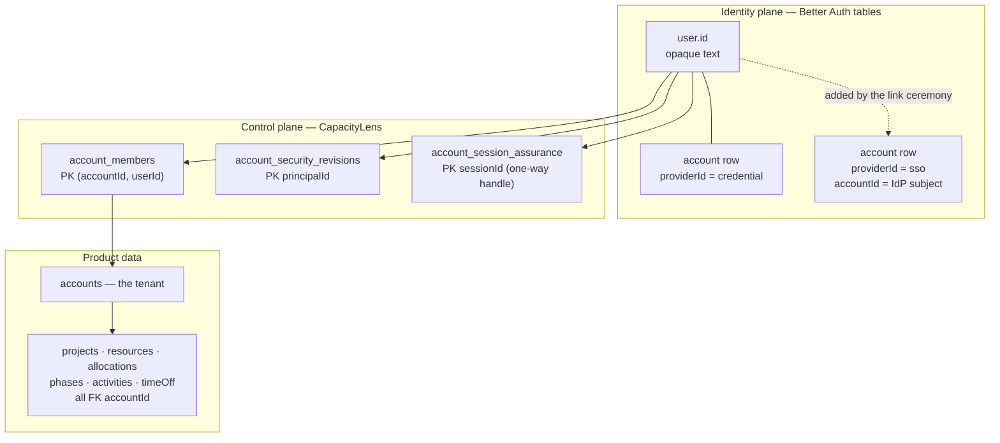
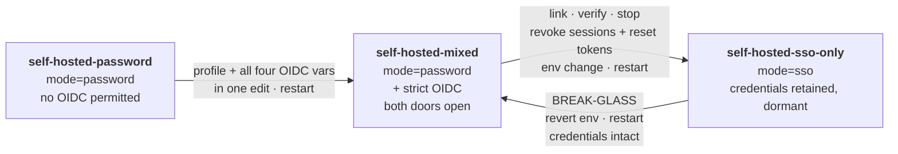
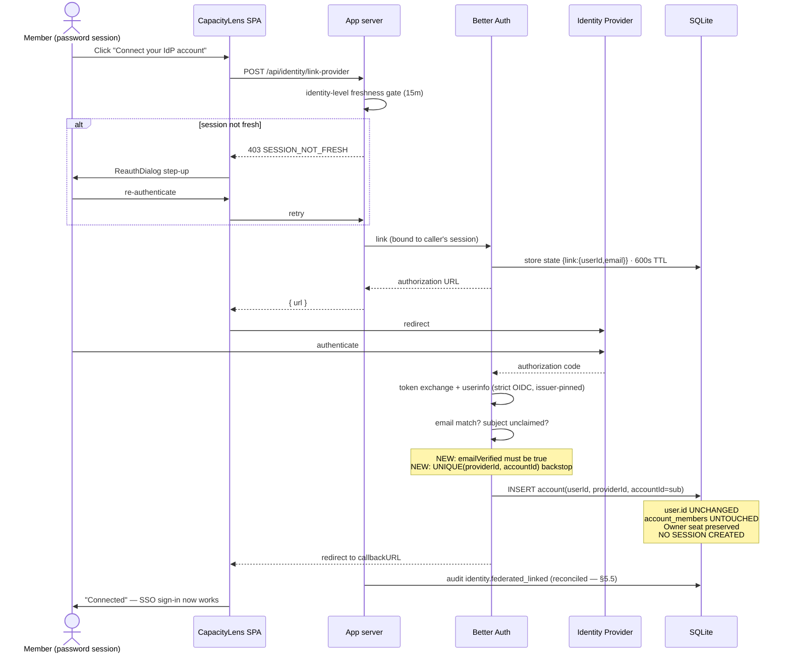
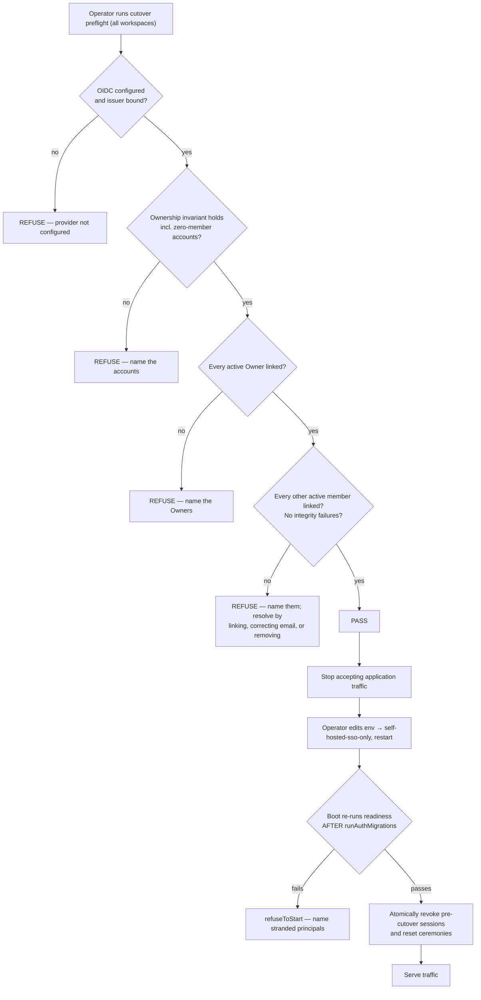

# Password → SSO cutover

> **IMPLEMENTED.** The consensus design in §§5–10 shipped as the supported self-hosted cutover path.
> Operate from the concise procedures in [authentication.md](authentication.md),
> [self-hosting.md](self-hosting.md), and [runbook.md](runbook.md); this document remains the detailed
> threat model, evidence record, and rejected-alternative history.

**Design record for CapacityLens self-hosted deployments**
Status: implemented revision 4 · Date: 2026-08-07
Design baseline: `main` @ `2280f59` · Better Auth `1.6.23` · implemented account contract `1.1.0` · baseline `ACCOUNT-SEC-2026-08-07-01`

**Revision history.** Revision 1 proposed a new `self-hosted-sso-cutover` deployment profile that
would report `authMode: "sso"` while keeping the internal mode at `"password"`. That proposal was
**rejected in review** after three independent verification passes against the Better Auth 1.6.23
distribution and the repository. Its central premise was factually wrong and the profile reopened
several doors it was meant to close. §13 is the post-mortem; it is kept deliberately, because the
failure mode ("a capability that preserves the machinery but not the door") is easy to re-derive.

Every code reference below has been read and quoted. Where revision 1 cited a line that turned out to
be wrong, the corrected reference is used silently and the correction is tabulated in the appendix.
Revision 4 uses file and symbol names for the implemented surface. Colon-only line references are
preserved historical evidence against the named baseline commit or pinned Better Auth distribution;
they are deliberately not presented as current-working-tree anchors.

---

## 0. TL;DR

A self-hosted instance can start on email/password and later move to SSO **without losing any data and
without losing the Owner seat**. The linking mechanism already exists in the dependency. What is
implemented around it is a user-facing surface, an all-workspace readiness check, stopped-server
repair tooling, a cutover runbook, and the database backstops needed to make linking recoverable.

Four facts drive the design:

1. **`disableImplicitLinking` does not block explicit linking.** The explicit link ceremony takes a
   different code path entirely. A password user can attach an OIDC identity to their _existing_
   `user.id`.
2. **Product data never references `user.id`.** Every product table keys off `accountId`. Identity
   changes have zero blast radius on scheduling data.
3. **The Owner seat is preserved by linking**, because linking preserves `user.id` and therefore the
   `account_members` row. No transfer, no re-invite, no fighting the single-owner index.
4. **Recovering a password is not recovering access.** Reset redemption changes a credential and
   returns `{status: true}`. It creates no session. Access requires a permitted sign-in path that can
   _issue_ a session. Any design that seals password sign-in has, by construction, sealed password
   recovery too.

**Implemented path.** No new deployment profile. Migrate while running `self-hosted-mixed`, link
every active member, verify readiness across all workspaces, stop traffic, then flip to the genuine
`self-hosted-sso-only` profile and internal `sso` mode. Startup rechecks readiness before atomically
revoking every pre-cutover session and outstanding reset ceremony. Clean later restarts preserve
sessions already issued with federated assurance. Credential rows remain dormant so break-glass is
an explicit, documented revert-to-mixed-and-restart.

```
self-hosted-password  →  self-hosted-mixed  →  [link · verify · stop · revoke]  →  self-hosted-sso-only
                                    ↑______________ break-glass: revert + restart ______________|
```

One new migration **is** required: owned ceremony/observation tables, provider-subject and
principal-provider uniqueness backstops, and an account-insert observation trigger (§8.7). Revision
1's "no new migration" promise does not survive contact with the concurrency analysis.

---

## 1. Why this document exists

The question that prompted it: _"can I set someone up on email/password now, and move them to SSO
later, without losing data?"_

The short answer is yes. The useful answer needs four things pinned down: what happens to identity
rows, what the failure modes are, what has to be built, and what "the Owner cannot be stranded"
actually requires. The fear worth taking seriously is Owner lockout — an instance where the only
person who can administer the workspace can no longer sign in, and the recovery tool cannot help.

That fear is well-founded. §4 explains why, and §5 is the design that addresses it honestly rather
than by relabeling the problem.

---

## 2. What exists today

### 2.1 The two knobs

Authentication behaviour is controlled by two independent environment inputs, both read at boot.

**`SMALLSASS_ACCOUNT_MODE`** (deprecated alias `CAPACITYLENS_AUTH`) takes `off | password | sso` —
`shared/src/account/types.ts`. Note the alias direction: `SMALLSASS_*` is canonical,
`CAPACITYLENS_*` is the compatibility alias (`server/src/accountConfig.ts`, warning at `:65-74`,
conflicting values throw at `:127-133`), but every downstream consumer reads the `CAPACITYLENS_*`
name.

`authMode` is **one closure constant** — `server/src/app.ts` — with a wide consumer set:

| What it gates                                                                                                        | Location                                                                                                               |
| -------------------------------------------------------------------------------------------------------------------- | ---------------------------------------------------------------------------------------------------------------------- |
| `emailAndPassword.enabled`                                                                                           | `server/src/auth.ts` — `enabled: mode === "password"`                                                                  |
| Reset-token **minting** config (`sendResetPassword`, `resetPasswordTokenExpiresIn`, `revokeSessionsOnPasswordReset`) | `server/src/auth.ts` — conditional spread, password mode only                                                          |
| The `twoFactor` plugin                                                                                               | `server/src/auth.ts` — only registered in password mode                                                                |
| Credential-principal creation                                                                                        | `server/src/accounts/betterAuthIdentityPort.ts` — throws `UNSUPPORTED_CAPABILITY` unless password (second copy `:612`) |
| Invitation password signup                                                                                           | `server/src/accounts/accountRoutes.ts` — 404 unless password                                                           |
| Admin-issued reset links                                                                                             | `server/src/accounts/accountRoutes.ts` — 400 unless password                                                           |
| `mayResetPassword` in the member directory                                                                           | `server/src/accounts/accountRoutes.ts`                                                                                 |
| Required-MFA enforcement                                                                                             | `server/src/app.ts` — 403 `MFA_ENROLLMENT_REQUIRED`                                                                    |
| First-owner setup (`needsSetup`)                                                                                     | `server/src/app.ts`                                                                                                    |
| Reported login mode + `mfaRequired`                                                                                  | `server/src/app.ts`, `:1611`, `:1612`                                                                                  |
| Federated-assurance session gate                                                                                     | `server/src/accounts/betterAuthIdentityPort.ts`                                                                        |
| The `reset:owner-password` CLI                                                                                       | `server/src/resetOwnerPassword.ts`                                                                                     |
| Production-posture warnings                                                                                          | `server/src/productionGuard.ts` (password branch), `:138` (sso branch)                                                 |

**Provider configuration is gated purely by env presence, never by mode.** The `genericOAuth` plugin
is pushed whenever the strict-OIDC vars are set (`server/src/auth.ts` compute,
`:858-888` push); `socialProviders` is whatever has a complete client id/secret pair
(`server/src/auth.ts`, computed `:925`, applied `:1168`). Neither consults `mode`. The only
mode-aware adjacency runs the other way: `auth.ts` refuses boot when `mode === "sso"` and no
generic SSO client is configured.

**Consequence worth stating plainly:** `mode === "sso"` is _not_ "strict-OIDC only". Google,
Microsoft and GitHub remain live sign-in doors in `sso` mode if their env is present. Only the hosted
profile bans them (`accountConfig.ts`).

### 2.2 Deployment profiles

`SMALLSASS_ACCOUNT_DEPLOYMENT_PROFILE` is a conformance assertion layered on top —
`shared/src/account/conformance.ts`:

```ts
export const ACCOUNT_PROFILE_CAPABILITIES: Readonly<Record<AccountDeploymentProfile, AccountProfileCapabilities>> =
  Object.freeze({
    "self-hosted-password": Object.freeze({ passwordSignIn: true, strictOidc: false, hosted: false }),
    "self-hosted-mixed": Object.freeze({ passwordSignIn: true, strictOidc: true, hosted: false }),
    "self-hosted-sso-only": Object.freeze({ passwordSignIn: false, strictOidc: true, hosted: false }),
    "hosted-oidc-only": Object.freeze({ passwordSignIn: false, strictOidc: true, hosted: true }),
  });
```

Profile and mode are coupled **4 → 2**, not 1:1 — `server/src/accountConfig.ts`:

```ts
const requiredMode = capabilities.passwordSignIn ? "password" : "sso";
if (env.CAPACITYLENS_AUTH !== requiredMode) throw new AccountConfigError(...);
```

`self-hosted-password` and `self-hosted-mixed` both require `mode=password`; `self-hosted-sso-only`
and `hosted-oidc-only` both require `mode=sso`.

**`self-hosted-mixed` is the migration staging rung**: `passwordSignIn: true` _and_ `strictOidc:
true`, mode pinned to `password`. Both doors open at once.

**Two boot constraints that shape the operational sequence:**

- `self-hosted-password` **refuses any external provider configuration** —
  `accountConfig.ts`, written as a capability test (`!capabilities.strictOidc` plus any
  SSO/social env present). You cannot pre-stage OIDC vars on that profile.
- `self-hosted-mixed` **refuses to boot without a complete strict-OIDC client** —
  `accountConfig.ts` fires for any `strictOidc && !hosted` profile and requires all four of
  `CAPACITYLENS_SSO_CLIENT_ID`, `_CLIENT_SECRET`, `_DISCOVERY_URL`, `_ISSUER`.

Together these mean **there is no soak period**: the move from `password` to `mixed` is one atomic
edit (profile plus all four OIDC vars) plus a restart. See §12.

### 2.3 What the login screen actually renders

`GET /api/auth/me` returns `authMode` and `providers` — `server/src/app.ts`. It exists in
every mode "so the client never forks on a flag". Unauthenticated it returns 401 with `authMode`,
`providers`, and optionally `needsSetup` (`:1599`, `:1604`).

`src/auth/LoginScreen.tsx` renders **two independent blocks**: the password form when `authMode ===
"password"` (`:383`), and the provider buttons whenever `providers.length > 0` (`:418`) — the second
block does not consult `authMode` at all (its only reference, `:424`, is cosmetic error routing). In
mixed mode a user sees both on one screen.

`AuthProviderInfo` is `{ id, label, kind: "social" | "oidc", experimental: boolean }`
(`server/src/auth.ts`); `experimental` marks named social providers as distinct from the
first-class strict-OIDC path (`server/src/auth.ts`).

This dual-render is documented behaviour, not an accident: `docs/authentication.md` states
that on a fresh `self-hosted-mixed` deployment the first-run wall shows both the setup-token password
form and every configured external provider, so an allow-listed first owner can bootstrap through
OIDC directly without an interim password owner. That is the same property the migration relies on —
mixed mode is a supported posture, not a transitional hack.

### 2.4 The identity model



The dotted edge is the only thing a link ceremony adds. Everything below `user.id` is untouched.

Key structural facts:

- `account_members(accountId, userId, role, status, createdAt)`, PK `(accountId, userId)` at
  `server/src/controlTables.ts` (table `:95-104`). **Membership binds on `user.id`, not email.**
- Product tables reference `accountId` only — `server/src/tables.ts`. A whole-file search for
  `userId` in that file returns **zero hits**. Only the audit record carries one
  (`server/src/audit.ts`, validated `server/src/auditOutbox.ts`).
- Roles are `owner | admin | editor | viewer` — `shared/src/account/types.ts`.
- **`InvitationRole = Exclude<Role, "owner">`** — `shared/src/account/types.ts`. Owner is never
  invitable. Enforced in the port (`sqliteAccountAdminPort.ts`), not at the route edge
  (`accountRoutes.ts` still accepts `"owner"` as syntactically valid and rejects it later).
- Exactly one active Owner per account, enforced by partial unique index
  `idx_account_members_single_active_owner` (name constant `controlTables.ts`, DDL `:551-553` and
  `:802`) and re-asserted at boot by `assertSingleOwnerControlPlaneCurrent` (`:789-841`).
  **The assertion only inspects accounts that have active member rows** (`:822-831` is a `GROUP BY
accountId` over `account_members`), so an `accounts` row with zero memberships escapes the
  invariant entirely — see §8.9.
- **`MembershipStatus = "active"` is the entire union** (`server/src/controlTables.ts`, future
  widenings named in the comment at `:21-28`). There is no deactivation; there is only removal. Note
  the union is **duplicated** in `shared/src/account/types.ts` with a _contradicting_ rationale
  (`:45-46` says inactive rows must deliberately not flow through the contract), so widening it is a
  two-file change with a design question attached.
- Session assurance is `'password' | 'mfa' | 'federated'` in storage
  (`server/src/accounts/state.ts` CHECK, TS union `:220`), but the **actor-facing** union has a
  fourth value, `trusted-local` (`server/src/accounts/localAccountFlows.ts`), which bypasses both
  freshness and MFA (`sqliteAccountAdminPort.ts`, `:215`).
- Session policy: 12-hour absolute TTL, refresh disabled, 15-minute freshness —
  `server/src/auth.ts`, values from `shared/src/account/sessionPolicy.ts`. Plus a
  30-minute inactivity timeout enforced in the wrapper (`auth.ts`).

---

## 3. The linking mechanism

`account: { accountLinking: { disableImplicitLinking: true } }` at `server/src/auth.ts` is read
in exactly one place in the entire dependency: `handleOAuthUserInfo`, the **sign-in** callback path
(`better-auth/dist/oauth2/link-account.mjs`). There it produces `{ error: "account not linked" }`
when an email matches an existing user with no matching provider account.

The **explicit link** callback takes a different branch entirely —
`better-auth/dist/plugins/generic-oauth/routes.mjs`:

```js
if (link) {
  if (ctx.context.options.account?.accountLinking?.allowDifferentEmails !== true
      && link.email.toLowerCase() !== userInfo.email.toLowerCase())
    redirectOnError(ctx, resolvedErrorURL, "email_doesn't_match");           // :235
  const existingAccount = await ctx.context.internalAdapter
    .findAccountByProviderId(String(userInfo.id), providerConfig.providerId);
  if (existingAccount) {
    if (existingAccount.userId !== link.userId)
      redirectOnError(ctx, resolvedErrorURL, "account_already_linked_to_different_user");  // :238
    ...
  } else if (!await ctx.context.internalAdapter.createAccount({ userId: link.userId, ... }))  // :248
    redirectOnError(ctx, resolvedErrorURL, "unable_to_link_account");
```

It never reaches `handleOAuthUserInfo`, so `disableImplicitLinking` never applies. The flag does
precisely what its comment claims — kills _implicit_ linking during sign-in, leaves the deliberate
authenticated ceremony intact.

**Consequence:** `user.id` is preserved, therefore `account_members` is preserved, therefore the Owner
seat is preserved, therefore audit attribution and `account_security_revisions.principalId` are
preserved. The link ceremony is non-destructive by construction. The branch calls `createAccount`
(`:248`), not `createOAuthUser`, so no `user` row is created and
`databaseHooks.user.create.before` / `externalIdentityAdmission` never fire. It also redirects at
`:266` before any `createSession` (`link-account.mjs`) or `setSessionCookie` (`routes.mjs`),
so **linking issues no session**.

### 3.1 What the ceremony actually guarantees — and what it does not

This is where revision 1 was too generous. The guardrails present:

| Guard                      | Where        | Effect                                                                                        |
| -------------------------- | ------------ | --------------------------------------------------------------------------------------------- |
| `use: [sessionMiddleware]` | `routes.mjs` | Must already be signed in as the target user. Cannot link another principal's identity.       |
| Email equality             | `routes.mjs` | `allowDifferentEmails` is unset here, so IdP email must equal local email (case-insensitive). |
| Subject exclusivity        | `routes.mjs` | An IdP subject already bound to a different user is refused — **serially**. See §8.7.         |
| IdP claim completeness     | `routes.mjs` | Missing email / subject / name each abort the callback.                                       |

The guardrails **absent**, all verified by reading the branch:

- **No `emailVerified` check on the IdP assertion.** The generic-oauth link branch never inspects
  `userInfo.emailVerified`. This is asymmetric with the social callback
  (`dist/api/routes/callback.mjs`) and `/link-social`
  (`dist/api/routes/account.mjs`), both of which consult `trustedProviders` and `emailVerified`.
  CapacityLens's strict OIDC client coerces the claim to a boolean but does not reject a false value
  (`server/src/strictOidc.ts`). **This conflicts with the standing decision at
  `DECISIONS.md`** and must be fixed — §5.3.
- **No freshness or step-up.** `/oauth2/link` uses plain `sessionMiddleware` (`routes.mjs`), not
  `freshSessionMiddleware` and not `sensitiveSessionMiddleware`. A session of any age initiates a link.
- **No `emailVerified` check on the local user.** `requireLocalEmailVerified` lives at
  `link-account.mjs`, which this path never touches.
- **No `trustedProviders` and no `accountLinking.enabled === false` check** on either initiation or
  callback.
- **The state carries a stale email snapshot.** `generateState` captures the session's email at
  initiation (`routes.mjs`) with a 600-second TTL (`dist/oauth2/state.mjs`). A local email
  change mid-ceremony is not detected — the equality check at `:235` compares against the snapshot.

**Net:** the raw route's entire security rests on possession of a session cookie plus one
case-insensitive string comparison. Wrapping it is mandatory, and shadowing the raw route is
mandatory, not optional (§5.3).

### 3.2 Email equality is not a correlation-model violation

Worth recording because it came up in review. `DECISIONS.md` states that federated
correlation is exact `(issuer, subject)`, never email. The link ceremony does not violate this: the
durable stored identity is still `(providerId, accountId=sub)`. Email equality is the _authorization
gate for attachment during the ceremony_, not the correlation key. The architect should still record
this interpretation explicitly, because the distinction is easy to lose.

---

## 4. Why the naive flip is unsafe

The mechanism exists but nothing drives it, and the surrounding controls are shaped for a _fresh_ SSO
deployment rather than a _migrating_ one.

**4.1 No client surface.** Nothing in `src/` calls `oauth2.link`. A repo-wide search across `src/`,
`server/src/` and `shared/src/` for `oauth2/link|linkSocial|linkAccount` returns exactly one hit, and
it is a prose comment (`server/src/auth.ts`). The only related machinery is the link-_state_
parser at `server/src/accounts/betterAuthIdentityPort.ts`, used by principal erasure at
`:184`.

**4.2 Nothing checks readiness.** There is no query anywhere that answers "which active members have
a federated account row for the configured provider". Without it, cutover is a leap.

**4.3 The mode flip denies sessions rather than evicting them, and it surfaces as an outage.**
Setting `SMALLSASS_ACCOUNT_MODE=sso` simultaneously disables `emailAndPassword` (`auth.ts`),
drops the `twoFactor` plugin (`auth.ts`), closes credential-principal creation
(`betterAuthIdentityPort.ts`), 404s invitation signup (`accountRoutes.ts`), 400s admin resets
(`accountRoutes.ts`), makes `reset:owner-password` refuse (`resetOwnerPassword.ts`), and
rejects every session lacking federated assurance —
`server/src/accounts/betterAuthIdentityPort.ts`:

```ts
if (authMode === "sso" && authentication?.assurance !== "federated")
  throw invalidProviderSession("The SSO-only profile received a session without federated assurance metadata.");
```

**But that throw is not a sign-out.** `invalidProviderSession` builds an `AccountContractError` with
`code: "DEPENDENCY_INVALID_RESPONSE"` (`:60-66`), which the request pre-handler maps to **503
"Sign-in is temporarily unavailable."** (`app.ts`), and `/api/auth/me` does the same
(`app.ts`). The session row and browser cookie survive. So users do not land on the login
wall and are never shown the IdP button they need; they see what looks like a backend outage, and
keep seeing it until the cookie is replaced, cleared or revoked.

This is why **explicit session revocation before the flip is mandatory**, not a nicety. The gate is a
backstop for anomalies, not the migration mechanism.

**4.4 If the Owner has not linked before the flip**, they cannot sign in, cannot be invited back
(owner is not an invitable role), cannot be re-created (the single-owner index forbids a second), and
cannot be recovered by CLI without reverting configuration. That is the exact failure mode to design
against.

**4.5 Reset redemption is not gated by `emailAndPassword.enabled`, and never was.** This is the
finding that killed revision 1 (§13). In Better Auth 1.6.23 that flag is read in exactly two places —
`dist/api/routes/sign-in.mjs` and `dist/api/routes/sign-up.mjs`. The password routes are
registered unconditionally (`dist/api/index.mjs`) and:

- `POST /reset-password` (`dist/api/routes/password.mjs`) has **no `use:` array and no config
  check**. It validates the token, consumes the verification row (`:148`), sets the password, and
  returns `{status: true}` at `:164`.
- It **creates a `credential` account if the user has none** (`:152-157`) — so redemption can install
  a password on a federated-only principal.
- Only _minting_ is gated, and not by `enabled` either: `POST /request-password-reset` checks for
  `sendResetPassword` presence (`:42`). CapacityLens happens to configure that only in password mode
  (`auth.ts`), which is a local configuration choice, not an upstream constraint.
- Redemption **revokes sessions** only if `revokeSessionsOnPasswordReset` is set (`:163`), and
  **creates no session** at any point.

**4.6 The client redemption screen is not gated on `authMode` at all.** `src/auth/ResetPassword.tsx`
is a standalone route (`src/router.tsx`, path constant `src/auth/authEntryRoute.ts`)
rendered outside `AppShell` and explicitly carved out of the login wall
(`src/auth/AuthProvider.tsx`). Its only conditional is demo-versus-server (`:43`). It POSTs
`/api/auth/reset-password` directly via raw `fetch` (`:83-88`), through the unrestricted wildcard
proxy at `server/src/app.ts`.

**Combined consequence:** in **any** auth-on mode, including genuine `sso`, an outstanding reset
token remains redeemable and will mint a dormant credential. Cutover must revoke outstanding reset
ceremonies (§5.6, decision 11.3).

**4.7 Provider identity is immutable once bound.** `bindFederatedProvider` —
`server/src/accounts/state.ts`, immutability checks at `:284-288` and `:297-299`. Called from
`auth.ts` via `ensureProviderBindings`, invoked in the boot sequence at
`server/src/index.ts`; a throw lands in `refuseToStart` (`index.ts`, `:316`).
**Choose `SMALLSASS_ACCOUNT_OIDC_PROVIDER_ID` deliberately the first time** — it cannot be renamed or
repointed later.

**4.8 Boot order matters for any new interlock.** `ensureProviderBindings()` runs at
`index.ts`, but `runAuthMigrations(auth)` does not run until `:338`. A readiness query over
the Better Auth `user`/`account` tables placed in the `:305-317` region would execute **before those
tables are guaranteed to exist**. The interlock belongs after auth migrations, before the server
accepts traffic.

---

## 5. The consensus design

### 5.1 The ladder



**No new profile.** The three existing self-hosted profiles are sufficient. The value revision 1
sought from a middle rung — "members can no longer sign in with a password, but recovery still
works" — does not exist, because recovery requires a session-issuing sign-in path (§4.5, §13).

Genuine `sso` mode is not merely adequate; it is _better_ than the rejected profile, because it
closes at their real owners the five doors revision 1 would have had to re-close by hand: the MFA
pre-handler (`app.ts` requires `authMode === "password"`), invitation password signup
(`accountRoutes.ts`), admin-issued resets (`accountRoutes.ts`), credential-principal creation
(`betterAuthIdentityPort.ts`), and both `/sign-in/email` and `/sign-up/email` at the library
level (`auth.ts`).

What genuine `sso` mode does **not** close, and cutover must therefore handle explicitly:

| Still open in `sso` mode                     | Mitigation                                                             | Section    |
| -------------------------------------------- | ---------------------------------------------------------------------- | ---------- |
| `POST /reset-password` + `ResetPassword.tsx` | Revoke outstanding ceremonies at cutover; consider shadowing the route | §5.6, 11.3 |
| `POST /api/auth/unlink-account`              | Shadow or wrap; enforce continuously                                   | §5.7, 11.4 |
| Named social providers as sign-in doors      | Profile policy decision                                                | §8.6, 11.9 |
| Persisted invalid sessions returning 503     | Revoke all sessions before the flip                                    | §5.6       |

### 5.2 The link ceremony



**This has to be self-service.** An admin cannot link on someone's behalf; the ceremony requires that
person's IdP credentials and their own session.

Build notes:

- **Wrap, and shadow the raw route.** `POST /api/auth/oauth2/link` is reachable through the wildcard
  proxy at `server/src/app.ts`, which restricts **method only** (`["GET","POST"]`) and does
  no path filtering whatsoever. The wrapper is bypassable unless the raw route is also shadowed, using
  the pattern already at `app.ts`. Given §3.1, this is mandatory.
- **Freshness must be identity-level, not account-level.** Revision 1 proposed reusing `authorize()`.
  That does not work: `authorize()` requires an `accountId`, the ceremony is identity-global, and every
  existing privileged action is admin-tier (`shared/src/account/policy.ts`), which would exclude
  editors and viewers from linking their own identity. The gate must require a real authenticated
  principal, a fresh session (15 min, `shared/src/account/sessionPolicy.ts`), self-operation only,
  the configured strict provider, and the ceremony being enabled — and must **not** require admin
  standing in any workspace.
- **The client plumbing mostly exists, with one blocking bug.** `src/auth/apiFetchReauth.ts`
  sniffs `SESSION_NOT_FRESH`, `src/auth/reauthCoordinator.ts` de-dupes, and
  `src/auth/ReauthDialog.tsx` raises the step-up. **But the dialog selects its method from the
  deployment `authMode`, not from the session's assurance or the principal's available methods**
  (`:138` takes the SSO branch only when reported mode is `sso`). In mixed mode — the staging rung
  where all linking happens — a user who signed in through the IdP is shown a password-only step-up
  (`:232-269`) with no provider escape hatch, and a federated-only principal may have no password at
  all. **This is an existing mixed-mode defect and it blocks using mixed as the migration
  environment.** It must be fixed first (work item 3).
- **Audit cannot be a plain `account.create.after` hook.** See §5.5.
- **Idempotency.** Linking is naturally idempotent (the `existingAccount` branch refreshes tokens), so
  it does not need an `account_commands` ledger entry. Keep it out of the command ledger; that
  machinery is for multi-step mutations with compensation.

### 5.3 Security fixes required on the linking path

These are not optional hardening; two of them are conflicts with standing decisions.

1. **Enforce `emailVerified === true` on the IdP assertion at the callback.** The generic-oauth link
   branch does not check it (§3.1) and `strictOidc.ts` forwards a false value. `DECISIONS.md`
   requires a verified email for external identities. Enforcement must be **callback-side** — at
   initiation the OIDC claims do not exist yet.
2. **Add a database uniqueness backstop on `(providerId, accountId)`.** See §8.7 — this requires a
   CapacityLens-owned migration.
3. **Shadow the raw `/api/auth/oauth2/link` route** so the wrapper's freshness gate and audit cannot
   be bypassed.
4. **Shadow or wrap `/api/auth/unlink-account`** — see §5.7.
5. **Record the admission interpretation in `DECISIONS.md`.** The standing rule at `:164` requires a
   verified email and a live invitation for external identities. The review consensus is that
   "admission" means _creation of a new installation-local principal_, and that attaching an
   additional authentication method to an already-admitted principal is a different act. That is a
   reasonable reading, but it is currently unwritten. Record it as:
   - **New federated principal:** verified email plus invitation (or operator bootstrap allow-list).
   - **Existing admitted principal linking SSO:** invitation not required; verified IdP email and
     explicit authenticated consent both required.

### 5.4 Readiness

New read-only endpoint plus an operator CLI. Both evaluate **all workspaces**, not the current one —
a member of two workspaces blocks both, and the security revision is deliberately identity-global
(`shared/src/account/types.ts`).

```
GET /api/accounts/:accountId/sso-readiness      (per-workspace view, for the admin screen)
pnpm --filter capacitylens-server cutover:preflight   (global, for the operator)
```

**Result shape.** Revision 1's `blocking: true` unconditionally for owners was self-contradictory (it
made a _linked_ Owner permanently blocking while the interlock treated a linked Owner as passing).
Separate the concepts:

- `linked: boolean` — a required-provider account row exists for this principal.
- `blocking: boolean` — derived from readiness policy (`!linked` for any active member).
- `critical: boolean` — `role === "owner"`, or an integrity failure. Drives ordering and copy.
- `reason: string` — a stable code, not a boolean. Boolean status is too weak once integrity
  conditions are included.

**Readiness must prove considerably more than "an account row exists".** The minimum set:

| Condition                                                                 | Why                                                   |
| ------------------------------------------------------------------------- | ----------------------------------------------------- |
| Active membership with no corresponding `user` row                        | Dangling membership; will never link                  |
| Multiple required-provider rows for one principal                         | Detected today only at read time, fails closed (§8.7) |
| One provider subject bound to multiple principals                         | Same; both principals become unusable                 |
| Provider rows whose provider is not the currently bound issuer            | Stale binding after a provider-id change attempt      |
| A linked row established from an unverified IdP email                     | Pre-fix links (§5.3)                                  |
| Product accounts with zero active members, or zero Owners                 | Invisible to the boot invariant (§8.9)                |
| Providerless or credential-only orphan principals                         | Removal leaves them behind (§8.4)                     |
| Alternative enabled sign-in providers outside cutover policy              | Named social providers (§8.6)                         |
| Live password-signup paths or config incompatible with the target profile | e.g. `ALLOW_OPEN_SIGNUP=1`                            |
| Outstanding password-reset ceremonies                                     | Must be revoked at cutover (§5.6)                     |

**Refusals must name the stranded people.** `"3 members are not linked"` is useless;
`"kevin@agency.com (owner), sam@agency.com (admin) have no sso identity"` is actionable. The codebase
already sets this standard — `controlTables.ts`.

**Implementation constraint — composition, not a join.** `server/src/accounts/conformance/architecture.test.ts`
enforces deny-by-default storage ownership across all of `server/src`: identity-table SQL (`user`,
`session`, `account`, `verification`, `twoFactor`) is permitted only in `auth.ts` and
`betterAuthIdentityPort.ts` (`:126-129`); membership-table SQL (`account_members`, `invites`) only in
`controlTables.ts`, `db.ts` and `sqliteAccountAdminPort.ts` (`:130-134`). A readiness route issuing a
cross-domain `JOIN` fails this test, and rightly so. The compliant shape:

```
identity port   → federated-link facts for a set of principal ids
account port    → active-membership facts across all workspaces
coordinator     → combines the two fact sets in TypeScript, no SQL
HTTP route      → exposes the coordinator result
```

Note also `architecture.test.ts` — the fitness function revision 1 predicted would fire
during this work — checks only account-administration role thresholds and would **not** fire. The
test that actually binds is `:124`.

### 5.5 Auditing the link

New action string `identity.federated_linked` must be added to `AccountAuditAction`
(`shared/src/account/audit.ts`, current union has 14 members) **and** to `ACCOUNT_ACTION_VALUES`
(`server/src/auditOutbox.ts`), or durable rows are rejected as malformed at `:158`. A
compile-time exhaustiveness trap at `:100-102` enforces both directions. Naming convention is
`<namespace>.<past_tense_snake_case>`.

**A plain `databaseHooks.account.create.after` hook is not sufficient**, for three verified reasons:

1. **It fires for every provider-account creation**, including `credential` rows — which
   `POST /reset-password` creates (`password.mjs`). Without a `providerId` filter, password
   resets would emit federated-link audit events.
2. **The row is committed before the hook can object.** `dist/db/with-hooks.mjs` inserts first,
   then hands the after-hook to `queueAfterTransactionHook`. The `await` is on the _queue call_, not
   the hook body.
3. **There is no enclosing transaction.** `internalAdapter.createAccount`
   (`dist/db/internal-adapter.mjs`) is a bare `createWithHooks` with no `runWithTransaction` —
   unlike `createOAuthUser` (`:59-77`), which does wrap. And the queue drain at
   `@better-auth/core/dist/context/transaction.mjs` runs pending hooks **even when the wrapped
   operation threw**, so hooks can fire for abandoned work.

So a throw inside the hook rolls nothing back, and a failed audit leaves a committed link with no
durable record. Choose one of:

- a CapacityLens-owned transactional linking operation, if Better Auth can be safely invoked inside
  one;
- an **idempotent outbox/reconciliation model** that detects committed links with no matching audit
  event and emits at-least-once;
- a durable "link observed" record followed by at-least-once audit emission.

**Recommendation: explicit idempotent reconciliation.** Given the dependency's hook semantics it is
the most honest and maintainable option, and the repository already has reconciliation machinery.

Cutover activation and session revocation should themselves be audited, not only individual links.

### 5.6 The cutover runbook



Two layers on purpose. The preflight is the UX; the boot check is the backstop for an operator who
edits env directly. Refuse-at-boot is idiomatic here — it is what `bindFederatedProvider` already
does. **The boot check must be placed after `runAuthMigrations` (`index.ts`), not in the
`:305-317` region** (§4.8), and before the server accepts traffic. If revocation fails, startup must
fail closed rather than start half-cut-over.

**Revoke every session, not selectively.** Revision 1 proposed deleting `account_session_assurance`
rows where `assurance IN ('password','mfa')` and their sessions. That is wrong in three ways:

1. **The order is backwards.** The assurance table is keyed by a one-way handle
   (`server/src/accounts/sessionHandle.ts`, a SHA-256 of application id plus session token), so
   deleting assurance first destroys the mapping needed to find the corresponding session rows. The
   existing code resolves the relation by loading tokens and re-hashing
   (`betterAuthIdentityPort.ts`).
2. **It misses grandfathered sessions.** `verifyApplicationSession` deliberately tolerates a session
   with _no_ assurance row when the principal is unambiguously credential-only (`:342-355`). Such a
   session is invisible to any query that starts from `account_session_assurance`, so it would survive
   cutover and then produce 503s.
3. **Selective classification is delicate** — it must handle password, mfa, missing, orphaned,
   handle-with-no-assurance-row and assurance-row-with-no-session cases.

Revoking everything avoids all of it, includes federated sessions, gives every user the same clean
experience, proves every surviving session was issued under the new posture, and leaves no stale
cookies to generate 503s. One extra IdP sign-in during a planned cutover is a reasonable cost.

**Implementation constraint — the hook only fires through the adapter.** Verified behaviour:
`deleteManyWithHooks` (`dist/db/with-hooks.mjs`) pre-fetches matching rows, bulk-deletes, then
runs `session.delete.after` once per entity; and `queueAfterTransactionHook`
(`@better-auth/core/dist/context/transaction.mjs`) runs the hook **inline** when there is no
AsyncLocalStorage store, which is the case for non-HTTP `auth.api.*` calls
(`dist/api/to-auth-endpoints.mjs` wraps only request state; `runWithAdapter` is called solely
from the HTTP entry point at `dist/auth/base.mjs`). So CLI and boot-time calls do fire the hook.

**But raw SQL does not.** If cutover revocation is written as `DELETE FROM session` inside
`betterAuthIdentityPort.ts` — which is exactly where the architecture test permits identity SQL — the
hook at `server/src/auth.ts` never runs and assurance rows orphan. The existing code shows
both patterns: `revokePrincipalSessions` (`:664-677`) goes through `auth.revokeUserSessions` →
`internalAdapter.deleteUserSessions`, so its explicit cleanup loop at `:670-672` is redundant
belt-and-braces; whereas `revokeOwnSession` (`:557-560`) deletes raw and its `removeSessionAssurance`
call is **load-bearing**. Two further raw deletes in `auth.ts` and `:277` (inactivity
enforcement) skip cleanup entirely.

**Therefore:** route cutover revocation through `internalAdapter.deleteUserSessions`/`deleteSessions`,
**or** pair every raw delete with an explicit `removeSessionAssurance`. Do not rely on the TTL sweep —
`state.ts` runs only inside `recordSessionAssurance`, throttled to once per five minutes
(`:68`), so on an installation that has just revoked everything and is waiting for its first IdP
sign-in, nothing sweeps at all.

**Revoke outstanding reset ceremonies.** Because redemption is ungated (§4.5) and the client screen is
ungated (§4.6), any token minted before cutover stays redeemable afterwards and will install a
dormant credential. Revoke them at cutover. `revokeResetTokensForUser` already exists and is called
from the membership-removal paths (`controlTables.ts`, `:880`). A live revocable ceremony remains a
reported preflight finding, but cannot make readiness fail before the cutover transaction reaches
the deletion it owns.

**Persist the activation boundary, not the configured posture.** The deployment profile remains the
source of truth for whether the installation is SSO-only. Migration v25 adds the application-scoped
`capacitylens_sso_cutover_state(applicationId, activatedAt)` marker solely to distinguish the first
cutover from a later clean restart when both contain zero password sessions and zero ceremonies.
The first cutover inserts the marker in the same transaction as revocation and the
`identity.sso_cutover_activated` audit; later restarts use it to make the boundary an idempotent
no-op unless mixed-mode activity has reintroduced non-federated state. The v25 migration and startup
schema assertion validate the marker's exact STRICT-table shape. This control is separate from the
`(providerId, accountId)` unique index in §8.7 and does not replace the profile's authority.

### 5.7 Unlink protection

`POST /api/auth/unlink-account` (`dist/api/routes/account.mjs`) is reachable through the
wildcard proxy today. Its protections are thin:

- `freshSessionMiddleware` (`:198`) — in this deployment that means a session younger than 15 minutes
  (`auth.ts` overrides Better Auth's 24-hour default from
  `dist/context/create-context.mjs`). It uses `getSessionFromCtx`, so unlike
  `sensitiveSessionMiddleware` it does **not** bypass the cookie cache.
- The last-account guard (`:214`) counts **all account rows**, not federated ones, and is overridable
  by `allowUnlinkingAll`. A migrated user has a `credential` row plus an OIDC row, so
  `accounts.length === 2` and the guard does not fire.
- No provider restriction, no re-authentication, no notification (`:215-217`).

So a member — including the Owner — can remove the only identity the SSO posture requires, in one
authenticated POST, at any point after the interlock has passed. Combined with
`password.mjs`, which mints a credential on redemption, the password-only fallback is
reachable by email alone.

**This is the proof that boot-only readiness is structurally insufficient**: link state remains
mutable after startup. The required provider must be non-unlinkable while the deployment depends on
it, enforced **continuously**, not at boot. Minimum: shadow the route. Preferred: wrap it with policy
that refuses to unlink the required provider while any membership depends on it, and audit the
attempt.

---

## 6. What the member actually sees

**In mixed mode, before cutover.** A banner: _"Your organisation is moving to <IdP> sign-in. Connect
your account now — it takes a few seconds and nothing changes until everyone's ready."_ Plus a
permanent control in account settings. Copy should never say "migrate" or "link your principal"; it
says **Connect** and, once done, **Connected**.

**Admin view.** The readiness list, showing who's connected and who isn't, with Owners pinned and
flagged `critical`, and integrity failures listed separately from ordinary not-yet-linked members.

**At cutover.** The password fields disappear from the login screen; provider buttons remain. Because
the mode genuinely is `sso`, `LoginScreen.tsx` stops rendering the form and `:418` keeps rendering
the buttons — **no client change is required for this**, which is a genuinely nice property of the
existing split.

**One subtlety worth telling users.** Linking does **not** create a new session (§3). After
connecting, the member still holds their original password-assurance session; they get a `federated`
assurance row only after they next sign in through the IdP (`recordSessionAssurance`,
`state.ts`, driven by the `session.create.after` hook at `auth.ts`). Because cutover
revokes all sessions, this resolves itself at the next sign-in.

**Assurance is a path heuristic, not a credential fact** — worth knowing when reasoning about the
above. `auth.ts` derives it from the request path: federated for external-identity paths,
`mfa` for `/two-factor/`, and `password` for anything else that creates a session.

---

## 7. What is and isn't at risk

| Asset                                                          | Effect of the whole migration                                                            |
| -------------------------------------------------------------- | ---------------------------------------------------------------------------------------- |
| Projects, phases, resources, activities, allocations, time off | **None.** FK on `accountId` only (`server/src/tables.ts`).                               |
| Clients, disciplines                                           | **None.** Same.                                                                          |
| `account_members` rows, roles, Owner seat                      | **None** on the link path — `user.id` unchanged.                                         |
| `account_security_revisions`                                   | **None** on link; bumped only by membership writes (`controlTables.ts`, `:856`, `:880`). |
| Audit history                                                  | **None.** `actorPrincipalId` continues to resolve to the same `user.id`.                 |
| Password `account` rows                                        | **Retained.** Cutover deletes no credentials. This is what makes rollback an env edit.   |
| Sessions                                                       | **All revoked at cutover.** Everyone signs in again through the IdP.                     |
| Outstanding reset ceremonies                                   | **All revoked at cutover.**                                                              |
| TOTP enrollments                                               | Dormant — see §8.5.                                                                      |

---

## 8. Edge cases and failure modes

### 8.1 Email mismatch — the likeliest real-world blocker

Because `allowDifferentEmails` is unset, a local account created as `kj@agency.com` **cannot** link to
an IdP identity asserting `kevin@agency.com`. It fails with `email_doesn't_match`
(`routes.mjs`). This will bite an agency, because password accounts get created ad hoc and rarely
match the Workspace directory exactly.

**Recommendation: fix the local email, not the rule.** Setting `allowDifferentEmails: true` would let
any IdP identity attach to any local account whose owner is signed in — a much bigger surface for a
much smaller convenience — and it would undercut the property stated in `docs/authentication.md`
(_"Email is an admission attribute only. Once the provider link is stored, equal or changed emails
never merge two identities."_).

**What exists upstream.** Better Auth ships a complete `/change-email` flow
(`dist/api/routes/update-user.mjs`), disabled unless `user.changeEmail.enabled` is configured
(`:409`), with three branches selected at `:424-427` (immediate write when the local address is
unverified, confirmation-to-old-address, or verification-to-new-address) and enumeration hardening at
`:431-435`. CapacityLens configures none of it, and configures no verification email delivery.

**What CapacityLens still has to build.** The protocol mechanics are largely supplied; the security
and product policy are not:

- enabling and configuring the route, plus delivery/verification or an approved alternative ceremony;
- **fresh step-up** — the route uses `sensitiveSessionMiddleware` (`:381`), which re-reads
  authoritative session state but performs **no age check and no password re-entry**;
- **identity-global authority** — changing `user.email` affects every workspace the principal can
  enter. `shared/src/account/policy.ts` (`canAdministerIdentityAcrossWorkspaces`, documented at
  `:47-50`) is the existing model for this;
- an **admin-approved** variant, since the migration case is an admin correcting someone else's
  address;
- **session revocation after change** — nothing in `changeEmail` calls `deleteUserSessions`;
- collision handling against `user.email` uniqueness, normalization, and whether the new address
  counts as verified;
- audit and command/reconciliation semantics;
- UI.
- **Link-ceremony invalidation.** The link state snapshots the session's email with a 600-second TTL
  (§3.1). If the address changes mid-ceremony, equality is checked against the stale snapshot. The UI
  must abandon and restart any in-progress link after a correction, and the correction should revoke
  sessions so the next link initiates under the corrected address.

**Sizing: L/XL on policy, small on protocol.** It is on the critical path for every real migration,
not an edge case.

### 8.2 Subject already claimed

If someone has two local accounts and links their IdP identity to the wrong one, the second attempt
fails with `account_already_linked_to_different_user` (`routes.mjs`). Correct behaviour — it
prevents takeover — but **the resolution path does not exist**. Revision 1 said "remove the wrong
membership and its principal, then re-link"; only the first half is possible.
`sqliteAccountAdminPort.ts` removes the membership row and nothing else. There is no admin
operation anywhere in `server/src` that deletes a principal or unlinks a provider account:
`deprovisionLocalPrincipal` (`betterAuthIdentityPort.ts`) and `deleteCredentialUser`
(`auth.ts`) have **no production callers**, and the only eraser,
`eraseLocalPrincipalsInTx` (`:166`), is reached solely through whole-workspace erasure
(`localAccountFlows.ts`, `:520`) or signup compensation.

A correct resolution workflow is net-new identity administration and must handle: the wrong principal
belonging to other workspaces; identity-global authority; removing the provider row without deleting
unrelated credentials; current sessions; audit and reconciliation; and proof that the subject is being
reassigned to the right principal.

### 8.3 There is no way to deactivate a member

`MembershipStatus = "active"` is the whole union (`server/src/controlTables.ts`). A departed
employee who never linked can only be resolved by **removal**, not deactivation. There is no
deactivation route anywhere in `accountRoutes.ts`; the closest primitives are membership removal
(`:493`) and session revocation (`:620`).

The implemented cutover accepts removal and states it explicitly in the preflight and runbook,
because "remove this person to proceed" is heavier than "mark them inactive". Member deactivation
remains a separate roadmap decision; adding it later would require the duplicated status union and
account contract to move together.

### 8.4 Removal leaves providerless or credential-only orphans

Removing a membership does not delete the principal (§8.2). The resulting providerless or credential-only orphan is
invisible to a member-based preflight. If that email is invited again after cutover: SSO sign-in finds
the existing email; implicit linking is disabled; password sign-in is closed; and the user cannot
reach the explicit link ceremony because they cannot get a session in the first place. Preflight must
inventory orphan local principals, and the product needs an operator-safe way to link or deprovision
them before cutover.

### 8.5 The Owner, specifically

Owner cannot be invited (`InvitationRole`, `types.ts`). A second Owner cannot be created (partial
unique index). Ownership moves only via `POST /api/accounts/:accountId/transfer-ownership`
(`accountRoutes.ts`), owner-tier, with self-transfer refused in the port
(`sqliteAccountAdminPort.ts`).

So for the Owner there is exactly one non-destructive route: **link before cutover.** That is why the
interlock treats an unlinked Owner as unconditionally critical, and why the preflight exists.

### 8.6 2FA goes dormant, and named social providers stay live

The `twoFactor` plugin is registered only in password mode (`auth.ts`), so genuine `sso` mode
drops it and existing TOTP enrollments stop mattering — the IdP owns MFA. Anyone previously told "you
have 2FA on" should be told what replaced it. Note that `mfaSatisfied` already treats federated as
satisfying MFA (`localAccountFlows.ts`, which also includes `trusted-local`), so admin operations
requiring `assertAdministrativeAssurance` (`sqliteAccountAdminPort.ts`) keep working for SSO
users. Ordering there matters: freshness is checked before MFA (`:216` then `:219`), so a stale
federated session yields `SESSION_NOT_FRESH`, never `MFA_REQUIRED`.

_While still in mixed mode_, TOTP management remains HTTP-reachable and is weaker than it looks:
`/two-factor/enable` uses plain `sessionMiddleware` (`dist/plugins/two-factor/index.mjs`), and with
`allowPasswordless: true` (`auth.ts`) `shouldRequirePassword`
(`dist/utils/password.mjs`) skips the password challenge for any principal with no credential
password — and the handler `deleteMany`s and re-`create`s the enrolment (`index.mjs`),
silently replacing an existing secret. Also confirmed: reset redemption is **not** 2FA-guarded in any
way (`password.mjs` declares no middleware; the plugin's `hooks.after` matcher at
`index.mjs` matches only the three sign-in paths).

**Named social providers remain a sign-in door in `sso` mode** (§2.1). A "Workspace SSO cutover" can
still expose Google/Microsoft/GitHub buttons, and the social link route is distinct from
`/oauth2/link` so shadowing the latter does not control it. Decision required — §11.9.

Finally, check `SMALLSASS_ACCOUNT_REQUIRE_MFA`. Under genuine `sso` mode the pre-handler gate at
`app.ts` does not fire, which is correct — but set `CAPACITYLENS_SSO_MFA_ENFORCED=1` or
`productionGuard.ts` will warn.

### 8.7 Subject uniqueness is not concurrency-safe

"An IdP subject bound elsewhere is refused, not stolen" is true only for **serial** requests. The
callback does find-then-create with no lock (`routes.mjs`), `findAccountByProviderId` is an
unlocked `findOne` (`dist/db/internal-adapter.mjs`), and `createAccount` (`:86-92`) has no
transaction wrapper. Two concurrent first-link callbacks for the same subject can both observe absence
and both insert.

**Nothing at the storage layer prevents it.** The core `account` model declares no `unique` on
`accountId` or `providerId` — only `userId` carries `index: true`
(`@better-auth/core/dist/db/get-tables.mjs`; the only three uniques in that file are
`rateLimit.key`, `session.token`, `user.email`). And Better Auth's migration generator emits
**single-column indexes only** (`dist/db/get-migration.mjs`, `.columns([fieldName])`), so a
composite unique constraint can never come from the library.

**The consequence is worse than a bad readiness reading.** The repo already detects the duplicate at
_read_ time and fails closed permanently: `betterAuthIdentityPort.ts` and `:357-368` use
`LIMIT 2` and throw _"The federated subject maps to more than one local principal."_ Both principals
become unable to sign in, and there is no repair path in the codebase.

**Therefore a CapacityLens-owned migration is required**, contradicting revision 1's "no new
migration" claim. It needs more than `CREATE UNIQUE INDEX`:

1. preflight existing duplicate subjects;
2. refuse with enough information to repair them safely;
3. a written reconciliation procedure (§8.2 work);
4. add the unique index on `(providerId, accountId)`;
5. bump `DB_SCHEMA_VERSION`, because this changes Better Auth-owned schema behaviour;
6. add a released migration fixture and retain the immutable migration definition;
7. test concurrent link attempts;
8. translate the uniqueness failure into a stable user-facing conflict, not a generic provider outage.

### 8.8 Multi-workspace members

Readiness must be evaluated across **all** accounts. A member of two workspaces blocks both. The
security revision is deliberately identity-global for exactly this reason
(`shared/src/account/types.ts`).

### 8.9 Ownerless and memberless workspaces

The boot invariant only inspects accounts that have active member rows (§2.4), so a product `accounts`
row with zero memberships boots clean and is invisible to readiness. If the preflight promises "every
account has exactly one Owner", it must inspect those accounts too — and provide a repair path,
because no principal has authority over an ownerless account through the existing UI.

### 8.10 Invitations under SSO

Post-cutover onboarding works, but only in one shape, and nothing currently enforces it.

`externalIdentityAdmission` (`server/src/accounts/externalIdentityAdmission.ts`) requires a verified
email (`:19`), then either the operator bootstrap allow-list when no principal exists yet (`:28`) or a
live pre-authorized invitation (`:29`). The lookup matches `invites.preauthEmail = ?`
(`sqliteAccountAdminPort.ts`).

But `preauthEmail` is **optional and defaults to NULL** (`accountRoutes.ts`, `:214`). A
bearer-only invite is redeemable by any _already signed-in_ principal via `/accept`, but it is
invisible to `hasLivePreauthorizedInvitation` and therefore **cannot bootstrap a new SSO principal** —
the invitee hits `EXTERNAL_IDENTITY_NOT_INVITED` (`auth.ts`).

**Operational rule to specify and enforce:** post-cutover onboarding must require email-preauthorized
invitations. The invitation UI should make `preauthEmail` mandatory when the invitee does not already
have an admitted principal. Note also that `hasLivePreauthorizedInvitation` is workspace-agnostic —
it admits the principal, but role binding still requires `/accept` with that specific token.

### 8.11 Provider id is a one-shot decision

Restated because it is the one truly irreversible choice: `SMALLSASS_ACCOUNT_OIDC_PROVIDER_ID` and
`SMALLSASS_ACCOUNT_OIDC_ISSUER` become an immutable pair (`state.ts`). Changing either later
is an identity migration with a reviewed mapping, per `docs/authentication.md`.

---

## 9. Rollback and break-glass

**The headline: cutover deletes no credentials.** Password `account` rows survive. Reverting
`SMALLSASS_ACCOUNT_DEPLOYMENT_PROFILE` from `self-hosted-sso-only` back to `self-hosted-mixed` and
restarting restores every password login.

**Break-glass is explicitly a configuration change plus a restart.** There is no in-place recovery
hatch, and the design does not pretend otherwise:

```
1. Stop the server.
2. Revert env → self-hosted-mixed (+ SMALLSASS_ACCOUNT_MODE=password).
3. If the Owner needs a credential:
     pnpm --filter capacitylens-server reset:owner-password -- <database> <owner-email> --confirm-server-stopped
   (the CLI requires the server stopped — it takes an exclusive database lock)
4. Restart.
5. Redeem the printed link at /reset-password/:token, then sign in at the login screen.
```

Note step 5 is two actions: redemption changes the credential and returns `{status: true}` without a
session, so the Owner must then sign in normally. That is why steps 2 and 4 cannot be skipped.

| Scenario                                 | Response                                                                                                                       |
| ---------------------------------------- | ------------------------------------------------------------------------------------------------------------------------------ |
| IdP outage, legacy password cohort       | Revert to `self-hosted-mixed`, restart. Their password sign-in returns immediately.                                            |
| IdP outage, SSO-native users             | They have **no credential**. Each needs an admin-issued reset after mixed mode returns, or an Owner-level ceremony. See below. |
| OIDC client secret rotated badly         | Same as IdP outage.                                                                                                            |
| Owner cannot sign in via IdP             | Full break-glass sequence above.                                                                                               |
| A credential must be genuinely destroyed | No purge tool exists. **Do not build one for v1** — it converts a reversible migration into an irreversible one.               |

**Rollback completeness degrades over time, and the doc must say so.** At the instant of migration,
reverting restores everyone, because everyone came from a password account. Later, cutover admits
federated-only users through pre-authorized invitations; those principals have no credential row.
For them a revert restores nothing by itself — each needs an individual reset ceremony, and a
federated-only _sole Owner_ needs the CLI (whose redemption will _create_ the credential, per
`password.mjs`). Distinguish:

- **Day-zero reversibility** — complete, for the migrated password cohort.
- **Long-term break-glass** — partial, and proportional to how many SSO-native users have joined
  since.

The CLI's own interlock is the model for the cutover interlock — `resetOwnerPassword.ts`:

```ts
db.exec("PRAGMA busy_timeout = 0;");
db.exec("PRAGMA locking_mode = EXCLUSIVE;");
try {
  db.exec("BEGIN EXCLUSIVE");
  db.exec("COMMIT");
} catch (cause) {
  throw new Error(
    "Another process holds this database — stop the CapacityLens server and retry. " +
      "Recovery only runs with exclusive database access.",
    { cause },
  );
}
```

`busy_timeout = 0` means no silent waiting; `locking_mode = EXCLUSIVE` persists past the COMMIT for
the connection's life, so a server starting mid-ceremony also cannot write. It refuses unless the
target is the **sole active Owner** of at least one workspace (`:117-123`), requires
`BETTER_AUTH_URL` (`:72-74`), and fails closed after minting — any audit failure revokes the freshly
issued ceremony (`:130-158`). It emits a single-line JSON blob containing `link`
(`server/scripts/reset-owner-password.ts`, link built at `resetOwnerPassword.ts`); the audit
row stores only a SHA-256 `ceremonyId`, never the token (`:133-136`, `:150-151`).

---

## 10. Work breakdown

Ordered so that blockers land first.

| #   | Item                                                                                                                | Surface                                                    | Size                    |
| --- | ------------------------------------------------------------------------------------------------------------------- | ---------------------------------------------------------- | ----------------------- |
| 1   | **Enforce `emailVerified === true` on the explicit link callback**                                                  | `server/src/auth.ts`, `server/src/strictOidc.ts`           | M                       |
| 2   | **`UNIQUE(providerId, accountId)` migration + duplicate preflight + `DB_SCHEMA_VERSION` bump + fixture**            | `server/src/` migrations                                   | M–L                     |
| 3   | **Fix `ReauthDialog` to select method from session assurance / available methods, not deployment mode**             | `src/auth/ReauthDialog.tsx`                                | M                       |
| 4   | Wrapped link endpoint with identity-level freshness gate (no `accountId`, no admin tier)                            | new route + `server/src/app.ts`                            | M                       |
| 5   | Shadow raw `POST /api/auth/oauth2/link`                                                                             | `server/src/app.ts` (pattern at `:1643`)                   | S                       |
| 6   | Shadow or wrap `POST /api/auth/unlink-account`; refuse unlinking the required provider, continuously                | `server/src/app.ts` + policy                               | M                       |
| 7   | `identity.federated_linked` audit action + outbox validator entry                                                   | `shared/src/account/audit.ts`, `server/src/auditOutbox.ts` | S                       |
| 8   | Link audit via idempotent reconciliation (not a bare `account.create.after`), filtered to the required `providerId` | `server/src/auth.ts`, outbox                               | M                       |
| 9   | Readiness facts via **composition** — identity port + account port + coordinator, no cross-domain SQL               | `server/src/accounts/`                                     | M–L                     |
| 10  | `GET /api/accounts/:id/sso-readiness`                                                                               | `server/src/accounts/`                                     | S                       |
| 11  | Preflight CLI `cutover:preflight` (all workspaces, integrity conditions, orphans)                                   | `server/scripts/`                                          | M                       |
| 12  | Cutover revocation: all sessions + all reset ceremonies, adapter-routed or with explicit assurance cleanup          | identity port                                              | M                       |
| 13  | Boot-time interlock naming stranded principals, placed **after** `runAuthMigrations`                                | `server/src/index.ts` (after `:338`)                       | M                       |
| 14  | Connect-your-account UI + admin readiness screen                                                                    | `src/auth/`, settings                                      | M                       |
| 15  | Invitation UI: require `preauthEmail` when the invitee has no admitted principal                                    | `src/components/invites/`, `accountRoutes.ts`              | S–M                     |
| 16  | **Admin-approved local email correction** (§8.1)                                                                    | new, spans identity + policy + UI                          | **L–XL, critical path** |
| 17  | Wrong-subject repair: unlink/deprovision a provider row under identity-global authority (§8.2)                      | new                                                        | L                       |
| 18  | Orphan-principal inventory + operator resolution (§8.4)                                                             | `server/src/accounts/`, CLI                                | M                       |
| 19  | Docs and standing records — see below                                                                               | docs                                                       | M                       |

**Standing-document and contract changes (item 19), which revision 1 under-scoped:**

- `DECISIONS.md` — record the link-versus-admission interpretation (§5.3.5) and the named-social-provider
  policy (§11.9).
- `user-stories/REFERENCE.md` — **first**, because routes, labels and test ids change.
- `CHANGELOG.md` under `[Unreleased]` (`:11`).
- Account contract/conformance version review — `shared/src/account/conformance.ts`.
- Operator runbooks: IdP outage, wrong-subject repair, email correction, unlink restrictions, cutover
  rollback, duplicate-subject reconciliation.
- `docs/authentication.md`, `docs/self-hosting.md`, and `docs/development.md` for the preflight CLI.
- Configuration examples and error-message copy.

### Test surfaces to extend

Ordered by how likely they are to catch a real defect.

1. **Unverified `email_verified=false` during explicit link** — must refuse (item 1).
2. **Concurrent link attempts for the same subject** — must produce a stable conflict, not a duplicate
   (item 2).
3. **Required-provider unlink attempts after cutover** — must refuse (item 6).
4. **`SMALLSASS_ACCOUNT_REQUIRE_MFA=1` with a federated session** — must not 403.
5. **Invitation password signup refused in `sso` mode**; and open-signup configuration refused.
6. **Cutover with existing password, mfa, federated, and assurance-less sessions** — all revoked, no
   orphan assurance rows.
7. **Owner recovery proving an actual usable sign-in**, not merely a successful redemption.
8. Wrong email → `email_doesn't_match`; already-claimed subject → the correct conflict.
9. Raw `/oauth2/link` and `/unlink-account` shadowing.
10. Providerless or credential-only orphan principals; active memberships with missing `user` rows; duplicate provider
    rows; zero-member and ownerless product accounts.
11. Audit failure after provider-account insertion → reconciliation detects it.
12. Federated-only users created after cutover; IdP-outage rollback for both cohorts.
13. `server/src/accounts/conformance/localIdentityPort.conformance.test.ts` — assurance behaviour.
14. `server/src/app.auth.test.ts` — `describe("CAPACITYLENS_AUTH sso")` has **no password→sso
    transition cases at all** today.
15. `server/src/accountConfig.test.ts` (strict-OIDC material required for mixed/SSO-only), `:250`
    (external providers refused on the password-only profile) — the two boot constraints that force
    the §12 sequencing.
16. `server/src/accounts/state.test.ts` — `bindFederatedProvider` immutability refusals.
17. `src/auth/ReauthDialog.test.tsx` — federated session in mixed mode gets an IdP step-up.
18. `src/auth/LoginScreen.test.tsx` — password form absent, providers present.
19. `e2e/login.auth.spec.ts` — an sso-mode counterpart to the password login describe.
20. Production-posture warnings for IdP MFA (`productionGuard.ts`).

---

## 11. Resolved decisions

Implementation adopted each recommendation below: restart-based break-glass, revoke every
pre-cutover session and reset ceremony, preserve clean federated sessions on later restarts, never
self-unlink the required provider, distinguish linking from admission,
use admin-approved email repair, reconcile link audit idempotently, and retain removal (not
deactivation) as the current departed-member path. Recommendation 11.9 was superseded by the
compatibility decision recorded in `DECISIONS.md`.

**11.1 — Recovery contract.** Is a configuration change plus restart acceptable for Owner break-glass?
**Recommendation: yes.** Simpler, explicit, auditable. If zero-restart recovery is a hard product
requirement, that is a purpose-built one-use recovery sign-in ceremony that can issue a session
without reopening ordinary password sign-in — sensitive new security work needing its own threat
model. It is _not_ achievable by keeping reset machinery alive (§13).

**11.2 — Cutover session policy.** Revoke only password/mfa sessions, or every session?
**Recommendation: every session at the first cutover boundary.** Avoids grandfathered and
missing-assurance cases. A durable application-scoped marker proves that the boundary occurred even
when staging left no live sessions. On later SSO-only restarts, a marked database containing only
sessions with federated assurance is already beyond that boundary and is left unchanged (§5.6).

**11.3 — Outstanding reset ceremonies.** **Recommendation: revoke all at cutover**, and shadow
`POST /api/auth/reset-password` in `sso` mode unless a recovery flow deliberately re-enables it.
Otherwise a pre-cutover token still installs a dormant credential (§4.5, §4.6). They are reported as
pending revocations rather than blockers so the cutover transaction cannot deadlock on its own work.

**11.4 — Unlink policy.** Can the required provider ever be self-unlinked?
**Recommendation: no**, not while the deployment requires it. Enforce continuously, not at boot
(§5.7).

**11.5 — Link admission.** Does linking an existing principal require an invitation?
**Recommendation: no**, provided the architect explicitly records linking as distinct from principal
admission in `DECISIONS.md`. Verified IdP email remains mandatory (§5.3).

**11.6 — Email mismatch repair.** Self-service, admin-approved, or both?
**Recommendation: admin-approved for the migration**, with self-service considered later once the
broader policy is designed (§8.1).

**11.7 — Uniqueness repair.** How are pre-existing duplicate subjects handled before the unique index
lands? Needs a written runbook and a fail-closed migration preflight (§8.7).

**11.8 — Audit guarantee.** Transactional ownership or eventual reconciliation?
**Recommendation: explicit idempotent reconciliation**, unless the link operation is brought fully
under a CapacityLens-owned transaction (§5.5).

**11.9 — Named social providers in an SSO deployment.** Permit exactly one strict provider, or allow
several federated providers with readiness evaluated against an approved set?
**Original recommendation: prohibit named social providers**, matching the hosted strict-OIDC
posture (§8.6). Final policy differs: self-hosted SSO-only retains configured experimental named
providers for compatibility, while `hosted-oidc-only` prohibits them.

**11.10 — Does member deactivation need to land first? No.** With no `inactive` status, the supported
cutover repair is removal — which also leaves an orphan principal (§8.4). Deactivation remains a
separate roadmap decision rather than a prerequisite for this migration.

---

## 12. What to do for the demo, right now

None of the above is needed to start. But the sequence matters, because `self-hosted-mixed` **refuses
to boot** without a complete strict-OIDC client (`accountConfig.ts`).

**Before the IdP configuration exists:**

```bash
SMALLSASS_ACCOUNT_DEPLOYMENT_PROFILE=self-hosted-password
SMALLSASS_ACCOUNT_MODE=password
```

**Once all four strict-OIDC variables are in hand** — client id, client secret, discovery URL, issuer
— switch profile and add them in the **same edit**, then restart:

```bash
SMALLSASS_ACCOUNT_DEPLOYMENT_PROFILE=self-hosted-mixed
SMALLSASS_ACCOUNT_MODE=password
SMALLSASS_ACCOUNT_OIDC_CLIENT_ID=...
SMALLSASS_ACCOUNT_OIDC_CLIENT_SECRET=...
SMALLSASS_ACCOUNT_OIDC_DISCOVERY_URL=...
SMALLSASS_ACCOUNT_OIDC_ISSUER=...
SMALLSASS_ACCOUNT_OIDC_PROVIDER_ID=...
```

There is no soak period: `self-hosted-password` refuses any external provider configuration
(`accountConfig.ts`), so the OIDC vars cannot be staged in advance. Changing profiles loses no
product data, so this is a sequencing constraint, not a risk.

**The one thing to decide before the IdP is ever pointed at the instance:**
**`SMALLSASS_ACCOUNT_OIDC_PROVIDER_ID`**. It is immutable from the first boot with OIDC configured
(§8.11).

---

## 13. Rejected alternative — the `self-hosted-sso-cutover` profile (post-mortem)

Revision 1 proposed a fourth profile with a new `passwordRecovery` capability, which would report
`authMode: "sso"` to clients while keeping the internal mode at `"password"`, shadowing
`POST /api/auth/sign-in/email` at the HTTP layer. It was rejected. Recording why, because the reasoning
is reusable.

**1. Its stated premise was false.** The design argued that `mode` must stay `password` because
`emailAndPassword.enabled` gates reset-token _redemption_. It does not (§4.5). That flag is read only
by `/sign-in/email` and `/sign-up/email`. What internal password mode actually preserves is token
_minting_ — and minting is not recovery.

**2. The recovery hatch dead-ended.** Redemption changes a credential and returns `{status: true}`
with no session (`password.mjs`). The Owner would then need `POST /api/auth/sign-in/email` — the
exact route the profile shadowed. The "maintenance hatch" let an operator change a password the Owner
still could not use. Both recovery routes end in the same place:

```
cutover profile:  mint → redeem → still locked out → revert env → restart → sign in
genuine sso:      revert env → restart → mint → redeem → sign in
```

The profile only changed whether minting happened before or after the configuration edit. That is not
worth a deployment posture and a cross-cutting mode split.

**The general lesson:** _recovering a password is not recovering access._ Access requires a permitted
sign-in path that can issue a session. Only three honest designs exist: roll back to password mode for
recovery (chosen); keep a permanent password door (that is mixed mode, not sealed SSO); or build a
real one-use recovery session ceremony (new security work).

**3. It re-opened doors it claimed to close.** Because internal mode stayed `password`,
`POST /api/invites/:token/signup` (`accountRoutes.ts`) remained live and would have created new
credential principals _after_ the interlock passed — manufacturing exactly the stranded membership the
interlock existed to prevent. Credential-principal creation (`betterAuthIdentityPort.ts`),
admin-issued resets (`accountRoutes.ts`) and `mayResetPassword` (`:442`) were all still keyed to
the internal mode. "Hide one sign-in endpoint" is not "disable the local credential lifecycle".

**4. It would have locked federated users out of the application.** `app.ts` rejects any request
where `authMode === "password" && requireMfa && user.twoFactorEnabled !== true`, reading only
`user.twoFactorEnabled` and never the session's assurance — which is populated one line earlier at
`:1265`. With internal mode pinned to `password` and `SMALLSASS_ACCOUNT_REQUIRE_MFA=1`, every
federated session whose principal never enrolled local TOTP would 403 out of the whole API. Genuine
`sso` mode does not have this problem.

**5. The mode split was mis-sized.** Item "report `authMode: sso`" was estimated **S**. `authMode` is
one closure constant (`app.ts`) feeding identity-port construction, assurance enforcement,
required-MFA, first-owner setup, reported login mode, credential-creation policy, reset availability,
invitation signup, member-management capabilities and trusted-local authorization. Splitting reported
from internal mode requires classifying every consumer into credential-machinery / sign-in-presentation
/ assurance / administrative-capability / bootstrap / trusted-local. That is a refactor, not a flag.

**6. Two smaller predictions were also wrong.** It predicted the architecture fitness function at
`architecture.test.ts` would fire (it checks only role thresholds and would not; the binding test
is `:124`), and it used `pnpm --filter server`, which matches nothing — the package is
`capacitylens-server` (`server/package.json`).

---

## Appendix A — archived revision-1 reference corrections

The line numbers in this appendix are historical review evidence for the recorded baseline commit;
they are not references to the current tree. Current implementation navigation is symbol-based:
`FEDERATED_IDENTITY_V25_DEFINITION`, `mixedModeCutoverContext`, `ssoCutoverReadiness`,
`betterAuthIdentityPort`, `registerSsoCutoverRoutes`, and `SsoReadinessPanel`.

Kept so reviewers who read the earlier draft can re-anchor. Substance unchanged unless noted.

| Revision 1                            | Correct                             | Note                                              |
| ------------------------------------- | ----------------------------------- | ------------------------------------------------- |
| `conformance.ts`                      | `:32-38`                            | `:13-18` is the profile list                      |
| `conformance.test.ts`                 | `:33-37`                            | frozen assertions                                 |
| `controlTables.ts`                    | `:29`                               | comment `:21-28`                                  |
| `controlTables.ts`                    | `:551-553`                          | `:550` is an unrelated DELETE                     |
| `controlTables.ts`                    | `:789-841`                          |                                                   |
| `controlTables.ts` (error string)     | `:838`                              | `:843` is a doc comment                           |
| `auth.ts`                             | `:1156-1164`                        |                                                   |
| `auth.ts`                             | `:858-888`                          | env compute at `:794-803`                         |
| `auth.ts`                             | `:890` (gate), `:891` push          |                                                   |
| `auth.ts`                             | `:1099-1118`                        | omits sibling `session.delete.after` `:1119-1123` |
| `betterAuthIdentityPort.ts`           | `:380-381`                          | function spans `:328-413`                         |
| `betterAuthIdentityPort.ts`           | `:143-163`                          | `:166+` is a different function                   |
| `betterAuthIdentityPort.ts`           | `:328-413`                          |                                                   |
| `accountRoutes.ts`                    | `:573-585`                          |                                                   |
| `auditOutbox.ts`                      | `:158`                              |                                                   |
| `localAccountFlows.ts`                | claim is at `:245`                  |                                                   |
| `sqliteAccountAdminPort.ts`           | `:209-222`                          |                                                   |
| `link-account.mjs`                    | `:23`                               |                                                   |
| `routes.mjs` (email guard)            | `:235`                              | `:234` is `if (link) {`                           |
| `resetOwnerPassword.ts`               | `:66-71`                            |                                                   |
| `pnpm --filter server`                | `pnpm --filter capacitylens-server` | package name                                      |
| "1:1 profile↔mode"                    | 4 profiles → 2 modes                |                                                   |
| "no `emailVerified` claim"            | absent from generic-oauth link path | see §3.1                                          |
| "reset redemption gated by `enabled`" | **false**                           | see §4.5                                          |

## Appendix B — archived baseline code reference index

This index is retained only to make the revision-1 threat-model review reproducible against its
named baseline. It must not be read as current-code documentation; use repository symbol search and
the operator documents linked at the top of this record for the implemented revision 4 surface.

**Auth configuration** — `server/src/auth.ts`: `authFromEnv()` `:731` · `betterAuth({...})` `:1036` ·
`emailAndPassword` block `:1130-1165` (`enabled` `:1131`, `disableSignUp: false` `:1139`, conditional
reset spread `:1156-1164`) · `accountLinking.disableImplicitLinking` `:1129` · `socialProvidersFromEnv`
`:582` (computed `:925`, applied `:1168`) · strict-OIDC env `:794-803`, plugin push `:858-888`, sso-mode
boot refusal `:798-802` · `twoFactor` `:890-903` · `externalProviderInfo` `:628-667` ·
`configuredFederatedIssuers` `:934-943` · `databaseHooks` `:1050-1125` (`user.create.before`
`:1052-1095`, admission `:1065-1068`; `session.create.after` `:1099-1118`, assurance derivation
`:1101-1105`; `session.delete.after` `:1119-1123`) · sign-up gate `hooks.before` `:1173-1238`
(`allowOpenSignup` `:1207`, bootstrap `:1218-1221`, refusal `:1234-1237`) · session policy `:1273-1277`
· `ensureProviderBindings` `:1357-1361` · `mintPasswordResetToken` `:413-418` · `captureResetToken`
`:388-399` · `revokeUserSessions` `:1391` · raw session deletes `:263`, `:277`

**HTTP surface** — `server/src/app.ts`: `authMode` constant `:867` · `/api/auth/me` `:1566-1622`
(`needsSetup` `:1599`, `mfaRequired` `:1611`, 503 mapping `:1616-1622`) · root preHandler `:1223`
(exemptions `:1225-1236`, `verifyApplicationSession` `:1250`, actor `:1265`, MFA gate `:1266-1276`,
503 catch `:1279-1286`) · freshness gate `:1384-1414` · shadowed reset route `:1643` · auth wildcard
proxy `:1644-1647`

**Account control plane** — `controlTables.ts`: `account_members` `:95-104` · `MembershipStatus` `:29`
· single-owner index `:519`, `:551-553`, `:802` · boot assertion `:789-841` (SQL `:822-831`, errors
`:810`, `:818`, `:838`) · revision bumps `:403`, `:856`, `:880` · invites `:82-88`
`state.ts`: `account_security_revisions` `:8-12` · `account_commands` `:14-38` ·
`account_session_assurance` `:40-53` · `account_federated_provider_bindings` `:55-62` · schema
assertion `:86-218` · TTL sweep `:238-248` · `recordSessionAssurance` `:227-258` ·
`removeSessionAssurance` `:267-269` · `bindFederatedProvider` `:275-307`
`betterAuthIdentityPort.ts`: `invalidProviderSession` `:60-66` · link-state parser `:143-163` ·
erasure `:166`, `:201`, `:206-207` · credential-creation gate `:253-259`, `:612` ·
`verifyApplicationSession` `:328-413` (no-assurance branch `:342-355`, sso gate `:380-381`) ·
duplicate-subject detection `:357-368`, `:445-458` · freshness derivation `:406` · `listSessions`
`:529-532` · `revokeOwnSession` `:549-566` · `deprovisionLocalPrincipal` `:594` (unused) ·
`revokePrincipalSessions` `:664-677`
`sessionHandle.ts`

**Routes** — `accountRoutes.ts`: invites `:197-274`, preview `:279-291`, accept `:303-339`, signup
`:344-394` (mode gate `:345-347`) · members `:414`, `mayResetPassword` `:442`, patch `:454`, delete
`:493` · transfer-ownership `:531` · admin reset `:573-585`, response `:611` · revoke-sessions `:620`
`sqliteAccountAdminPort.ts`: preauth lookup `:70-83` · invitation roles `:163-180` ·
`assertAdministrativeAssurance` `:209-222` · `removeMemberRow` `:933` · self-transfer refusal
`:955-957`

**Policy & contract** — `shared/src/account/`: `conformance.ts`, `:32-38` · `policy.ts`,
`:42`, `:47-52` · `types.ts`, `:32`, `:40-44`, `:47`, `:120` · `sessionPolicy.ts` ·
`errors.ts` · `audit.ts`
`server/src/auditOutbox.ts`, `:100-102`, `:114`, `:137`, `:141`, `:158`

**Config & boot** — `accountConfig.ts`: alias table `:16-42` · profile→mode `:157-167` ·
password-profile provider refusal `:211-232` · strict-OIDC requirement `:234-242`
`index.ts`: admission wiring `:285-291` · `ensureProviderBindings` `:305-307` · `refuseToStart`
`:136-139`, `:316` · `runAuthMigrations` `:338`
`productionGuard.ts`, `:138`

**Identity admission** — `externalIdentityAdmission.ts`, `:19`, `:28-29` · `strictOidc.ts`

**Recovery** — `resetOwnerPassword.ts`: result shape `:19-27` · mode refusal `:66-71` ·
`BETTER_AUTH_URL` `:72-74` · sole-owner condition `:117-123` · fail-closed audit `:130-158` · link
construction `:137` · exclusive lock `:164-183`
`server/scripts/reset-owner-password.ts`, `:16`, `:22`, `:24`

**Client** — `LoginScreen.tsx`, `:418`, `:424` · `ResetPassword.tsx`, `:83-88`, `:173-177` ·
`authEntryRoute.ts` · `router.tsx` · `AuthProvider.tsx` · `ReauthDialog.tsx`,
`:32`, `:138-171`, `:174-230`, `:232-269` · `apiFetchReauth.ts` · `reauthCoordinator.ts`,
`:20-24`, `:39` · `MembersSection.tsx` · `accountClient.ts` · `InviteAccept.tsx`

**Fitness functions** — `server/src/accounts/conformance/architecture.test.ts`: source walk `:10-18` ·
policy thresholds `:112-121` · storage ownership `:124-155` (owners `:126-134`, regexes `:142-144`,
import ban `:153-155`)

**Upstream (Better Auth 1.6.23)** — `dist/api/index.mjs`, `:164-166` ·
`dist/api/routes/password.mjs`, `:42`, `:83`, `:120`, `:141`, `:148`, `:152-157`, `:163`, `:164` ·
`dist/api/routes/sign-in.mjs` · `dist/api/routes/sign-up.mjs` ·
`dist/api/routes/account.mjs`, `:151`, `:194-200`, `:214`, `:215-217` ·
`dist/api/routes/update-user.mjs`, `:381`, `:409`, `:424-427`, `:431-435` ·
`dist/api/routes/session.mjs`, `:328-335`, `:355-367` ·
`dist/api/routes/callback.mjs`, `:98`, `:101` ·
`dist/plugins/generic-oauth/routes.mjs`, `:234`, `:235`, `:238`, `:248`, `:259`, `:266`,
`:288`, `:321-324`, `:347-369` ·
`dist/oauth2/link-account.mjs`, `:23`, `:97`, `:134` · `dist/oauth2/state.mjs` (600s TTL) ·
`dist/db/with-hooks.mjs`, `:115-149`, `:152-186` ·
`dist/db/internal-adapter.mjs`, `:86-92`, `:354`, `:377`, `:394`, `:403`, `:408`, `:413`,
`:546-557` ·
`dist/db/get-migration.mjs`, `:317-319` · `dist/context/create-context.mjs` ·
`dist/auth/base.mjs` · `dist/api/to-auth-endpoints.mjs` ·
`dist/plugins/two-factor/index.mjs`, `:57`, `:113-118`, `:138`, `:141`, `:190-192` ·
`dist/utils/password.mjs` ·
`@better-auth/core/dist/db/get-tables.mjs` ·
`@better-auth/core/dist/context/transaction.mjs`, `:86-94`
