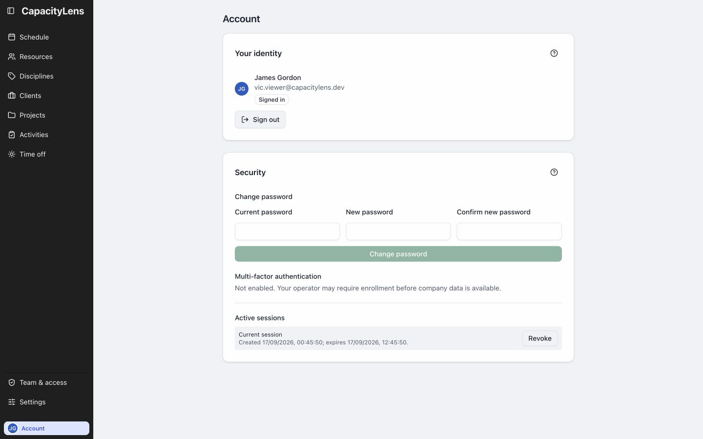

# Account

Open Account at the bottom of the left menu.

It shows your signed-in identity and available security controls. These differ between password sign-in and company login.

Select Sign out on this page when you have finished.

[Account controls](/guide/settings#your-personal-account)
