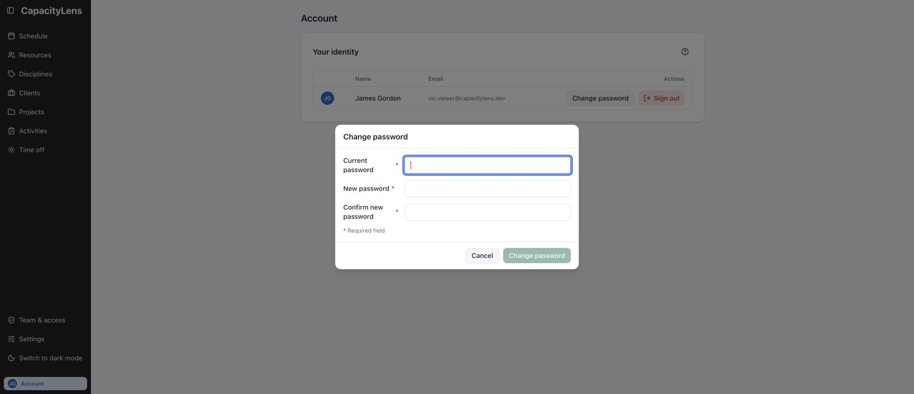

# Account

Open **Account** at the bottom of the left menu. Every member can use their own Account controls,
including a Viewer. The table shows the identity you used to sign in: avatar, name, email and
available actions. It does not show your company role or create a schedulable person.

A long email is shortened to fit; hover over it or move keyboard focus to it to read the full
address. On a narrow screen, scroll the row sideways to reach every column. The same identity may
have membership in several companies, with a different role in each. Check **Team & access → Your
access** for the role in the current company.

## Change a local password

Select **Change password** when it is available. Enter **Current password**, then a **New
password** of 15–128 characters and the same value in **Confirm new password**. Select **Change
password** and wait for the success message. The form cannot submit until every field has a value.

The new password must meet the installation’s password policy. The form reports a length error or
mismatched confirmation so you can correct it. A wrong current password, a rejected new password
or an unavailable sign-in service produces an error; do not assume the change succeeded. Keep the
message visible and correct the input or try again when the service is available. **Cancel**
closes the form and clears its contents.

A successful change revokes your other sessions. Other browsers and devices must sign in again,
including sessions used to enter another company. The Account page confirms this with **Password
changed. Other sessions were revoked.** Changing your password does not change company membership,
role or scheduled work.

If you use company login, password changes belong to that provider and this local control may be
absent. Do not create a second identity just to obtain a password button.

## Connect company login

When the operator has configured Google or Microsoft, Account can show a **Connect** button for
that provider. Start from the local identity you intend to keep, confirm your sign-in when asked,
and complete the provider’s steps using the matching email address. Your local email must already
be verified. An invitation is not needed to connect a provider to an existing verified identity.

Return to Account and check the provider’s **Connected** badge. A failed or cancelled connection
shows an error; a provider button disappearing during a request does not prove success. If the
message says your email is not verified, ask the operator to confirm mailbox ownership and
an authorised Owner or Admin to arrange the guarded repair in mixed mode. The repair requires
identity-wide authority and is an API action, not an Account button; it revokes your sessions.
See [Connect existing accounts](/company-login/move-to-single-sign-on#connect-existing-accounts),
then sign in again before retrying. If Microsoft asks for mailbox proof, open the verification message in the same
browser that began the request. [Company login](/company-login/) explains the supported providers
and the distinction between connecting an existing identity and joining for the first time.

Company-login-only installations offer provider sign-in without local password controls. Required
multi-factor checks are managed by the provider; there is no local authenticator setup control on
this page in the current installation.

## Finish or recover a session

Select **Sign out** when you finish, especially on a shared device. This ends the current browser
session; it does not remove company membership or delete scheduling records. To leave a company,
ask its Owner or Admin to review your membership.

If you forget a local password, use the recovery option offered on the sign-in page. Availability
depends on the installation’s email setup. If it is unavailable or the message does not arrive,
ask an Owner or Admin for help. Use your provider’s recovery process for company login. An
administrative password reset or session revocation affects the identity across every company it
can enter, rather than only the company where the request was made.

Account does not display bearer session tokens or provide a list of other active sessions. Ask an
Owner or Admin if you need existing sessions revoked. Display preferences are under
[Settings → My display](/using/settings#my-display), and access permissions are explained in
[Team & access](/using/team-access).
