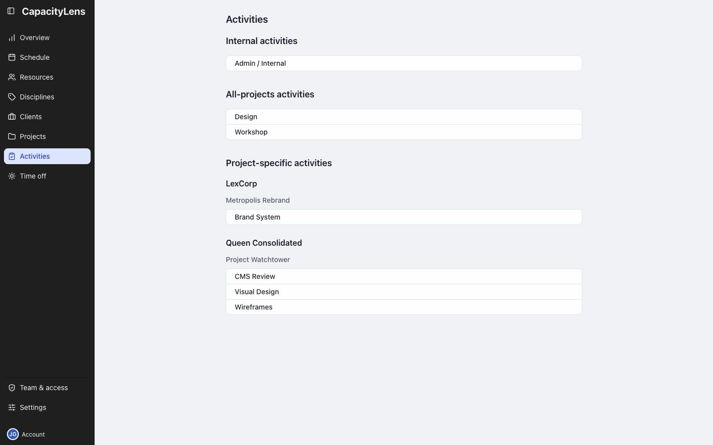

# Activities

Activities are grouped by where they can be used:

- Internal: internal bookings.
- All projects: reusable across projects.
- Project-specific: listed under their client and project.

Your own assignments are in the [Schedule work list](/using/read-the-schedule#your-work-list).

[Activity types and booking options](/guide/projects-and-allocations#choose-where-an-activity-can-be-used)

[Set up activities](/admin/prepare-work)
