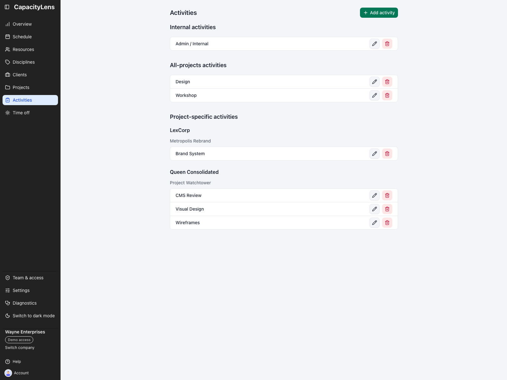
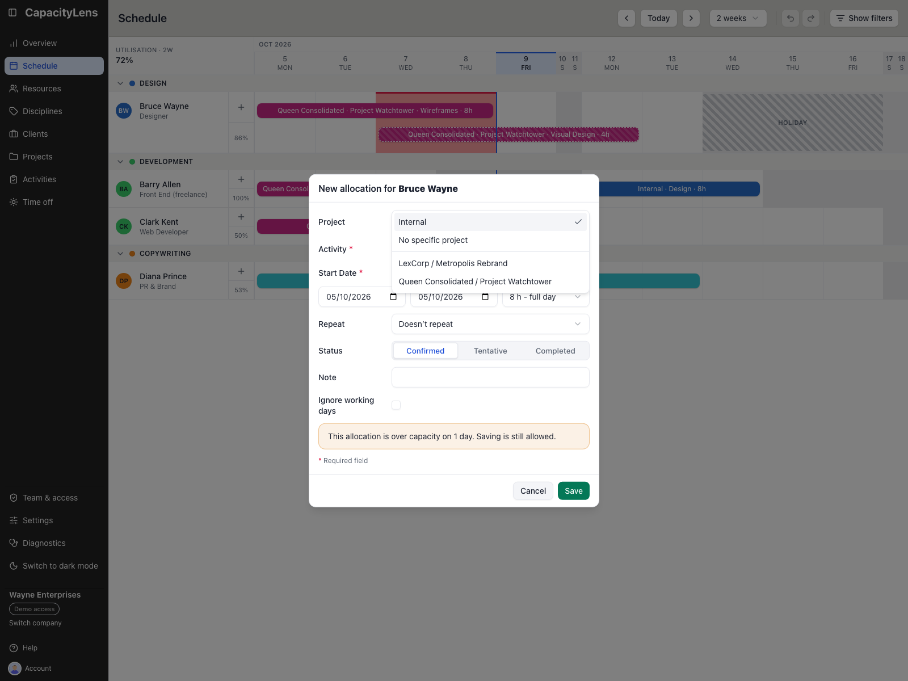
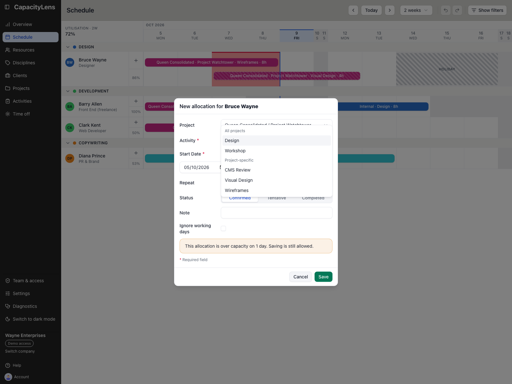
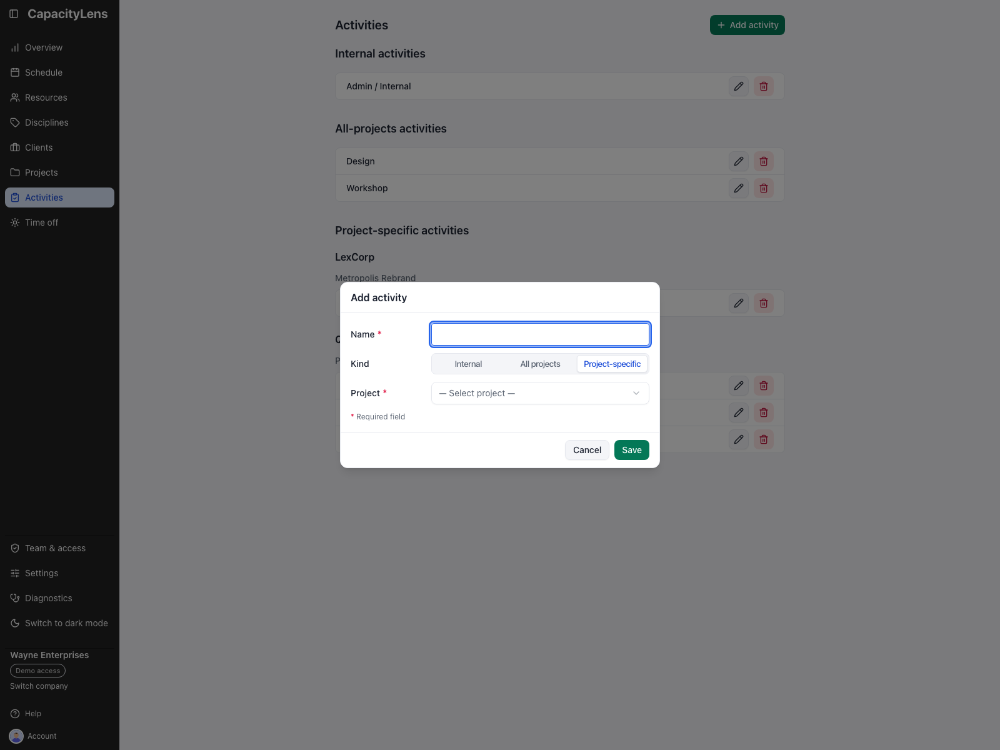
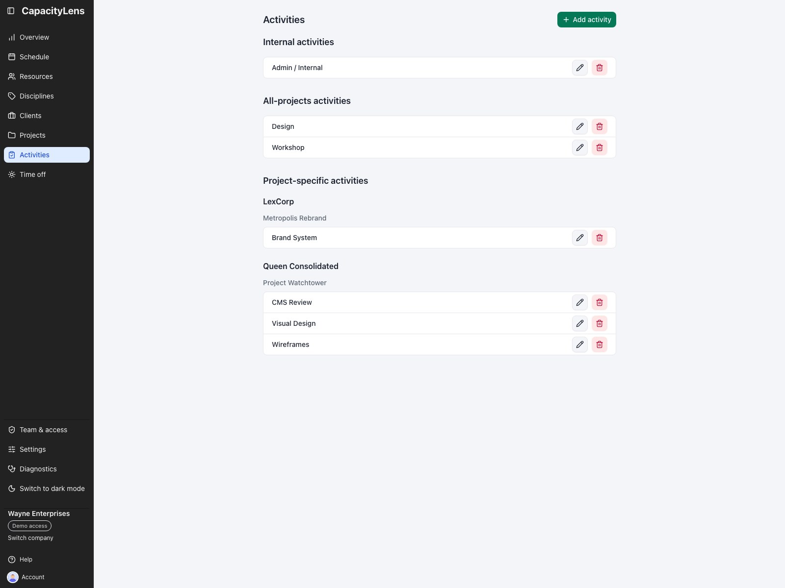

# Activities

Activities are grouped by where they can be used:

- Internal: internal bookings.
- All projects: reusable across projects.
- Project-specific: listed under their client and project.

Your own assignments are in the [Schedule work list](/using/read-the-schedule#your-work-list).

[Set up activities](/admin/prepare-work)

## Choose where an activity can be used

On **Activities**, each empty category explains where its activities can be used. Select
**Add activity** beside the page heading to create one.

Before you create an allocation, decide whether its activity is for internal work,
reusable across projects or unique to one project:

| Activity kind | Use it for | Where it is available |
| --- | --- | --- |
| **Internal** | Non-billable work such as administration or an internal meeting | Only when the allocation's Project is **Internal** |
| **All projects** | Work your team does in the same way for many projects, such as account management, design or workshops | Under every real project, or under **No specific project** when the work is not attributed to one project |
| **Project-specific** | Work created for one project, such as that project's discovery, wireframes or launch | Only under the project it belongs to |

The activity kind controls where an activity is available. The allocation records the
actual booking. This means one **All projects** activity can be reused many times: one
allocation can count towards Project Watchtower, another can count towards Metropolis
Rebrand and a third can remain under **No specific project**.

When you create an allocation, choose its context from **Project** first:

- Choose **Internal** for an Internal activity.
- Choose **No specific project** for an unattributed All-projects activity.
- Choose a real project to use either a shared **All projects** activity or one of that
  project's **Project-specific** activities.

After you choose a real project, the **Activity** picker separates reusable **All projects**
activities from the activities in that project's **Project-specific** group.

## Add and order activities

Under **Activities**, an activity is the specific thing a person is booked to do, and
it comes in three kinds:

- **Internal** — non-billable work that isn't tied to a project.
- **[All projects](/reference/glossary#all-projects)** — shared work that can be booked
  against any project, like general account management.
- **Project-specific** — belongs to one project.

Internal and All-projects activities are alphabetical. Project-specific activities are
grouped in client, project and then activity order, with each client and project name
shown once as a heading rather than repeated on every row.

## What's next

[Schedule work](/using/schedule-work) against an activity, or [prepare clients and work](/admin/prepare-work)
as an Admin.
